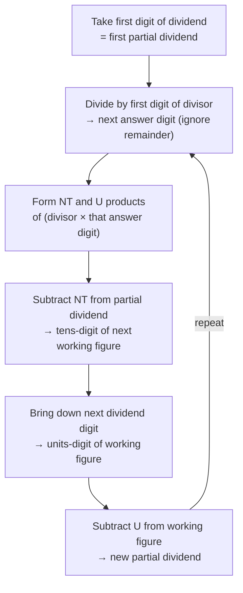

# Trachtenberg Division — Simple and Fast Methods

**Summary**: Trachtenberg's division ([trachtenberg-system](./trachtenberg-system.md) Ch 5) gives two methods. The **simple method** sets up a 10-entry table of `divisor × 1`, `divisor × 2`, …, `divisor × 10` by repeated addition (no multiplication), with a parallel digit-sum check column to catch addition errors. Long division then becomes a lookup-and-subtract loop. The **fast method** uses the *NT/U-product* on `divisor × answer-digit` pairs to compute each next answer digit directly, without any intermediate tables — the answer streams out one digit at a time without writing partial products. Both methods replace conventional long division's mistake-prone multiplication steps with structurally simpler ones, with the fast method approaching reflexive mental long-division for short divisors.

**Sources**:
- Trachtenberg, J. (1960). *The Trachtenberg Speed System of Basic Mathematics*, trans. Cutler & McShane — Chapter 5 "Division — Speed and Accuracy", pp. 133–183. PDF at `raw/01 Core_Memory/Math/Books/trachtenberg-system.pdf`.

**Last updated**: 2026-07-22 — linked to [division-drill-ladder](./division-drill-ladder.md), which sequences these two methods as fade rungs


---

## Why two methods

Trachtenberg explicitly designed two methods for different user profiles:

- **Simple** — for "people more or less non-mathematical". Trades speed for foolproofness. The setup-table eliminates multiplication entirely from the division loop.
- **Fast** — for those with arithmetic comfort. Streams the answer digit-by-digit with no scratch work.

Both replace conventional long division's two error-prone steps (multiply-then-subtract per quotient digit) with simpler operations. Conventional long division produces ~24 wrong answers out of 30 attempts in a freshman college class (Trachtenberg's anecdote, p. 133). His methods reduce error rates structurally, not by exhortation.

---

## The simple method

### Setup: build the 10-multiple table by addition

Given divisor `D`, write a column of `D`, `2D`, `3D`, … `10D`, each obtained by adding `D` to the previous entry. *No multiplication is needed* — only addition. Label each entry with its multiplier in parentheses.

In parallel, build a **check column** of digit-sums: the first entry is the digit-sum of `D`, the second is that digit-sum + the digit-sum of `D` again (reduced to single digit by casting out nines), and so on. At any row, the digit-sum check entry must equal the across-row digit-sum of the corresponding multiple. This catches *every* addition error at the moment it occurs.

Terminal-row check: the 10th entry must equal `10D` — i.e. `D` with a `0` appended. This is a structural sanity check; if it doesn't match, the table is wrong.

### Worked example — 27,483,624 ÷ 62

Setup (divisor column with check column on the left, see book p. 137 for the full layout):

```
   check    divisor column  label
                  62        (1)
   8        +62             
              124           (2)
   8        +62             
              186           (3)
   7        +62             
              248           (4)
   6        +62             
   ...      ...            (...)
              620           (10)  ← matches D·10 ✓
```

### Division: lookup-and-subtract

Now apply the rule:

```
   Subtract repeatedly from the dividend, the largest number
   that you can use in the divisor column. The label-number
   of the number that you subtract is the next figure of the answer.
```

Working left-to-right across the dividend:
- Find the largest multiple in the table that fits — write its label as the next quotient digit
- Subtract that multiple, bring down the next dividend digit
- Repeat until the dividend is exhausted; what remains is the remainder

For `27,483,624 ÷ 62`: 248 fits into 274 (label 4); 248 fits into 268 (label 4); … final answer **443,284 with remainder 16**.

### Self-correcting nature

If you accidentally pick the wrong multiple from the table:
- **Too large**: subtraction fails immediately
- **Too small**: the next quotient digit would be 10 (impossible), so the error is caught next step

Both error modes are detected within one step. Conventional long division's silent errors (subtracting wrong, miswriting a quotient digit) don't have this property.

### Answer-level check via digit-sums

After completing the division:
1. `(dividend − remainder).digit_sum = ?`
2. `answer.digit_sum × divisor.digit_sum = ?` (reduced)
3. Compare. If equal, the division is verified.

For the example: `(27,483,624 − 16).digit_sum = 2`. `443,284.digit_sum × 62.digit_sum = 7 × 8 = 56.digit_sum = 2`. ✓

---

## The fast method — NT/U products

### The NT-product and U-product primitives

Given two-digit `ab` and single-digit `m`:
- **U-product** (units-and-tens, single-digit output): `U(ab × m) = units_digit(a × m) + tens_digit(b × m)`. The output is a single digit.
- **NT-product** (number-and-tens, two-digit output): `NT(ab × m) = (a × m) + tens_digit(b × m)`. The output is a two-digit number — *the entire* a×m product, plus the tens digit of b×m.

Example: `43 × 6`. U-product = units(4·6=24) + tens(3·6=18) = 4 + 1 = **5**. NT-product = 24 + tens(18) = 24 + 1 = **25**.

These are the only two primitives needed; the rest of the fast method is bookkeeping.

### The fast-division loop (two-digit divisor)

Setup: align the dividend with the divisor as in conventional long division.



The answer streams out one digit per loop iteration. No scratch work for partial products; the NT and U values are computed in working memory and immediately consumed.

### Worked example — 8,384 ÷ 32

```
   partial dividend  8
   8 ÷ 3            = 2 (first answer digit)
   NT(32 × 2)       = 06   ; U(32 × 2) = 4
   8 − 06           = 2    (tens-digit of working figure)
   bring down 3     → 23
   23 − 4           = 19   (new partial dividend)
   19 ÷ 3           = 6 (second answer digit)
   NT(32 × 6)       = 19   ; U(32 × 6) = 2
   19 − 19          = 0
   bring down 8     → 08
   08 − 2           = 06   (new partial dividend)
   6 ÷ 3            = 2 (third answer digit)
   NT(32 × 2)       = 06   ; U(32 × 2) = 4
   ... remainder calculation
   ─────────────────────
   answer:           262, remainder 0
```

### Why fast

The bookkeeping is what makes this dramatic: at no point do you write a partial product (like `32 × 6 = 192` in conventional long division), nor do you align and subtract a multi-digit number. Each digit of the answer requires one NT and one U product, plus two single-digit subtractions. With practice, all of this fits in working memory and the answer can be written **directly without intermediate steps**.

### Extension to longer divisors

For three-digit divisors, the working figure becomes three digits (one NT subtraction plus one U subtraction plus one "middle" subtraction). For any-length divisors, the bookkeeping grows linearly with divisor length but the per-digit work stays bounded. See Trachtenberg pp. 158–175 for the three-digit and arbitrary-length recipes.

---

## When to use which

| Situation | Method |
|---|---|
| One-off division, want maximum reliability | Simple |
| Want to do mental division reflexively | Fast |
| Divisor near a power of 10 (e.g. 98, 996) | [vedic-speed-math](./vedic-speed-math.md) §Transpose-and-Apply (faster than either Trachtenberg method) |
| Repeated divisions by the same divisor | Simple (table reuses across problems) |
| Long dividend with short divisor | Fast (streams) |

---

## Related pages

- [division-drill-ladder](./division-drill-ladder.md) — the training path for both methods on this page: the multiple table is its R1 rung, NT/U streaming its R3
- [trachtenberg-system](./trachtenberg-system.md) — parent page; this is the Chapter 5 expansion
- [trachtenberg-addition](./trachtenberg-addition.md) — uses the same digit-sum check primitive
- [vedic-speed-math](./vedic-speed-math.md) §Transpose-and-Apply — alternative division method for near-base divisors
- [vedic-digit-sum-check](./vedic-digit-sum-check.md) — the casting-out-nines verification used in both methods
- [symbolic-fluency-drill-ladder](./symbolic-fluency-drill-ladder.md)

---

## U — See (CAST)
1. Two-column table: divisor multiples and digit-sum checks
2. Streaming digit-by-digit answer with NT/U products

## D — Name (NEDF)
1. Trachtenberg division = lookup-table (simple) or streaming-NT/U (fast)
2. Distinguisher: no multi-digit partial products in either method
3. Failure mode: NT vs U confusion (writing NT where U is needed)

## F — Do (SPEAR)
1. Simple: build table → loop subtract-largest
2. Fast: NT/U products → subtract → bring-down

## B — Watch (HEART)
1. Picking wrong multiple in simple method (caught next step)
2. NT/U swap in fast method (silent error — verify with digit-sum)

## L — Predict (ORACLE)
1. Quotient first digit → predict by leading-digit ratio
2. Divisor near power of 10 → predict Transpose-and-Apply faster

## R — Act (GRACE)
1. New division problem → check divisor shape, pick method
2. Quotient suspicious → digit-sum check
