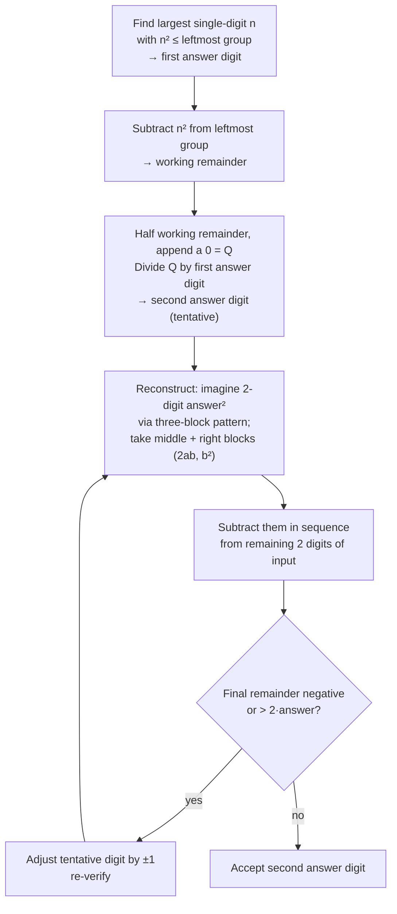

# Trachtenberg Squares and Square Roots

**Summary**: Trachtenberg ([trachtenberg-system](./trachtenberg-system.md) Ch 6) treats squaring as a constrained case of multiplication: for a 2-digit number `ab`, the square is the three-block `[a²][2ab][b²]`-then-collapse pattern; for 3-digit numbers, the same pattern with an added open-cross-product overlap. Two special-case shortcuts compute squares of `n5` and `5n` instantly with no carries. Square roots reverse the structure: digit-pair the number from the right, find each answer digit by a half-the-remainder ÷ first-answer-digit step, then verify by reconstructing the implied squared answer and subtracting. The method handles 3-to-8 digit inputs and is the only chapter of Trachtenberg's that uses the squaring identity directly rather than working purely digit-by-digit.

**Sources**:
- Trachtenberg, J. (1960). *The Trachtenberg Speed System of Basic Mathematics*, trans. Cutler & McShane — Chapter 6 "Squares and Square Roots", pp. 185–226. PDF at `raw/01 Core_Memory/Math/Books/trachtenberg-system.pdf`.

**Last updated**: 2026-07-22 — linked to [squaring-reflexes](./squaring-reflexes.md), which routes between this three-block route and the base-snap one


---

## Squaring 2-digit numbers — the three-block pattern

For `ab` (where `a` and `b` are single digits), the square equals:

```
   (ab)² = [a²] [2·a·b] [b²]
```

Each block is a two-digit number (pad with a leading zero if needed). Then **collapse** the blocks: write them adjacently, then propagate carries from right to left (or left to right with corrections).

### Worked: 32² = 1024

```
   a = 3, b = 2
   a² = 09
   2ab = 12
   b² = 04
   ───────────
   blocks:    09 | 12 | 04
   collapse:  09 (12) 04
              add carries: 9 + 1 = 10, carry 1 into the leading-zero slot
   answer:    1024
```

### Worked: 84² = 7056

```
   a = 8, b = 4
   a² = 64
   2ab = 64
   b² = 16
   ───────────
   blocks:    64 | 64 | 16
   collapse from right:
      16 → write 6, carry 1
      64 + 1 = 65 → write 5, carry 6
      64 + 6 = 70 → write 70
   answer:    7056
```

### Mental form

With practice, the three blocks live simultaneously in working memory as a single visual: `[09][12][04]` for 32², `[64][64][16]` for 84². The collapse step is the same carry-propagation as in conventional addition.

---

## Two special cases — instant squares with no carries

### Ends-in-5: `n5` squared

```
   (n5)² = [n · (n+1)] | 25
```

The square always ends in `25`. The leading portion is `n × (n+1)`.

- `35² = (3·4)|25 = 1225`
- `65² = (6·7)|25 = 4225`
- `95² = (9·10)|25 = 9025`

### Tens-digit-5: `5n` squared

```
   (5n)² = [25 + n] | [n²]
```

The leading portion is `25 + n`; the trailing portion is `n²` (padded to two digits).

- `56² = (25+6)|36 = 3136`
- `51² = (25+1)|01 = 2601`
- `54² = (25+4)|16 = 2916`

Both special cases are derivable from the three-block pattern but the carry doesn't propagate, so the answer is reconstructible in any order — left-to-right or right-to-left.

---

## Squaring 3-digit numbers — open-cross-product overlap

For `abc` (a 3-digit number), the square is constructed by overlapping two 2-digit squarings:

1. **Right square**: square the last two digits, `bc`, using the three-block pattern → 4-digit result for the right side of the answer
2. **Open cross-product**: compute `2 · a · c` (the *outer pair* doubled), add it onto the *left two digits* of the right-square result
3. **Left square**: square the first two digits, `ab`, but **omit b²** (it's already captured in the right square's leftmost block)

### Worked: 462² = 213,444

```
   Right square (62²):  62 → blocks [36][24][04] → collapse → 3844
   Open cross-product:  2·4·2 = 16
                        Add 16 onto the left two digits of 3844: 38 + 16 = 54
                        Now have: 5444
   Left square (46²):   46 → blocks [16][48][36]; OMIT the 36 (already in 6² above)
                        Just collapse [16][48] = 1648, then prepend onto 5444's leading 5
                        Result: 16 | 48+5 | 444 = 16 | 53 | 444 → propagate: 21|3|444 = 213,444
```

Trachtenberg's method preserves the 2-digit squaring primitive; the 3-digit case is a structured overlap of two such primitives. For 4-digit and longer, the pattern extends by adding more open-cross-products. See the book pp. 193–195 for the worked recipe.

---

## Square roots — the structural reverse

For an `N`-digit number, the square root will have `⌈N/2⌉` digits. Mark off the number into 2-digit pairs from the *right*; the leftmost group may be 1 or 2 digits.

### Algorithm (3-to-4-digit inputs, 2-digit output)



### Worked: √625 = 25

```
   Mark off:        6 | 25
   Step 1: largest n with n² ≤ 6 → n = 2
   Step 2: 6 − 4 = 2
   Step 3: half(2) = 1; append 0 → Q = 10
           10 ÷ 2 = 5 → second answer digit (tentative)
   Step 4: reconstruct 25² blocks: [04][20][25]; use [20][25] = 225 (the imagined middle+right)
   Step 5: subtract 2 from working remainder: 2 − 2 = 0; bring down 25 of input
           00 25 − 25 = 00 → exact match, remainder 0
   ─────────────────────
   √625 = 25 exactly
```

### Worked: √676 = 26 (with correction)

```
   Mark off:        6 | 76
   Step 1: n = 2,  n² = 4
   Step 2: 6 − 4 = 2
   Step 3: half(2) = 1, Q = 10, 10 ÷ 2 = 5 → tentative second digit 5
   Step 4: reconstruct 25² → use 2 (the leading 2 of 225) and 25 (the last two)
   Step 5: 2 − 2 = 0; bring down 76; subtract 25 → 76 − 25 = 51
   Check: 51 > 2·25 = 50 → tentative second digit was too small. Try 6:
   Step 4': reconstruct 26² → [04][24][36], use 24 and 36
   Step 5': 2 − 2 = 0; bring down 76; subtract 36 → 76 − 36 = 40; minus 24 = ... ✓
   Re-verify: 51 → adjust by +1 → 26
   ─────────────────────
   √676 = 26 exactly
```

### Acceptance rule

A tentative answer digit is correct iff the final remainder satisfies `0 ≤ remainder ≤ 2 · answer_so_far`. If too large, the digit is too small (increment by 1 and retry); if negative, the digit is too large (decrement by 1).

This is the same correction logic as conventional long-division-style square roots, but the per-step work uses Trachtenberg's reconstructed-square subtraction rather than the conventional "double the answer, divide" pattern.

---

## How the squaring identity composes

The 2-digit three-block pattern is just the algebraic identity:

```
   (10a + b)²  =  100·a²  +  10·(2ab)  +  b²
                  └─ [a²]┘  └─[2ab]┘    └[b²]┘
```

When the blocks are written adjacently in 2-digit slots, the place-value arithmetic naturally aligns the powers of 10. The collapse step is what propagates the inter-block carries.

For 3-digit `100a + 10b + c`:

```
   (100a + 10b + c)²  =  10000·a²  +  1000·(2ab) + 100·(2ac + b²) + 10·(2bc) + c²
```

The Trachtenberg recipe partitions this into:
- `(10b + c)²` = right-square (covers the 2bc, b², c² terms)
- `(10a + b)²` minus `b²` = left-square (covers the a², 2ab terms)
- `2ac` = open-cross-product (the term that doesn't fit either square — the *outer*-pair product)

This is the same partition as [vedic-speed-math](./vedic-speed-math.md)'s Criss-Cross polynomial multiplication, applied to a polynomial multiplied by itself.

---

## Trachtenberg's coverage in this chapter (omitted here)

- 7-digit and 8-digit square roots (pp. 214–223) — extension of the above by adding more digit-pairs
- "Longer numbers" — arbitrary length, same recurrence
- Checking — digit-sum verification of both squares and square roots

See the source PDF for these. The methods extend the same primitives; the working-memory cost grows linearly in digit count, not polynomially.

---

## Related pages

- [squaring-reflexes](./squaring-reflexes.md) — the routing and training layer above this chapter; the three-block pattern is its equal-offset route, base-snap the opposite-offset one
- [trachtenberg-system](./trachtenberg-system.md) — parent page
- [trachtenberg-addition](./trachtenberg-addition.md) — uses the same digit-sum check
- [trachtenberg-division](./trachtenberg-division.md) — square-root method shares structural primitives with the fast-division method
- [vedic-speed-math](./vedic-speed-math.md) — Criss-Cross multiplication is the multi-digit analogue of the three-block pattern
- [vedic-perfect-square-roots](./vedic-perfect-square-roots.md) — Bathia's complementary last-digit-lookup approach for perfect squares specifically
- [vedic-duplex-square-roots](./vedic-duplex-square-roots.md) — the Vedic general-case square root using the Duplex operation

---

## U — See (CAST)
1. Three blocks `[a²][2ab][b²]` collapsing into one number
2. Right-square + open-cross-product + left-square overlap for 3-digit case

## D — Name (NEDF)
1. Trachtenberg squaring = three-block algebraic identity with carries
2. Distinguisher: open-cross-product is the *outer-pair* doubled, not inner
3. Failure mode: forgetting to omit b² when adding the left square

## F — Do (SPEAR)
1. 2-digit: blocks → collapse
2. 3-digit: right-square → +OCP → left-square-minus-b²

## B — Watch (HEART)
1. Mis-collapsing (wrong carry direction)
2. Wrong-tentative-digit in square root (too small / too large)

## L — Predict (ORACLE)
1. Ends-in-5 → predict 25 suffix
2. Tens-digit-5 → predict (25+n)|n² shape

## R — Act (GRACE)
1. Squaring need → check digit-shape, pick special case if applicable
2. Square root → mark pairs from right, run the recurrence
