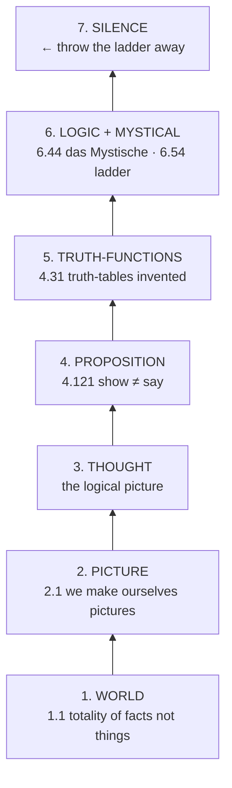

# Tractatus Logico-Philosophicus

**Summary**: Ludwig Wittgenstein's *Tractatus Logico-Philosophicus* (1921 German *Annalen*, 1922 English Kegan Paul edition with Russell's introduction). The 75-page primary philosophical text that **invented truth tables**, formalized the **picture theory of language**, drew the **show-vs-say** boundary, and concluded with **proposition 7** — *what we cannot speak about we must pass over in silence*. The most important 20th-century book on the logic of language; the philosophical antecedent of the wiki's encoder paradigm.

**Sources**:
- Ludwig Wittgenstein, *Tractatus Logico-Philosophicus*. German first published in *Annalen der Naturphilosophie* (Leipzig, 1921). English first published by Kegan Paul (London, 1922) with C. K. Ogden's translation (assisted by Frank Ramsey) and Bertrand Russell's introduction.
- Side-by-side-by-side edition v0.69 (Klement, September 2025) — German + Ogden/Ramsey + Pears/McGuinness translations in parallel columns. Source PDF at `C:\Users\David\Documents\tlp.pdf`; extracted text at `.tmp/logic_ingest/tlp_*.txt`. Public domain (typesetting CC-BY-SA).
- The two English translations: **Ogden/Ramsey 1922** (originally cleared by Wittgenstein himself) and **Pears/McGuinness 1961/74** (modern standard). The wiki cites both side-by-side when the translation matters; defaults to Pears/McGuinness for one-translation citations.
- Bertrand Russell, *Introduction to the Tractatus Logico-Philosophicus* (1922) — the standard scholarly entry-point; covers picture theory, atomic facts, truth-functions, generality, identity, the mystical, and (gently) flags the hierarchy-of-languages objection that Russell never resolved with Wittgenstein.

**Last updated**: 2026-05-25

---

## Unlocks (lead, not footer)

1. **Picture theory of language ↔ the wiki's encoder paradigm.** TLP 2.1: *"We make to ourselves pictures of facts."* TLP 2.17: *"What the picture must have in common with reality, in order to be able to represent it after its manner — rightly or falsely — is its form of representation."* This **is** the philosophical basis of [NEDF](./nedf-overview.md) / [CAST](./cast-overview.md) / [SPEAR](./spear-overview.md) / [HEART](./heart-overview.md): encode the concept as a vivid scene whose *structure* shares the logical form of the fact. The wiki has been doing TLP picture theory operationally for months without naming the root. Confirmed unlock in [composability-index](./composability-index.md). Owner: [picture-theory-of-language](./picture-theory-of-language.md).

2. **Show vs say ↔ the visual-per-concept rule.** TLP 4.121: *"What expresses itself in language, we cannot express by language. Propositions show the logical form of reality. They display it."* TLP 4.1212: *"What can be shown cannot be said."* The wiki's already-established rule that **every concept page must ship with a visual** now has its 1922 philosophical home. Structure can be *shown* (diagram, glyph, scene, formula) — it cannot be fully *said* (prose alone). Text-only pages don't merely fall short of a stylistic preference; they violate the show-vs-say boundary. Owner: [show-vs-say](./show-vs-say.md).

3. **Truth tables — Wittgenstein invented them here.** TLP 4.31: the two-row, four-row, eight-row matrices for the truth-values of compound propositions of one, two, three components. This is the *first published occurrence* of the truth-table notation that now appears in every introductory logic textbook (including [Copi](./copi-introduction-to-logic.md) Ch 8). Picture theory operationalized: a truth-table *shows* the logical form of a compound proposition.

4. **The mystical — what lies outside the limits of language.** TLP 6.44: *"Not how the world is, is the mystical, but that it is."* The boundary between sense and nonsense; ethics, aesthetics, the meaning of life all live on the far side — they can be shown (a life lived well shows what cannot be said about the good), not said. Cross-link to faith as substance of things hoped for: the same epistemic structure shows up.

5. **The ladder — TLP's own self-cancelling structure.** TLP 6.54: the propositions of the book must be recognized as senseless by anyone who has understood them; *climb the ladder, then throw it away*. The book's last act is to deny its own assertions. **The most radical move in 20th-century philosophy**, and the load-bearing reason TLP is hard: it does not want to be a doctrine.

## Mnemonic

**1 World · 2 Picture · 3 Thought · 4 Proposition · 5 Truth-Function · 6 Logic · 7 Silence.**

The seven top-level numbered propositions of TLP, in order. Each opens an entire structural layer of the book. The mnemonic *"World Picture Thought Proposition Truth-Function Logic Silence"* (7 nouns, the first six in expanding-scope sequence, the seventh closing the door) is enough to retrieve the whole skeleton.

## Memory checksum

If you can answer these in <60 s each from memory, the page is encoded:

1. **What does TLP 1.1 say?** (*The world is the totality of facts, not of things.*)
2. **What is the picture theory of language in one sentence?** (A proposition is a logical picture of a fact; the structure of the sentence shares the logical form of the fact.)
3. **What is the show-vs-say distinction?** (What can be *shown* cannot be *said*; the logical form a proposition has in common with reality can be displayed in the proposition but not stated by it.)
4. **What is the mystical, per TLP?** (Not *how* the world is, but *that* it is. Ethics, aesthetics, the meaning of life — beyond the limits of language; can be shown, not said.)
5. **State TLP proposition 7.** (Ogden: *Whereof one cannot speak, thereof one must be silent.* / Pears/McGuinness: *What we cannot speak about we must pass over in silence.*)

## Visual — the seven-rung ladder

The book is read *bottom-up* (world → silence) and *understood top-down* (silence → world reframes everything below). The ladder is meant to be climbed and then discarded.

---

## The seven top-level propositions

TLP's numbering is hierarchical: integer propositions are the spine; *n*.1, *n*.2 … are comments on *n*; *n*.*m*1, *n*.*m*2 … are comments on *n*.*m*; and so on. The decimal indicates *logical weight* (Wittgenstein's word), not paragraph order.

| # | Proposition (Pears/McGuinness) | What it opens |
|---|---|---|
| 1 | *The world is all that is the case.* | Ontology: world = facts |
| 2 | *What is the case — a fact — is the existence of states of affairs.* | Atomic facts (*Sachverhalte*) |
| 3 | *A logical picture of facts is a thought.* | The thought as picture |
| 4 | *A thought is a proposition with a sense.* | Picture theory + show-vs-say |
| 5 | *A proposition is a truth-function of elementary propositions.* | Truth-tables + generality |
| 6 | *The general form of a truth-function is [p̄, ξ̄, N(ξ̄)].* | The mystical + ethics |
| 7 | *What we cannot speak about we must pass over in silence.* | The book closes |

Each numbered proposition is the load-bearing claim of its section. Proposition 7 is the only one without sub-propositions — it has no commentary because it cannot have any; it *shows* its meaning by standing alone.

## TLP on picture theory

> *We make to ourselves pictures of facts.* — TLP 2.1
> *The picture is a model of reality.* — TLP 2.12
> *To the objects correspond in the picture the elements of the picture.* — TLP 2.13
> *The picture is a fact.* — TLP 2.141
> *What the picture must have in common with reality, in order to be able to represent it after its manner — rightly or falsely — is its form of representation.* — TLP 2.17
> *The logical picture of the facts is the thought.* — TLP 3

The full statement of picture theory and its operationalization in the wiki's encoders lives on the owner page [picture-theory-of-language](./picture-theory-of-language.md). The summary form: a proposition is a logical picture; its elements correspond to the objects of the fact it represents; what makes the picture able to represent the fact is the *logical form* they share — and this shared form cannot itself be put into words.

## TLP on show-vs-say

> *Propositions cannot represent logical form: it mirrors itself in them. What expresses itself in language, we cannot express by language. Propositions show the logical form of reality. They display it.* — TLP 4.121
> *What can be shown cannot be said.* — TLP 4.1212

The owner page [show-vs-say](./show-vs-say.md) develops this into the wiki's visual-per-concept rule. The summary: language can *show* its logical form (by having that form) but cannot *say* its logical form (because saying would require a meta-language that itself has a form that cannot be said …). The regress is real; Russell's introduction proposes a hierarchy-of-languages escape; Wittgenstein rejected it.

## Truth-functions

TLP 4.31 contains the first published truth-table — *the* notation that now appears in every introductory logic textbook. Wittgenstein presents it as a *proof* that the truth-value of any compound proposition is determined entirely by the truth-values of its component elementary propositions; the truth-table makes this *show* itself.

The general form of a truth-function (TLP 6) is *[p̄, ξ̄, N(ξ̄)]* — the result of taking any selection of elementary propositions, applying N (joint negation: "neither p nor q nor …") to that selection, and iterating. Russell's introduction expands the notation: this is Wittgenstein's compression of all propositions of logic into a single generative procedure built on Sheffer's stroke / joint negation.

## The mystical

TLP 6.44–6.522 contains TLP's only explicit ethical / aesthetic / religious passages. Key propositions:

- **6.44**: *Not how the world is, is the mystical, but that it is.*
- **6.45**: *The feeling of the world as a bounded whole is the mystical.*
- **6.522**: *There is indeed the inexpressible. This shows itself; it is the mystical.*

What can be *shown* about ethics, aesthetics, the meaning of life is the actual life lived; what can be *said* in propositions is logical / scientific. The wiki cross-links this to faith as the substance of things hoped for, the evidence of things not seen — the same epistemic structure of *shown but not said* appears in Hebrews 11:1's hypostasis / elenchos pairing.

## The ladder

TLP 6.54 is the book's self-cancellation:

> *My propositions are elucidatory in this way: he who understands me finally recognizes them as senseless, when he has climbed out through them, on them, over them. (He must so to speak throw away the ladder, after he has climbed up on it.) He must surmount these propositions; then he sees the world rightly.*

The propositions of TLP are, by TLP's own picture-theory standards, *nonsense* — they attempt to say what can only be shown. They function only as instruments: climb them, see what they point at, discard them. **The book denies its own propositions in its closing move.** This is the single most-discussed move in 20th-century philosophy.

## Proposition 7

> *Whereof one cannot speak, thereof one must be silent.* — Ogden
> *What we cannot speak about we must pass over in silence.* — Pears/McGuinness

The book's final sentence. No sub-propositions; no commentary; no defense. It shows its meaning by standing alone.

## What Gödel did to TLP

Wittgenstein's truth-function machinery in TLP 5–6 assumes that every proposition is a truth-function of elementary propositions. The whole of logic is then tautologies and contradictions (TLP 6.1). **Gödel's incompleteness theorems (1931) demolished this.** Any sufficiently powerful consistent formal system contains true propositions that are not provable within the system — *not* tautologies and *not* contradictions; not derivable by truth-function manipulation alone.

This does not refute picture theory at the philosophical layer (the wiki's encoder paradigm survives); it does refute the specific reductionist claim that all logic is truth-functional. The [logicomix-graphic-novel](./logicomix-graphic-novel.md) narrative arc closes with Gödel and Wittgenstein meeting only in metaphor — the cartoon version of this technical defeat.

## Russell's introduction — what to keep, what Russell himself flagged

Russell's introduction is the standard scholarly entry-point. He covers:

- The four problems of language (psychology · epistemology · special sciences · *logical* — Wittgenstein's domain)
- Picture theory: facts as common-form sentences
- Atomic vs molecular propositions; truth-functions
- The Sheffer stroke as foundation
- Identity (Wittgenstein's destructive criticism)
- The mystical
- A *gentle objection*: the hierarchy-of-languages possibility — Russell suspects a meta-language could say what TLP claims cannot be said; Wittgenstein rejected this throughout his life.

The wiki cites Russell's introduction as scaffolding, not as gospel. The hierarchy-of-languages objection is *interesting* but the wiki sides with Wittgenstein on the show-vs-say boundary for operational reasons — every meta-language would itself require a meta-meta-language, and the regress is what makes visuals indispensable in the first place.

## METER integration

| Drill | Pass floor | Source | Owner |
|---|---|---|---|
| TLP proposition recall from decimal index | <10 s from index to proposition | TLP's own decimal numbering | this page |
| Picture-theory → encoder mapping | name the wiki encoder slot a given TLP fragment grounds in <30 s | TLP 2.1–4.06 + wiki encoder pages | [picture-theory-of-language](./picture-theory-of-language.md) |
| Show-vs-say boundary call | given a wiki claim, decide *shown* / *said* / *both* in <30 s | TLP 4.121–4.1212 + wiki concept pages | [show-vs-say](./show-vs-say.md) |
| TLP → Gödel translation | name which TLP claim Gödel demolished in <60 s | TLP 6.1 + Gödel 1931 (via [logicomix-graphic-novel](./logicomix-graphic-novel.md)) | this page §What Gödel did |

## Limits — what TLP doesn't give us

- **Modal logic** (TLP has none — Wittgenstein thought "possibility" was a confusion). Closed by future Sider ingest if we want it.
- **Model theory** (Tarski 1933, post-TLP). Closed by future Smullyan ingest.
- **Type theory** (Russell's solution to his own paradox, which TLP doesn't directly engage). Closed by future Pierce or Sørensen-Urzyczyn ingest.
- **Post-1931 logic** in general — TLP is a closed 1922 system; the post-Gödel landscape is outside.

See [logic-atomic-design](./logic-atomic-design.md) §Gaps for the full register.

## Related pages

- [picture-theory-of-language](./picture-theory-of-language.md) — TLP's central technical claim, operationalized as the wiki's encoder paradigm
- [show-vs-say](./show-vs-say.md) — TLP's central epistemic boundary, operationalized as the visual-per-concept rule
- [copi-introduction-to-logic](./copi-introduction-to-logic.md) — paired textbook ingested 2026-05-25
- [logicomix-graphic-novel](./logicomix-graphic-novel.md) — paired narrative ingested 2026-05-25; covers the broader foundations-crisis context that TLP fits into
- [nedf-overview](./nedf-overview.md) — the wiki encoder whose philosophical antecedent is TLP picture theory
- bible-study-hebrews-11-1 — Hebrews 11:1 *substance/evidence* pairing shares TLP's show-vs-say epistemic shape
- [memory-paradox](./memory-paradox.md) — Genova's *take-seriously / hold-lightly* meta-rule applies to TLP itself: read it; do not idolize it
- [glossary](./glossary.md) — TLP layer registration
