# Tractatus Proposition Tree

**Summary**: A **navigation aid** for [TLP](./tractatus-logico-philosophicus.md)'s hierarchical decimal numbering system. The 7 top-level propositions + their sub-propositions form a *tree* where the decimal indicates **logical weight + sub-comment relationship** (TLP's own footnote): proposition *n* is supported/elaborated by *n.1, n.2, …*; proposition *n.m* is elaborated by *n.m1, n.m2, …*; and so on. **This page walks the tree branch-by-branch with cross-links to the wiki's concept pages.** The page complements [tractatus-logico-philosophicus](./tractatus-logico-philosophicus.md) (source summary) by being a *map* rather than a *summary*.

**Sources**:
- [Wittgenstein TLP](./tractatus-logico-philosophicus.md) (1921 German / 1922 English) — primary text.
- TLP's own preface footnote explaining the numbering system.
- [tractatus-logico-philosophicus](./tractatus-logico-philosophicus.md) · [picture-theory-of-language](./picture-theory-of-language.md) · [show-vs-say](./show-vs-say.md) · [truth-function-machine](./truth-function-machine.md) · [atomic-fact-tlp](./atomic-fact-tlp.md) · [the-mystical-tlp](./the-mystical-tlp.md) · [limits-of-language-tlp](./limits-of-language-tlp.md) · [russells-introduction-to-tlp](./russells-introduction-to-tlp.md) — wiki TLP concept pages.

**Last updated**: 2026-05-25

---

## One-line

> **TLP's 7 top-level propositions are the trunk; the decimal numbering encodes the tree.** Read the trunk first (7 sentences, 5 minutes); then walk the branches that interest you using the decimals. **The decimal weight indicates logical importance**, not chronological order.

## Unlocks (lead, not footer)

1. **TLP is navigable, not linear.** Most readers approach TLP as a sequential book. Wittgenstein's preface footnote explicitly says otherwise: the decimal numbering encodes *logical weight*. Read top-level propositions first; then drill into the sub-propositions that elaborate the parts you want. **The numbering is itself part of the work** — a structural artifact most readers ignore.

2. **The trunk (7 sentences) is the load-bearing summary.** TLP propositions 1, 2, 3, 4, 5, 6, 7 are the spine: World · Picture · Thought · Proposition · Truth-function · Logic · Silence. **Anyone who reads only the trunk has the book's argument compressed into 7 sentences.** The sub-propositions elaborate and defend; the trunk is the claim.

3. **The branch structure organizes the wiki's TLP coverage.** The wiki's 8 TLP concept pages each owns a branch: picture theory ([picture-theory-of-language](./picture-theory-of-language.md)) = 2.1-4.06; show-vs-say ([show-vs-say](./show-vs-say.md)) = 4.121-4.1212; truth-function machine ([truth-function-machine](./truth-function-machine.md)) = 4.31 + 5-6; atomic fact ([atomic-fact-tlp](./atomic-fact-tlp.md)) = 2; the mystical ([the-mystical-tlp](./the-mystical-tlp.md)) = 6.44-6.522; limits of language ([limits-of-language-tlp](./limits-of-language-tlp.md)) = 5.6-5.641. **The proposition tree shows how the branches partition the book.**

4. **The decimal-weight system is itself a wiki-relevant insight about encoding.** TLP's numbering encodes the *importance* of each proposition by its decimal depth. This is a *show-vs-say* move at the structural level: the importance is *shown* by the numbering, not *said* in prose. **A worked instance of TLP's own picture-theoretic + show-vs-say principles applied to the book's own organization.**

## Mnemonic

**1-2-3-4-5-6-7** = *World · Picture · Thought · Proposition · Truth-function · Logic · Silence.*

The 7 trunk propositions. Memorize the trunk; the branches are reachable by decimal.

## Memory checksum

1. **State the trunk in order with one-word labels.** (1: World. 2: Picture. 3: Thought. 4: Proposition. 5: Truth-function. 6: Logic. 7: Silence.)
2. **What does the decimal numbering encode?** (Logical weight + sub-comment relationship. Proposition *n.m* is a comment on *n*; *n.m.p* is a comment on *n.m*; etc. The decimal depth indicates logical importance.)
3. **What branch covers picture theory + atomic facts?** (Branch 2 — Picture + atomic facts + objects. Sub-propositions 2.0 through 2.225.)
4. **What branch covers truth-functions + tautology?** (Branch 4 + 5 + 6 — 4.31 introduces truth-tables; 5 states the universal-truth-function claim; 6 gives the general form.)
5. **State the relationship between TLP's numbering and TLP's content.** (The numbering is itself a *show-vs-say* move at the structural level: importance is *shown* by the decimal depth, not *said* in prose. The book's structure exemplifies its content.)

## Visual — the proposition tree

```mermaid
graph TD
  T1["1 &mdash; The world is all that is the case."]
  T2["2 &mdash; What is the case, a fact, is the existence of states of affairs (atomic facts)."]
  T3["3 &mdash; A logical picture of facts is a thought."]
  T4["4 &mdash; A thought is a proposition with a sense."]
  T5["5 &mdash; A proposition is a truth-function of elementary propositions."]
  T6["6 &mdash; The general form of a truth-function is p̄, ξ̄, N(ξ̄)."]
  T7["7 &mdash; What we cannot speak about we must pass over in silence. (No sub-propositions.)"]

  T1 -.->|trunk| T2 -.->|trunk| T3 -.->|trunk| T4 -.->|trunk| T5 -.->|trunk| T6 -.->|trunk| T7

  subgraph BR1["Branch 1 &mdash; the world"]
    B111["1.1 The world is the totality of facts, not of things."]
    B1111["1.11 The world is determined by the facts, and by their being all the facts."]
    B1112["1.12 The totality of facts determines what is and is not the case."]
    B1113["1.13 The facts in logical space are the world."]
    B12["1.2 The world divides into facts."]
    B121["1.21 Each item can be the case or not the case while everything else remains the same."]
  end
  T1 --> B111
  B111 --> B1111
  B111 --> B1112
  B111 --> B1113
  T1 --> B12
  B12 --> B121

  subgraph BR2["Branch 2 &mdash; atomic facts (owner: atomic-fact-tlp)"]
    B20["2.0 Objects make up the substance of the world."]
    B201["2.01 A state of affairs (atomic fact) is a combination of objects (things)."]
    B2011["2.011-2.0123 Objects + their combinatorial nature"]
    B202["2.02 Objects are simple."]
    B2021["2.021-2.027 Simples + substance of the world"]
    B203["2.03 In a state of affairs objects fit into one another like the links of a chain (TLP's image for atomic-fact structure)."]
    B206["2.06 The existence and non-existence of states of affairs is reality."]
    B2061["2.061-2.063 Independence + sum-total of reality"]
    B21["2.1 We make to ourselves pictures of facts. (owner: picture-theory-of-language)"]
    B212["2.12 The picture is a model of reality."]
    B213["2.13 To the objects correspond in the picture the elements of the picture."]
    B217["2.17 What the picture must have in common with reality is its form of representation."]
    B218["2.18 The logical picture is the most general form of picture."]
    B222["2.22 The picture represents whatever it represents independently of its truth or falsity."]
  end
  T2 --> B20
  T2 --> B201
  B201 --> B2011
  T2 --> B202
  B202 --> B2021
  T2 --> B203
  T2 --> B206
  B206 --> B2061
  T2 --> B21
  T2 --> B212
  T2 --> B213
  T2 --> B217
  T2 --> B218
  T2 --> B222

  subgraph BR3["Branch 3 &mdash; thought"]
    B301["3.01-3.05 The relation between thought and proposition"]
    B31["3.1 In a proposition a thought finds expression that can be perceived by the senses."]
    B32["3.2-3.5 Names + their reference + propositional signs"]
    B342["3.42 A proposition may determine only a single place in logical space, yet the whole of logical space must already be given by it."]
  end
  T3 --> B301
  T3 --> B31
  T3 --> B32
  T3 --> B342

  subgraph BR4["Branch 4 &mdash; proposition"]
    B401["4.01 The proposition is a picture of reality."]
    B4022["4.022 The proposition shows its sense."]
    B40312["4.0312 The possibility of propositions is based upon the principle of representation by means of signs."]
    B40411["4.0411 Russell's discussion of generality cited."]
    B4121["4.121 Propositions cannot represent logical form: it mirrors itself in them. (owner: show-vs-say)"]
    B41212["4.1212 What can be shown cannot be said."]
    B4122["4.122 Internal vs external relations; formal vs material concepts."]
    B42["4.2 The sense of a proposition is its agreement and disagreement with the possibilities of existence and non-existence of states of affairs."]
    B43["4.3 Truth-possibilities of elementary propositions. (owner: truth-function-machine)"]
    B431["4.31 TRUTH-TABLE introduced &mdash; first publication of truth-table notation in modern logic."]
    B44["4.4 A proposition is the expression of agreement and disagreement with truth-possibilities."]
    B446["4.46 Two extreme cases: tautology + contradiction."]
    B4461["4.461 Tautology and contradiction are senseless (sinnlos) but not nonsensical (unsinnig)."]
    B45["4.5 The most general form of a truth-function is given by the formula introduced at TLP 6."]
  end
  T4 --> B401
  T4 --> B4022
  T4 --> B40312
  T4 --> B40411
  T4 --> B4121
  T4 --> B41212
  T4 --> B4122
  T4 --> B42
  T4 --> B43
  T4 --> B431
  T4 --> B44
  T4 --> B446
  T4 --> B4461
  T4 --> B45

  subgraph BR5["Branch 5 &mdash; truth-function"]
    B501["5.01 Elementary propositions are the truth-arguments of propositions."]
    B51["5.1 Truth-functions can be arranged in series."]
    B5101["5.101 Schemata for truth-functions of elementary propositions."]
    B5143["5.143 Tautology is something shared by propositions that have nothing in common with one another."]
    B52["5.2 Operations + their iteration."]
    B54["5.4 There are no logical objects."]
    B543["5.43 From an atomic fact, no other follows &mdash; logical independence of atomic facts. (owner: atomic-fact-tlp §Logical-independence)"]
    B55["5.5 Every truth-function results from successive application of N(ξ̄)."]
    B55301["5.5301 The relation between two propositions."]
    B5534["5.534 Wittgenstein's destructive criticism of identity."]
    B56["5.6 The limits of my language mean the limits of my world. (owner: limits-of-language-tlp)"]
    B561["5.61 Logic pervades the world."]
    B562["5.62 Solipsism shown not said."]
    B563["5.63 I am my world."]
    B5632["5.632 The subject does not belong to the world but it is a limit of the world."]
    B5633["5.633 Eye-and-field-of-sight analogy."]
    B564["5.64 Solipsism strictly carried out coincides with pure realism."]
    B5641["5.641 The philosophical I is the metaphysical subject, the limit &mdash; not a part of the world."]
  end
  T5 --> B501
  T5 --> B51
  B51 --> B5101
  T5 --> B5143
  T5 --> B52
  T5 --> B54
  T5 --> B543
  T5 --> B55
  T5 --> B55301
  T5 --> B5534
  T5 --> B56
  T5 --> B561
  T5 --> B562
  T5 --> B563
  T5 --> B5632
  T5 --> B5633
  T5 --> B564
  T5 --> B5641

  subgraph BR6["Branch 6 &mdash; logic + mystical"]
    B60["6.0 Iteration of operations."]
    B602["6.02 Number."]
    B61["6.1 The propositions of logic are tautologies."]
    B611["6.11 Tautologies say nothing."]
    B613["6.13 Logic is not a theory but a reflection of the world. Logic is transcendental."]
    B6232["6.232 Equation (identity) discussion."]
    B6241["6.241 (Mathematical) proof."]
    B63["6.3 The exploration of logic means the exploration of everything that is subject to law."]
    B634["6.34 Natural laws."]
    B6341["6.341 Newtonian mechanics imposes a unified form on the description of the world."]
    B636["6.36 Causality."]
    B6371["6.371-6.372 (Modern view of natural laws.)"]
    B64["6.4 All propositions are of equal value."]
    B641["6.41 The sense of the world must lie outside the world."]
    B642["6.42 Hence also there can be no ethical propositions."]
    B6421["6.421 Ethics is transcendental. (owner: the-mystical-tlp)"]
    B643["6.43 If good or bad willing changes the world, it can only change the limits of the world, not the facts."]
    B64311["6.4311 Death is not an event in life."]
    B644["6.44 Not how the world is, is the mystical, but that it is."]
    B645["6.45 The feeling of the world as a bounded whole is the mystical."]
    B65["6.5 For an answer which cannot be expressed, the question too cannot be expressed."]
    B6521["6.521 The solution of the problem of life is seen in the disappearance of this problem."]
    B6522["6.522 There is indeed the inexpressible. This shows itself; it is the mystical."]
    B653["6.53 The right method of philosophy."]
    B654["6.54 My propositions are elucidatory: he who understands me finally recognizes them as senseless, having climbed out through them; throw away the ladder after climbing it. (Wittgenstein's ladder.)"]
  end
  T6 --> B60
  T6 --> B602
  T6 --> B61
  T6 --> B611
  T6 --> B613
  T6 --> B6232
  T6 --> B6241
  T6 --> B63
  T6 --> B634
  B634 --> B6341
  T6 --> B636
  T6 --> B6371
  T6 --> B64
  T6 --> B641
  T6 --> B642
  B642 --> B6421
  T6 --> B643
  B643 --> B64311
  T6 --> B644
  T6 --> B645
  T6 --> B65
  T6 --> B6521
  T6 --> B6522
  T6 --> B653
  T6 --> B654

  classDef trunk fill:#eef1f5,stroke:#7d8aa0,color:#26303f;
  classDef key fill:#f3ece0,stroke:#a08a5c,color:#3a3020;
  class T1,T2,T3,T4,T5,T6,T7 trunk;
  class B21,B4121,B43,B431,B543,B56,B6421,B644,B6522,B654 key;
```

The 7-level trunk + the branch sub-propositions are the navigable structure of the book.

---

## How the wiki's 8 TLP concept pages map onto the branches

| Wiki page | Owns branches |
|---|---|
| [tractatus-logico-philosophicus](./tractatus-logico-philosophicus.md) | Source summary; covers all 7 trunk propositions + outlines branches |
| [atomic-fact-tlp](./atomic-fact-tlp.md) | Branch 2 (atomic facts + objects + logical-independence) |
| [picture-theory-of-language](./picture-theory-of-language.md) | Branch 2.1-4.06 (picture theory) |
| [show-vs-say](./show-vs-say.md) | Branch 4.121-4.1212 + 6.522 (show-vs-say boundary) |
| [truth-function-machine](./truth-function-machine.md) | Branch 4.3-4.46 + 5-6 (truth-function machinery + N-operator + tautology) |
| [limits-of-language-tlp](./limits-of-language-tlp.md) | Branch 5.6-5.641 (limits of language + solipsism + metaphysical subject) |
| [the-mystical-tlp](./the-mystical-tlp.md) | Branch 6.4-6.522 (the mystical + ethics + the ladder) |
| [russells-introduction-to-tlp](./russells-introduction-to-tlp.md) | Pre-text introduction by Russell (1922) — companion not a branch |
| [wittgenstein-ludwig](./wittgenstein-ludwig.md) | Author biography (not a branch; biographical context) |
| [early-vs-late-wittgenstein](./early-vs-late-wittgenstein.md) | Comparison with the later Wittgenstein |

**Branch 1 (the world)** and **branch 3 (thought)** are covered briefly across multiple pages but don't have dedicated wiki concept pages. **Branch 7 (silence)** is covered as a single proposition across [tractatus-logico-philosophicus](./tractatus-logico-philosophicus.md) + [the-mystical-tlp](./the-mystical-tlp.md) + [hypostasis-elenchos-and-tlp-show-vs-say](./hypostasis-elenchos-and-tlp-show-vs-say.md).

## Recommended reading orders

Different readers benefit from different paths through the tree:

### Order A — *"What is TLP about?"* (the load-bearing summary)

1. Read the 7 trunk propositions only (5 minutes).
2. Read [the source summary](./tractatus-logico-philosophicus.md) (15 minutes).
3. Read [Russell's introduction](./russells-introduction-to-tlp.md) (45 minutes; or use the wiki page as a substitute).
4. Decide whether to drill further.

### Order B — *"How does TLP ground the wiki's encoder paradigm?"*

1. Read trunk + [tractatus-logico-philosophicus](./tractatus-logico-philosophicus.md) as in Order A.
2. Read [picture-theory-of-language](./picture-theory-of-language.md) — focuses on 2.1-4.06.
3. Read [show-vs-say](./show-vs-say.md) — focuses on 4.121-4.1212 + 6.522.
4. Cross-link to [nedf-overview](./nedf-overview.md) + [scene-grammar](./scene-grammar.md) + [representation-rules](./representation-rules.md) to see operational application.

### Order C — *"How does TLP relate to Gödel?"*

1. Read trunk + [tractatus-logico-philosophicus](./tractatus-logico-philosophicus.md) as in Order A.
2. Read [truth-function-machine](./truth-function-machine.md) — focuses on 4.3-6.
3. Read [godels-incompleteness](./godels-incompleteness.md) for what Gödel demolished in scope.
4. Read [picture-theory-of-language](./picture-theory-of-language.md) for what survives.

### Order D — *"What does TLP say about ethics and the mystical?"*

1. Read trunk + [tractatus-logico-philosophicus](./tractatus-logico-philosophicus.md) as in Order A.
2. Read [the-mystical-tlp](./the-mystical-tlp.md) — focuses on 6.4-6.522.
3. Read [hypostasis-elenchos-and-tlp-show-vs-say](./hypostasis-elenchos-and-tlp-show-vs-say.md) for cross-tradition grounding.
4. Read [limits-of-language-tlp](./limits-of-language-tlp.md) — focuses on 5.6-5.641.

### Order E — *"How did TLP's author think later?"*

1. Read trunk + [tractatus-logico-philosophicus](./tractatus-logico-philosophicus.md) as in Order A.
2. Read [wittgenstein-ludwig](./wittgenstein-ludwig.md) for biographical context.
3. Read [early-vs-late-wittgenstein](./early-vs-late-wittgenstein.md) for the comparison.
4. Read [philosophical-investigations-overview](./philosophical-investigations-overview.md) for the late period.

## The proposition tree as a wiki structural feature

TLP's decimal-numbering system is **itself** an exemplification of TLP's content:

- **Show-vs-say at the structural level**: the decimal depth *shows* logical importance; the prose doesn't *say* "this proposition is more important than that one" — the numbering shows it.
- **Picture theory at the structural level**: the tree-structure *pictures* the inferential structure of the book; the *form* of the numbering shares the *form* of the logical dependency.
- **Atomic-fact-and-compound at the structural level**: lower-decimal propositions are more atomic; higher-decimal propositions are compounds of atomic remarks.

**TLP is unusual** among philosophical books in that its structural format embodies its content. Most books *say* their argument is structured; TLP *shows* the structure by being structured that way.

The wiki cross-links: when designing wiki page structures, ask whether the structure *shows* the content or merely *organizes* it. Both are valid; the show-the-structure mode is a TLP-style design choice.

## METER integration

| Drill | Pass floor | Source |
|---|---|---|
| State the 7 trunk propositions in order | <30 s | this page §Mnemonic |
| Identify which branch contains a given concept (picture theory / truth-function / mystical / limits) | <30 s | this page §How the wiki's pages map |
| State the meaning of TLP's decimal-numbering convention | <30 s | this page §Visual |
| Walk a 5-proposition path through the tree to a specific concept | <120 s | this page §Recommended reading orders |
| Explain why TLP's numbering exemplifies TLP's content | <60 s | this page §The proposition tree as structural feature |

## Related pages

- [tractatus-logico-philosophicus](./tractatus-logico-philosophicus.md) — source summary
- [picture-theory-of-language](./picture-theory-of-language.md) · [show-vs-say](./show-vs-say.md) · [truth-function-machine](./truth-function-machine.md) · [atomic-fact-tlp](./atomic-fact-tlp.md) · [the-mystical-tlp](./the-mystical-tlp.md) · [limits-of-language-tlp](./limits-of-language-tlp.md) · [russells-introduction-to-tlp](./russells-introduction-to-tlp.md) — TLP concept pages each owning a branch
- [wittgenstein-ludwig](./wittgenstein-ludwig.md) — author biography
- [early-vs-late-wittgenstein](./early-vs-late-wittgenstein.md) — comparison with the late period
- [philosophical-investigations-overview](./philosophical-investigations-overview.md) — the late-period book
- [hypostasis-elenchos-and-tlp-show-vs-say](./hypostasis-elenchos-and-tlp-show-vs-say.md) — cross-domain owner page
- [godels-incompleteness](./godels-incompleteness.md) — what Gödel did to branches 5-6
- [logic-atomic-design](./logic-atomic-design.md) — Wave 5 navigation aid
- [glossary](./glossary.md) — Logic layer registration
