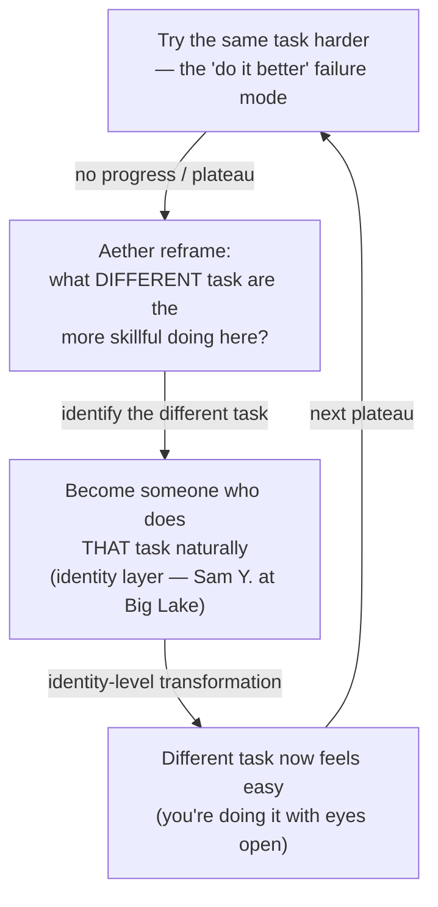

# Aether — Engaging Change / Transform Yourself (Burger Habit 5)

**Summary**: Burger and Starbird's fifth habit of effective thinking ([*The 5 Elements of Effective Thinking*](./burger-5-elements-effective-thinking.md) 2012, Ch 5). The Quintessential element. The first four habits do the heavy lifting; the fifth recommends that you *actually do them*. The load-bearing reframe: people who perform better are not *"doing the same task better"* — they are doing **a fundamentally different task**. The canonical narrative is Sam Y. at Big Lake — the R. L. Moore method made visible. Names overlap with [automaticity-and-reflex-training](./automaticity-and-reflex-training.md)'s Aether=Strategic skill-type — they are not the same (see [five-elements-mapping-reconciliation](./five-elements-mapping-reconciliation.md); Burger's Aether is *identity-change*, the wiki's is *domain-strategy*).

**Sources**: [burger-5-elements-effective-thinking](./burger-5-elements-effective-thinking.md) Ch 5 (pp. 119–135); R. L. Moore method narratives (pp. 131–133).

**Last updated**: 2026-05-27 — created during the Burger ingest.

---

## The single meta-move

The fifth habit is **a meta-lesson, not a sub-divided habit**. The book itself opens Ch 5 with:

> *"The fifth element of effective learning and thinking is the simplest and most difficult, the most important and most dispensable. If this chapter doesn't resonate with you, just skip it."* — Burger & Starbird p. 119

The chapter then unfolds as one extended argument: *the habit of constructive change itself*.

---

## The load-bearing reframe: *"do a different task, not the same task better"*

> *"Often people describe the distinction between the skilled practitioner and the less skilled practitioner by saying that the skilled person is better at the task. But a more useful and accurate perspective is that the skilled practitioner is doing a fundamentally different task — one that you could master as well."* — Burger & Starbird p. 125

**The eyes-closed writing demonstration** (pp. 122–123): close your eyes tightly, write "I am writing as neatly as I can and any mistake I make is unintentional." Open eyes — your handwriting is not perfect. Now repeat with eyes open. The eyes-open writing is dramatically better. **They are different tasks.** Writing-with-eyes-open is fundamentally easier than writing-with-eyes-closed.

**The tennis-ball reframe** (p. 123): when great players play tennis, they watch the ball. Beginners estimate the ball's future location based on where it was when it crossed the net. The great player is *doing an easier task* (hit while watching) compared to the beginner (estimate future position).

**The plug-and-chug physics reframe** (pp. 123–124): students who apply formulas with no understanding are *doing physics with their eyes closed*. Students who understand the formulas are doing a fundamentally different task — *physics with their eyes open*, which is easier and produces better results.

**The list-of-words memorization reframe** (p. 124):

```
List A (12 random words):
HORSE ORDER BECAUSE EASY IN WE BEFORE SENTENCE A DID LOGICAL IS

List B (24 words in a meaningful sentence):
THIS SENTENCE IS EASY TO REMEMBER BECAUSE THE WORDS APPEAR IN A
LOGICAL ORDER; THAT IS, WE DID NOT PUT THE CART BEFORE THE HORSE.
```

List B is *twice as long* but easier and faster to memorize, because the surrounding context gives meaning to otherwise meaningless discrete words. **Different task.** Memorizing-in-context is fundamentally different from memorizing-from-list — and easier.

**Operational form**: to become more skillful and successful, *alter what you do*, rather than think about *how well you do it*. Instead of "do it better," think "do it differently."

---

## The 10,000-hour rule reframe (pp. 128–129)

> *"You have probably heard of the '10,000-hour rule,' which encapsulates the idea that a person needs 10,000 hours of practice to become world-class at anything... This book is about what to do during hours 1 through 9,999. The magic of the 10,000-hour rule does not happen at the 10,000th hour. The magic is an accumulated flow of incremental progress in which the journey forward comes from attaining deeper understanding, making mistakes and learning from them, asking questions, and seeing the evolution of ideas. All mastery is actually a continuum."* — Burger & Starbird pp. 128–129

The 10,000 hours are not what creates mastery — they are when mastery is *measured*. What creates mastery is the *deliberate enaction of the first four habits* (Earth · Fire · Air · Water) across all 10,000 hours.

---

## The Einstein anecdote (pp. 129–130)

At the 1979 Einstein Centennial Symposium at the Institute for Advanced Study, one speaker told a story about being a young assistant to Einstein. Einstein and the assistant had been working for months on a particular problem. Einstein had a strategy he persistently tried. One day the assistant received a letter from other physicists showing Einstein's approach could not work. The assistant had to deliver the bad news, knowing months of effort had been wasted. *"Einstein listened with an open mind and understood the reasoning. The very next day, Einstein had taken a totally different tack on the issue that exposed a new perspective and completely solved the problem."*

> *"Einstein was brilliant. But he was also willing to change in the face of compelling evidence."* — Burger & Starbird p. 130

The capacity to immediately pivot when evidence demands it — that is the Aether habit.

---

## The Sam Y. at Big Lake story (pp. 131–133) — the canonical Aether narrative

R. L. Moore was one of the most famous mathematics teachers of the mid-twentieth century. His method was peculiar: he never lectured; he posed difficult questions, and students were required to answer them independently with no outside help. In class, Moore started with the student he considered the *least able* and asked: *"Mr. ——, can you answer the next question?"* If not, the question passed to the next-weakest student, and so on.

**Sam Y.** was branded the weakest student in one of Moore's courses. He had not answered a question correctly during the entire fall semester. The first semester did not end until several weeks after winter break. Sam went with his parents to Big Lake, Texas. *"His only chance to pass this class was to somehow find a way to answer some of those difficult questions."* He isolated himself and thought.

> *"He returned to the first questions of the semester. As he looked back at the beginning of the term, the work began to make sense. He saw why the first theorems were true. He built up from the ground floor and, question by question, solidly constructed answers for himself that taught him the material in a deep and meaningful way."* — Burger & Starbird p. 132

On the first day back from vacation, Moore turned (as always) to Sam first and asked: *"Mr. Y., can you answer Question 26?"* With a feeling of pride, Sam replied: *"Yes, sir, I can."* And he could. *"Mr. Y., can you solve Question 27?"* — *"Yes, sir, I can."* For the remaining two weeks of the term, Sam presented his correct solutions to all the remaining questions.

> *"At Big Lake, Mr. Y. had become a quintessential student."* — p. 133

Sam went on to earn a PhD in mathematics and had a long and successful career as a professor at a major university.

The Sam Y. story is structurally the wiki's [RISE](./red-queen-skill-gym.md) Lamp→Scale→Sword progression made visible in classroom form. Moore's design *forced* Aether: the worst student must transform or fail, with no instructor scaffolding except the questions themselves.

---

## Where Aether fits in the wiki

| Wiki page | How Aether shows up |
|---|---|
| [self-image](./self-image.md) | Maltz's identity-layer twin of Aether — *who you are* upstream of *what you can do* |
| [growth-mindset](./growth-mindset.md) | Dweck's grand-parent of Aether — the belief that you can change is the gate |
| [automatic-success-mechanism](./automatic-success-mechanism.md) | AIM·TRUST·RELAX·LEARN·DO is the 5-step operational version of Aether-habit |
| [theater-of-the-mind](./theater-of-the-mind.md) | 21-day identity-rehearsal cycle = the *do a different task* reframe applied to identity |
| [ok-plateau](./ok-plateau.md) | the Foer-metronome counter is what Aether looks like at the reflex layer |
| [red-queen-skill-gym](./red-queen-skill-gym.md) | Moore-method Sam Y. story = canonical RISE Sword phase narrative |
| meadows-12-leverage-points | Rung 2 paradigm-shift is Aether at the systems layer |
| great-work / [automaticity-and-reflex-training](./automaticity-and-reflex-training.md) | Coagulation operation (#7) is Aether at the reflex layer |
| [transformative-change-habit](./transformative-change-habit.md) | this page |

---

## METER integration

| Event | Operational form | Pass floor |
|---|---|---|
| `identity_promotion_count/quarter` | Habits successfully moved from cognitive-effort to identity-level over a quarter | ≥1/quarter |
| `different_task_recognition` | When stuck, name what *different task* an expert is doing here, not what they're doing better | binary per session |
| `evidence_driven_pivot_count` | Per month, count pivots where you abandoned a strategy after explicit evidence against it | ≥1/month (stretch) |
| `aether_routing_pass` | Before drilling-harder, audit whether the limit is skill (drill more) or identity (change who you are) | binary; required-gate before extending drill plateau by >2 weeks |
| `quintessential_self_audit/year` | Annual reflection: what kind of person am I now vs a year ago? Name 3 specific transformations. | binary; ≥1/year |

---

## Visual — Aether as the meta-loop



---

## Mnemonic — *"Eyes Open, Not Closed; Watch The Ball"*

Two anchor reframes in one line.

- *"Eyes Open, Not Closed"* = the writing demonstration; *different task, not the same task harder*
- *"Watch The Ball"* = the tennis reframe; what the skilled practitioner is *actually doing*

Together: *Watching with eyes open IS the different task.*

---

## Memory Checksum

Numbered inventory (recite in ≤20 s):

1. **The single meta-move**: do a different task, not the same task better
2. **The 4 reframes**: eyes-closed-vs-open writing · tennis-ball watching · plug-and-chug physics · in-context word memorization
3. **10,000-hour rule reframe**: the magic is the *accumulated flow* across hours 1–9,999, not the 10,000th hour
4. **Einstein pivot anecdote**: brilliance + willingness-to-change-on-evidence
5. **Sam Y. at Big Lake**: canonical Aether narrative; weakest student → quintessential student over one winter break; R. L. Moore method
6. **The book's closing arc**: *"learning is a lifelong journey; thus each of us remains a work-in-progress — always evolving, ever changing — and that's Quintessential living"* (p. 135)

**Counts**: 1 meta-move · 4 reframes · 3 named stories (Einstein · Sam Y. · Moore) · 1 ten-thousand-hour reframe.

**Recite floor**: ≤20 s for the meta-move + 4 reframes; ≤60 s with Sam Y. story.

---

## Related pages

- [burger-5-elements-effective-thinking](./burger-5-elements-effective-thinking.md) — parent ingest summary
- [five-elements-mapping-reconciliation](./five-elements-mapping-reconciliation.md) — collision page (Aether-habit ≠ Aether-skill-type)
- [understand-deeply-habit](./understand-deeply-habit.md) · [fail-to-succeed-habit](./fail-to-succeed-habit.md) · [socratic-question-generation](./socratic-question-generation.md) · [flow-of-ideas-habit](./flow-of-ideas-habit.md) — sibling habits
- [self-image](./self-image.md) · [automatic-success-mechanism](./automatic-success-mechanism.md) · [theater-of-the-mind](./theater-of-the-mind.md) — Maltz identity-layer companion stack
- [growth-mindset](./growth-mindset.md) — Dweck's grand-parent belief-gate
- [ok-plateau](./ok-plateau.md) · [red-queen-skill-gym](./red-queen-skill-gym.md) — Sam Y. story as canonical RISE Sword phase
- meadows-12-leverage-points — Rung 2 paradigm-shift is Aether at the systems layer
- [automaticity-and-reflex-training](./automaticity-and-reflex-training.md) — Coagulation operation = Aether at the reflex layer
