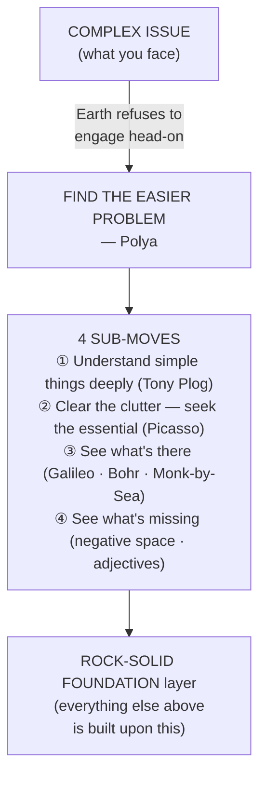

# Earth — Understand Deeply (Burger Habit 1)

**Summary**: Burger and Starbird's first habit of effective thinking ([*The 5 Elements of Effective Thinking*](./burger-5-elements-effective-thinking.md) 2012, Ch 1). Don't tackle complex issues head-on — first build rock-solid understanding of simple things. Four sub-moves: (1) understand simple things deeply · (2) clear the clutter — seek the essential · (3) see what's there · (4) see what's missing. Earth is the *foundation* habit — the wiki's other 4 habits ([Fire](./fail-to-succeed-habit.md) · [Air](./socratic-question-generation.md) · [Water](./flow-of-ideas-habit.md) · [Aether](./transformative-change-habit.md)) all assume this one is in place. Names overlap with [automaticity-and-reflex-training](./automaticity-and-reflex-training.md)'s Earth=Procedural skill-type — they are not the same (see [five-elements-mapping-reconciliation](./five-elements-mapping-reconciliation.md)).

**Sources**: [burger-5-elements-effective-thinking](./burger-5-elements-effective-thinking.md) Ch 1 (pp. 13–46); enacted throughout [burger-heart-of-mathematics](./burger-heart-of-mathematics.md) Ch 1–9.

**Last updated**: 2026-05-27 — created during the Burger ingest.

---

## The four sub-moves

### 1. Understand simple things deeply

> *"True experts continually deepen their mastery of the basics."* — Burger & Starbird 2012, p. 15

The Tony Plog story (pp. 15–17): an internationally-acclaimed trumpet virtuoso conducted a master class for advanced soloists who played dramatic virtuosic pieces. Plog asked them to play a beginner warm-up exercise. The students' rendition sounded childish. Then Plog picked up his trumpet and played the same warm-up — *exquisitely*. Each note was rich; the simple phrase had delicate shape; a flowing sense of dynamics revealed meaning in the simple notes. *"Mastering an efficient, nuanced performance of simple pieces allows one to play spectacularly difficult pieces with greater control and artistry"* (p. 16).

Operational form: when preparing for an exam, ensure you can earn 100% on every previous exam first. When learning calculus, master basic algebra. When debugging, understand the system's invariants before tracing a specific failure. The basics are a *moving target* — as you learn more, the fundamentals become at once simpler and subtler, deeper, more nuanced.

> *"If you can't solve a problem, then there is an easier problem you can't solve: find it."* — George Polya (cited Burger & Starbird p. 24)

### 2. Clear the clutter — seek the essential

The Picasso bull story (pp. 29–30): in 1945–1946, Picasso produced eighteen drawings of a bull, beginning with a fully detailed realistic image and progressively simplifying — shading vanishes, muscles disappear, three-dimensionality evaporates — until plate 18 contains ten curves and two ovals. Twelve marks. Picasso named only the eighteenth drawing *The Bull*.

The aviation pioneers' story (p. 27): when people thought of flight, they thought of *flapping*. But flapping is not the essence — it's the gentle curve of the top of the wing that creates lift. Ignoring the flapping is incredibly difficult because it's the most conspicuous, loudest, most obvious feature.

Two-step strategy: **Step 1** — identify and ignore all distracting features to isolate the essential core. **Step 2** — analyze that central issue and apply those insights to the larger whole.

### 3. See what's there

The "Cut the bull and tell us what you see" story (pp. 33–34): Starbird, in an undergraduate medieval art history class, was asked what he saw in a slide. He gave a profound-sounding answer about "halo of light representing the circle of life." The professor retorted: *"Cut the bull and tell us what you see."* Twin story: Burger, sitting in an art history course as a professor, was shown Caspar David Friedrich's *The Monk by the Sea* (1808–10) and asked what was in it. The auditorium was silent — everyone hunted for hidden meaning. The lecturer answered: *"It's a painting of a monk! His back is to us! He is standing near the shore! There's a blue sea and enormous sky!"*

Operational form: when describing what you see/feel/understand, consciously acknowledge what is actually there — no matter how mundane or obvious — rather than guess at what you think you are supposed to see. If you see it, then say it; if you don't see it, then don't claim to see it.

The Galileo gravity reframe (pp. 36–37): for ~2000 years people accepted Aristotle's claim that heavier objects fall faster because (1) it sounded reasonable and (2) Aristotle said it. The combination of reasonableness + authority is a recipe for entrenched bias. *"If you believe something only because another person — even a professor — told you it was so, then you should not view your understanding as rock solid."*

Niels Bohr quantum-mechanics technique (p. 39): on alternate days, Bohr assumed quantum mechanics was true (followed implications) and assumed it was false (followed consequences). Alternating views allowed objective exploration of each alternative.

### 4. See what's missing

The art-class "negative space" reframe (pp. 41–42): one of the most profound ways to see the world more clearly is to look for the *gaps* — the negative space.

The "add the adjective" technique (pp. 42–43): when photographs were not in color, people called them "photographs" not "black-and-white photographs." World War I was called "The Great War" or "The War to End All Wars" before WWII. Adding the qualifier *"black-and-white"* or *"First"* makes the current limitation visible — and opens minds to possibilities. *"What if we had called it 'World War I' back in 1918? Such a label might have made the possibility of a second worldwide conflict a greater reality for governments and individuals."*

Sylvan Goldman shopping-cart story (pp. 42–43): a 1937 grocery-store owner described his current limitation as *"a person can buy only what he or she can carry."* The articulation exposed the invisible — and led to inventing the wheeled shopping cart by affixing wheels and a basket to a folding chair.

---

## Where Earth fits in the wiki

| Wiki page | How Earth shows up |
|---|---|
| [active-recall](./active-recall.md) | Burger's "if you can't explain it, you don't know it" (p. 44) is the testing-effect at the deep-understanding scale |
| [5-gates-of-comprehension](./5-gates-of-comprehension.md) | Burger's 4 sub-moves are pedagogically parallel to LOCATE · REPRESENT · MINIMIZE · FALSIFY · REGENERATE — both refuse to encode material that hasn't passed |
| [bridge-load](./bridge-load.md) | "Add the adjective" is BRIDGE's Guard step (boundary identification) in narrative form |
| [ok-plateau](./ok-plateau.md) | Tony Plog's "deep work on simple, basic ideas" is the Foer-metronome forced regression *applied to fundamentals*, not to peak performance |
| [anti-tactic-detection](./anti-tactic-detection.md) | "Cut the bull and tell us what you see" is anti-tactic recognition at the perception layer |
| [understand-deeply-habit](./understand-deeply-habit.md) | this page |

---

## METER integration

| Event | Operational form | Pass floor |
|---|---|---|
| `explain_to_5yo_pass` | Can you give the simple version of a simple thing in <90 s, no jargon? | ≥70% (floor 40%) |
| `100pct_on_prior_exam_check` | Before each new test, achieve 100% on every prior test in the sequence | binary; required-gate |
| `negative_space_articulation` | For any current claim, name 2 adjacent claims that are *missing* | ≥1.5 missing-claims/main-claim |
| `clutter_clear_pass` | Reduce 1-page write-up to ≤50 words while retaining the essence | pass = same point survives |

---

## Visual — Earth as foundation

---

## Mnemonic — *"Deep · Clear · Real · Gap"*

D-C-R-G = the four sub-moves in book order.

- **Deep** = understand simple things deeply
- **Clear** = clear the clutter
- **Real** = see what's there (cut the bull)
- **Gap** = see what's missing (negative space)

The four words form a quatrain when chanted: *"Deep, clear, real, gap — that's the Earth I stand on."*

---

## Memory Checksum

Numbered inventory (recite in ≤20 s):

1. **Sub-move 1**: Understand simple things deeply (story: Tony Plog trumpet master class)
2. **Sub-move 2**: Clear the clutter — seek the essential (story: Picasso bull, 18 drawings, only plate 18 named *The Bull*)
3. **Sub-move 3**: See what's there (stories: "cut the bull" art-history class · Galileo vs Aristotle · Bohr alternating-days quantum mechanics)
4. **Sub-move 4**: See what's missing (stories: black-and-white photographs · "World War I" · 1937 shopping cart)

**Counts**: 4 sub-moves · 8 named stories · 1 Polya quote.

**Recite floor**: ≤20 s for the 4 sub-moves; ≤90 s with named stories.

---

## Related pages

- [burger-5-elements-effective-thinking](./burger-5-elements-effective-thinking.md) — parent ingest summary
- [five-elements-mapping-reconciliation](./five-elements-mapping-reconciliation.md) — collision page (Earth-habit ≠ Earth-skill-type)
- [fail-to-succeed-habit](./fail-to-succeed-habit.md) · [socratic-question-generation](./socratic-question-generation.md) · [flow-of-ideas-habit](./flow-of-ideas-habit.md) · [transformative-change-habit](./transformative-change-habit.md) — sibling habits
- [5-gates-of-comprehension](./5-gates-of-comprehension.md) · [active-recall](./active-recall.md) · [bridge-load](./bridge-load.md) — wiki pages that operationalize this habit
- [ok-plateau](./ok-plateau.md) — Tony Plog story = Foer-metronome on fundamentals
- [anti-tactic-detection](./anti-tactic-detection.md) — "Cut the bull" pattern at perception layer
