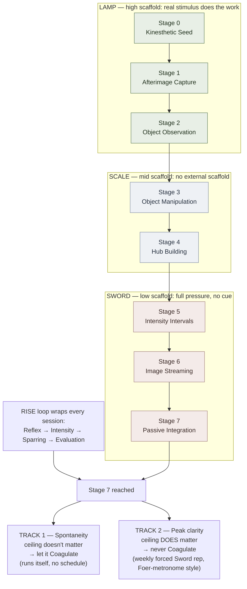

# Visualization Gym

**Summary**: The [Red Queen Skill Gym](./red-queen-skill-gym.md) instantiation for imagery vividness. [visualization-training](./visualization-training.md)'s 8-stage ladder gets a learner from near-zero imagery to Stage 7 once; it has no repeatable, escalating, measured practice engine after that. This page wires the ladder into RISE (Reflex · Intensity · Sparring · Evaluation) and Lamp/Scale/Sword phase rotation, turning a one-time climb into a gym. It does **not** redefine the 8 stages, their drills, or their pass-floors — [visualization-training](./visualization-training.md) owns those. This page owns the phase mapping, session structure, promotion/fallback rules, ongoing [METER](./meter-overview.md) telemetry, and the maintenance workout the ladder stops short of. **Status: BUILT** — [`gyms/visualization-gym.html`](../../gyms/visualization-gym.html) runs offline today (self-graded ladder tracker with pass/fail logging per stage, dedicated timer tools for Stage 1 afterimage hold / Stage 5 clarity-burst reps / Stage 6 streaming stopwatch with REMAPS stall-rescue logging, and the two-track Maintenance panel with a stale-rep warning); localStorage-persisted, JSON export. This page is the canonical owner of the Visualization Gym in this wiki.

**Sources**:
- [visualization-training](./visualization-training.md) — the 8-stage ladder this gym runs on top of
- [red-queen-skill-gym](./red-queen-skill-gym.md) — RISE protocol, Four Gym Modes, Minimum Declaration format, Lamp/Scale/Sword phases
- [automaticity-and-reflex-training](./automaticity-and-reflex-training.md) — Five Elements (Fire/Generative, Water/Perceptual), automaticity levels 0–9, the Coagulation trap / [OK Plateau](./ok-plateau.md) routing rule
- [l2-phonology-gym](./l2-phonology-gym.md) — precedent for a `*-gym.md` companion page that conforms to Red Queen Skill Gym without redefining the content page it sits on
- `/validate-idea` session, 2026-07-09 — verdict keep-with-modification on David's "gym for imagination" proposal: renamed to scope accurately (imagery vividness, not generative/creative ideation), built as a new companion page rather than merged into [visualization-training](./visualization-training.md)

**Last updated**: 2026-07-09

---

## What this page owns vs. what it doesn't

| Owned by [visualization-training](./visualization-training.md) | Owned by this page |
|---|---|
| The 8 stages and their drills | Which Lamp/Scale/Sword phase each stage belongs to |
| Per-stage "advance when" pass-floor | The gym-level promotion rule (N consecutive sessions at floor) |
| REMAPS-as-bootstrapping per stage | The RISE workout wrapping every session |
| Cross-cutting principles (allow-don't-force, etc.) | Session templates (anchor/stretch/repair) |
| — | Ongoing maintenance workout for after Stage 7 |
| — | `viz_gym.*` METER events (session-level, not one-time) |

If you find yourself restating a stage's drill content here, stop — link to [visualization-training](./visualization-training.md) instead. This is the wiki's DRY rule applied to gym pages, same split as [l2-phonology-gym](./l2-phonology-gym.md) vs its confusion-map source.

## Skill declaration

Per [red-queen-skill-gym](./red-queen-skill-gym.md)'s Minimum Declaration format:

```yaml
skill: imagery vividness (mental visualization)
skill_type: generative (Fire), perceptual (Water) at Stages 0-2
target_reflex: on a chosen cue, generate a controllable multisensory image and sustain felt presence without forcing
real_use_case: feeds remaps, NEDF Name-hook, memory-palace loci, theater-of-the-mind rehearsal
gym_mode: execution
current_stage: <self-assessed 0-7, see visualization-training stage table>
failure_mode: forcing instead of allowing; fixating on detail; skipping stages; timing broken form (Sword before Scale is stable)
anchor_drill: today's stage-appropriate ladder drill, at current pass floor
stretch_drill: one manipulation domain / one intensity rep / one stream-minute beyond yesterday's ceiling
repair_drill: REMAPS-move rescue targeted at today's specific collapse (image lost, stream stalled, hub unstable)
metrics:
  accuracy: property-recall count / chain-length completed / stream continuity (stage-dependent)
  latency: time-to-first-impression; clarity-burst latency
  branch_quality: correct REMAPS-move choice when a stall/collapse is diagnosed
  stability: image/hub holds across the session; across a 1-week gap
  recovery: stall-to-resumed-stream time
  transfer: spontaneous unprompted imagery frequency (the Stage 7 signal)
pass_rule: stage-specific (see visualization-training Advance-when criteria); gym-level — 3 consecutive sessions at the current phase's floor before phase-advance
fallback_rule: drop timer/pressure, return one phase down; any strain signal (scalp tension) triggers immediate fallback
review_rule: D1/D3/D7 spot-check of hub stability + spontaneous-imagery count
session_length: 10-15m
weekly_frequency: 5-7x — daily short sessions outperform weekly long ones (visualization-training's own Consistency-over-intensity principle)
```

Not a [recognition gym](./recognition-gym-pattern.md) — that pattern is explicitly scoped to classifying an already-presented item under timer. Imagery generation is production, not classification, so this instance follows [red-queen-skill-gym](./red-queen-skill-gym.md)'s general template (`gym_mode: execution`) instead.

## Stage-to-phase mapping

The ladder's 8 stages sort cleanly onto the three [Lamp / Scale / Sword](./automaticity-and-reflex-training.md) phases by scaffolding level (high → low), per that page's expertise-reversal-effect rule:

| Phase | Ladder stages | Scaffolding | What's trained |
|---|---|---|---|
| **Lamp** | 0 Kinesthetic Seed · 1 Afterimage Capture · 2 Object Observation | High — the image is scaffolded by real sensory input (a felt hand-movement, an afterimage, a just-seen object) | Establishing *any* felt presence; recall from a fresh external cue |
| **Scale** | 3 Object Manipulation · 4 Hub Building | Mid — the image is held with no external scaffold, controlled and discriminated under rising internal load | Holding + transforming an image without losing it; telling "stable" from "collapsing" |
| **Sword** | 5 Intensity Intervals · 6 Image Streaming · 7 Passive Integration | Low — full self-generation under time or attention pressure, no scaffold at all | Peak clarity on demand; sustained generation under narration pressure; spontaneous imagery with no cue |

Do not run Sword-phase drills (timed clarity bursts, unbroken streaming) on a learner who hasn't passed Stage 4 — per [red-queen-skill-gym](./red-queen-skill-gym.md)'s "do not time broken form" rule and the expertise-reversal effect, pressure applied before the substrate is stable collapses the image instead of testing it.

## RISE workout

| RISE element | Applied here |
|---|---|
| **Reflex** | The specific target for the *current* phase — e.g. Lamp: "hold a simple-object afterimage 30s"; Scale: "walk the 5-locus hub without spatial confusion"; Sword: "sustain image-streaming 5+ minutes" |
| **Intensity** | Session cadence and duration (see Skill declaration above), not raw content difficulty — automaticity comes from load, not more stages |
| **Sparring** | Stage 5's clarity-burst-then-relax under a strict window; Stage 6's stall-and-rescue (calling a REMAPS move mid-collapse); Stage 3's full-palette cross-domain chains — these are the adversarial reps that prove the skill survives contact, not passive familiarity |
| **Evaluation** | Track hold-duration, chain-length, VVIQ trend, stream-duration, stall-recovery time, and spontaneous-occurrence frequency — the `metrics` block above, logged per session via the METER events below |

## Session template

Every session runs the three drill roles from [red-queen-skill-gym](./red-queen-skill-gym.md)'s Universal Gym-Creation Framework:

1. **Anchor (5m)** — the stage-appropriate drill at today's current pass floor. Stable work, no pressure added.
2. **Stretch (3-5m)** — one step harder than yesterday: one more manipulation domain, one more clarity-burst rep, one more minute of streaming.
3. **Repair (2-5m)** — direct attack on yesterday's specific collapse, using the REMAPS-move-as-rescue mechanism [visualization-training](./visualization-training.md) §REMAPS as Stream-Stall Rescue already defines.

10-15 minutes total, 5-7x/week. This is a floor, not a ceiling — the point is consistency, per [visualization-training](./visualization-training.md)'s own "consistency over intensity" cross-cutting principle.

## Maintenance mode: two tracks, opposite Coagulation rules

Stage 7 (Passive Integration) is the ladder's terminus, but it isn't the gym's terminus — it splits into two sub-skills that need **opposite** long-term treatment, per [automaticity-and-reflex-training](./automaticity-and-reflex-training.md)'s Coagulation-trap / [OK Plateau](./ok-plateau.md) routing rule:

| Sub-skill | Ceiling matters? | Routing |
|---|---|---|
| **Spontaneity / felt presence** (the Stage 7 target itself) | No — the goal *is* automatic, unprompted imagery | Let it Coagulate. Once passive integration is running, it needs no conscious maintenance drilling; keep it light and enjoyable per Stage 7's own rule |
| **Peak clarity ceiling** (the VVIQ trend Stage 5 tracks) | Yes — there is real headroom above any given plateau | Never let this Coagulate. Run periodic Stage-5-style intensity bursts forever, pushed slightly past the current ceiling (the Foer-metronome logic from [ok-plateau](./ok-plateau.md)), even after Stage 7 is reached |

Concretely: the maintenance-mode weekly workout is one Sword-phase intensity-interval session (Track 2) layered on top of the passive, driftingly-automatic Stage 7 practice (Track 1) that no longer needs a scheduled slot. Skipping Track 2 because Track 7 "already happens on its own" is the specific failure mode this section exists to name — the ceiling flatlines exactly the way [ok-plateau](./ok-plateau.md) predicts for any ceiling-matters skill left to run on autopilot.

## Failure modes specific to this gym

- **Running Sword before Scale is stable** — expertise-reversal overload; see phase table above.
- **Treating Stage 7 as "done, stop practicing"** — kills the ceiling track (see Maintenance mode above); the ladder's terminus is not the gym's terminus.
- **Timing broken form** — adding Stage 5's timer before Stage 3-4's untimed pass criterion is met corrupts the read on whether the image is actually stable.
- **Misfiling this as a recognition gym** — it isn't; see Skill declaration's boundary note. A future 4th [recognition-gym-pattern](./recognition-gym-pattern.md) instance should not cite this page as a precedent.

## METER events

Namespace `viz_gym.*` — distinct from [vivid-palace-fast-experiment](./vivid-palace-fast-experiment.md)'s `viz_session`, which logs a fixed 7-day experiment rather than ongoing gym sessions.

| Event | Fields | Purpose |
|---|---|---|
| `viz_gym.session` | `date`, `phase` (Lamp/Scale/Sword), `anchor_done`, `stretch_done`, `repair_done`, `duration_min` | One row per session |
| `viz_gym.clarity_burst` | `duration_s`, `self_rated_clarity` (1-5) | Sword-phase Track 2 (ceiling) reps |
| `viz_gym.collapse` | `stage`, `trigger`, `repair_drill_used`, `recovered` (bool) | Every image/hub/stream collapse and what fixed it |
| `viz_gym.stall_rescue` | `remaps_move`, `recovered` (bool) | Stage 6 stall-and-rescue, extends the `remaps_stall_rescue` field [vivid-palace-fast-experiment](./vivid-palace-fast-experiment.md) already logs into ongoing use |
| `viz_gym.maintenance_check` | `track` (spontaneity / ceiling), `result` | Weekly check that Track 2 hasn't been silently dropped |

## Related pages

- [`gyms/visualization-gym.html`](../../gyms/visualization-gym.html) — the built tool; also listed on [`gyms/index.html`](../../gyms/index.html)
- [web-gym-generation-schema](./web-gym-generation-schema.md) — the app-generation contract; this tool is a self-graded ladder tracker (BeamNG-tracker shape), not a classification quiz, because imagery vividness has no ground truth to auto-grade against
- [visualization-training](./visualization-training.md) — the 8-stage ladder this gym instantiates; owner of all stage content
- [vivid-imagery](./vivid-imagery.md) — theory layer: imagery channels, neural overlap, aphantasia spectrum
- [red-queen-skill-gym](./red-queen-skill-gym.md) — the universal gym-creation framework this page conforms to
- [automaticity-and-reflex-training](./automaticity-and-reflex-training.md) — Lamp/Scale/Sword phases, Five Elements, the Coagulation trap
- [ok-plateau](./ok-plateau.md) — the ceiling-matters routing rule behind Maintenance mode Track 2
- [l2-phonology-gym](./l2-phonology-gym.md) — sibling `*-gym.md` instance; naming and SRP-split precedent
- [recognition-gym-pattern](./recognition-gym-pattern.md) — the sibling pattern this gym is explicitly *not* an instance of
- [vivid-palace-fast-experiment](./vivid-palace-fast-experiment.md) — the fixed 7-day experiment `viz_session` event this page's `viz_gym.*` namespace extends
- [remaps](./remaps.md) — the transformation moves used as Repair-drill rescues
- [skill-progression-stages](./skill-progression-stages.md) — canonical stage/level numbering cited throughout
- [composability-index](./composability-index.md) — this page's candidate unlock registration
- [drill-generator](./drill-generator.md) — the underlying drill-role engine (anchor/stretch/repair)

---

## U — See (CAST)
1. 8 ladder stages sorted into 3 Lamp/Scale/Sword phases
2. Two post-Stage-7 maintenance tracks with opposite Coagulation rules

## D — Name (NEDF)
1. Visualization Gym = the RISE/phase wiring that turns the ladder into a repeatable gym
2. Distinguisher: doesn't redefine the 8 stages — visualization-training owns those
3. Failure mode: mistaking it for a recognition gym, or for the ladder itself

## F — Do (SPEAR)
1. Self-assess current stage → find its Lamp/Scale/Sword phase
2. Run anchor → stretch → repair each session
3. Past Stage 7: keep Track 2 (ceiling) scheduled even though Track 1 (spontaneity) runs itself

## B — Watch (HEART)
1. Sword-phase timer applied before Scale is stable
2. Track 2 silently dropped because Track 1 "already happens"
3. Repair drill skipped — same collapse recurs session after session

## L — Predict (ORACLE)
1. Consistent anchor/stretch/repair → phase-advance within N sessions
2. Track 2 abandoned post-Stage-7 → VVIQ ceiling flatlines (OK Plateau signature)

## R — Act (GRACE)
1. New stage reached → re-derive its Lamp/Scale/Sword phase, don't assume it inherits the old one
2. Ceiling flat for ≥4 sessions → suspect OK Plateau before suspecting an innate limit

## Mnemonic

**Climb once, train forever.** [visualization-training](./visualization-training.md) is the one-time ascent up 8 stages; this page is the gym membership that keeps the muscle from atrophying — and the two post-Stage-7 tracks (**let spontaneity Coagulate, never let the ceiling Coagulate**) are the specific reason the membership doesn't cancel itself at Stage 7.

## Checksum

1. Which three stages map to Lamp, which two to Scale, which three to Sword?
2. Name the two Coagulation tracks this gym runs after Stage 7, and which one must never be allowed to Coagulate.
3. What does this page own that [visualization-training](./visualization-training.md) doesn't, and vice versa?

## Visual


