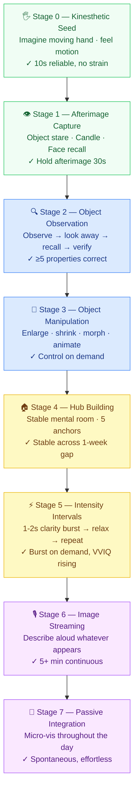

# Visualization Training

**Summary**: Eight-stage drill ladder for building mental imagery from near-zero to persistent inner world. The upstream training path that feeds [remaps](./remaps.md), [nedf-overview](./nedf-overview.md) Scene slots, and [Memory Palace](./memory-palace-architecture-for-neural-os.md). Users starting from aphantasia-adjacent imagery can reach retrieval-grade scenes within days to weeks of consistent practice.

**Sources**:
- `Clippings/Exploring Cognitive Skills Imagery and Visualization.md` (HappyNeuron Pro, 2024)
- `Clippings/Learn Techniques to Improve Visualization.md` (Art of Memory, 2012)
- `Clippings/What are the best techniques to improve visualization.md` (Reddit r/hyperphantasia, 2022)
- Art of Memory forum: `improving-visualization`, `visualization-exercises`, `how-to-improve-visualization-and-mental-imagery`, `tips-on-how-to-increase-visualization`, `i-would-like-help-with-first-steps-in-visualization` (fetched 2026-05-15)

**Last updated**: 2026-07-09 — added [visualization-gym](./visualization-gym.md) cross-link (the Red Queen Skill Gym instantiation of this ladder)

**Diagrams**:
- `wiki/assets/visualization-stage-ladder.excalidraw` — color-coded 8-stage ladder with drills and advance criteria
- [Open in Excalidraw.com](https://excalidraw.com/#json=SvhHI7y_WDl7jVjI5QXAT,6hVCX69CDpq7mBeAur3ZvQ)

**Theory layer**: [scene-grammar](./scene-grammar.md) — the Elements of Art map 1:1 to Stage 3 domains; the Principles of Design are the composition rules for Stage 4 hub scenes

**Sibling target**: [theater-of-the-mind](./theater-of-the-mind.md) — same machinery (mental imagery), different target. Visualization-training builds the technique substrate (concept-target imagery: NEDF Name-hook, palace loci, REMAPS scenes). Theater of the Mind uses the same machinery for **identity rehearsal** — running scenes of oneself *as the kind of person one is becoming*, for [self-image](./self-image.md) re-programming. Stage 7 (Passive Integration) is the natural feeder into Theater of the Mind: once mental imagery is spontaneous, the practitioner has the substrate to run effective identity-rehearsal sessions. Pre-Stage-7 practitioners pair Theater with the structural-scaffolding mode in [memory-palace-for-aphantasia](./memory-palace-for-aphantasia.md) §3-Framework Mental Scene Builder.

---

## Stage Ladder — Quick Reference

*Green = sensory foundation · Blue = imagery control · Yellow = intensity + space · Purple = generative flow*

---

## The Foundational Reframe

Before drilling, clear the most common misconception:

> "It's not exactly visual... It's more about *feeling of having experience of seeing something*." — Tomasz Śliwa, Art of Memory forum (source: `i-would-like-help-with-first-steps-in-visualization`)

The goal is not photographic recall. **Photographic memory has no verified adult instances** despite decades of research — the only candidate ever studied refused re-testing (source: `Clippings/Eidetic Memory vs. Photographic Memory Do They Exist.md`). The goal is **phenomenological presence**: inhabiting a sensory space, not rendering pixels.

This reframe matters for Neural OS because every slot in [remaps](./remaps.md), [nedf-overview](./nedf-overview.md), [spear-overview](./spear-overview.md), and [Memory Palace](./memory-palace-architecture-for-neural-os.md) asks for *felt presence* of a scene, not visual fidelity. Even world-class memory athletes achieve only partial clarity on key image elements, not perfect detail (source: AoM forum thread `how-to-improve-visualization-and-mental-imagery`).

---

## Types of Imagery

The six sensory channels (source: `Clippings/Exploring Cognitive Skills Imagery and Visualization.md`):

| Channel | What it involves | Mnemonic relevance |
|---|---|---|
| **Visual** | Mental pictures, color, shape, motion | Palace scenes, NEDF Name-hook |
| **Auditory** | Sounds, music, speech heard internally | Sound-level REMAPS |
| **Kinesthetic** | Sense of movement, motor rehearsal | [motoric-encoding-systems](./motoric-encoding-systems.md), SPEAR Execution |
| **Olfactory** | Imagined smells | REMAPS Sensations |
| **Gustatory** | Imagined tastes | REMAPS Sensations |
| **Tactile** | Touch, texture, temperature, weight | REMAPS Sensations; spatial grounding |

**Neural mechanism**: visualization activates the same neural pathways as actual perception. Imagining a visual scene activates the visual cortex just as real stimuli do (source: `Clippings/Exploring Cognitive Skills Imagery and Visualization.md`, citing Pearson et al. 2019). This is why vivid scenes are retrievable — they are structurally close to real experience.

---

## The Training Spectrum

Imagery is a skill on a continuous scale from near-aphantasia to hyperphantasia. All positions are trainable. Expected timeline for a practitioner going from average to highly vivid: **a few months** of consistent daily practice (source: Reddit r/hyperphantasia, Jessenstein comment, ~March 2022 to present).

The [memory-palace-for-aphantasia](./memory-palace-for-aphantasia.md) page is the constraint-aware reading of the encoder spine for users at the low end of the spectrum. This page is the **training path for moving along that spectrum** — not an alternative to it.

---

## The Eight-Stage Drill Ladder

Work stages in order. Do not skip. Each stage builds the substrate the next stage requires.

### Stage 0 — Kinesthetic Seed

**Why first**: if visual imagery feels completely absent, the kinesthetic channel is almost always partially available. Establishing *any* felt presence opens the door for visual to follow.

**Drill**: Close your eyes. Imagine slowly moving your right hand, or scratching your nose. Don't try to see it — just feel it happening. Sustain for 30 seconds.

**Advance when**: you can reliably produce the felt sensation of hand movement in 10 seconds without strain. (source: AoM forum, `i-would-like-help-with-first-steps-in-visualization`)

---

### Stage 1 — Afterimage Capture

**Why**: afterimages are the weakest possible visual imagery — they require the external world to do the generation. The skill is just holding and tracing them.

**Drill A — Object stare** (source: `Clippings/Learn Techniques to Improve Visualization.md`):
1. Choose a simple object (pen, cup). Avoid high-detail objects at first.
2. Look at it for 30 seconds, mentally tracing outlines and colors.
3. Close eyes. Hold the afterimage. Trace it again.
4. Repeat 5–10 times per session.
5. Progress to faces, complex photographs, paintings.

**Drill B — Candle/Trataka** (source: AoM forum, `improving-visualization`; `i-would-like-help-with-first-steps-in-visualization`):
1. Stare at a candle flame for 60–90 seconds, observing color, shape, movement.
2. Close eyes. Trace the afterburn visible in the darkness.
3. The afterburn is an external anchor — keep tracing before it fades.

**Drill C — Face recall** (source: AoM forum, `i-would-like-help-with-first-steps-in-visualization`, Josh Cohen):
1. Look at a stranger's face for a moment in public.
2. As soon as you pass them, close your eyes and try to hold the visual impression.
3. Do not worry about detail. Hold *any* impression.

**Key principle**: the harder you try to force the image, the faster it vanishes. *Allow* the afterimage; do not grasp it. (source: AoM forum, `tips-on-how-to-increase-visualization`)

**Advance when**: can hold a simple-object afterimage for 30 seconds without strain.

---

### Stage 2 — Object Observation Cycle

**Why**: builds recall from memory rather than afterimage — the first step toward fully internally generated imagery.

**Drill** (source: AoM forum, `how-to-improve-visualization-and-mental-imagery`):
1. Observe any object carefully (color, texture, shape, fine details, smell, weight).
2. Look away. Recall as many properties as you can.
3. Look back. Check accuracy.
4. Repeat. Aim to catch what you missed.

**Drawing variant** (source: AoM forum, `improving-visualization`):
1. Draw a simple shape (star, pentagon, or design) on paper.
2. Immediately close eyes. Mentally redraw against the afterimage.
3. Repeat until you can hold the drawing without the physical reference.

**Advance when**: can recall ≥5 distinct properties of an observed object without looking, verified correct.

---

### Stage 3 — Object Manipulation

**Why**: controllable imagery — not just holding a still image but changing it on demand. This is the first stage that directly feeds [remaps](./remaps.md) (Rotate, Exaggerate, Modify moves).

**Diagrams**: `wiki/assets/stage3-manipulation-domains.excalidraw` · [Open in Excalidraw.com](https://excalidraw.com/#json=ZCVMklclfp7TG9w9Yw6gl,4Vsv7iPn1C5OC-ZHAzrhlQ)

---

#### Progressive Object Familiarization — James's three-stage ladder (source: AoM forum, `tips-on-how-to-increase-visualization`)

1. **Sensory knowledge**: texture, smell, appearance, history. Hold the object's felt reality.
2. **Ordinary manipulation**: rotate it, stretch it, tie it into a knot, make it bounce.
3. **Extraordinary transformation**: animate it, add physics, make it interact with other objects.

Do not jump to step 3. Each step builds the internal degrees of freedom the next step requires.

---

#### Manipulation Domains — systematic drill matrix

Practice one domain at a time on the same object (apple is the recommended seed object). Master each move in a domain before moving to the next. Cross-domain mixing comes last.

| Domain | Specific moves |
|---|---|
| **Rotation** | X-axis (nod) · Y-axis (spin) · Z-axis (roll) · CW vs CCW · slice (half-rotation of a cross-section) · inner rotation (core spins, surface still) · outer rotation (shell spins, core still) · tumble (simultaneous multi-axis) |
| **Time** | freeze frame · slow-motion (0.1×) · fast-forward (10×, 100×) · rewind · aging / decay (seconds → years → decades) · jump forward 1 hour / 1 year / 100 years · reverse lifecycle (ash → log → tree → seed) |
| **Scale** | zoom in to cell level · zoom in to atomic lattice · zoom out to room-filling · zoom out to planetary · stretch along one axis only · compress along one axis · asymmetric (shrink one half, grow other) |
| **Material / Phase** | solid → liquid → gas → plasma · swap material (wood → metal → glass → rubber → flesh → crystal) · transparency sweep (opaque → translucent → invisible) · **Texture sub-axis**: tactile roughness sweep (ultra-smooth → satin → rough → coarse → jagged) · reflectivity sweep (matte → satin → glossy → mirror) · material grain family (wood grain / stone pores / metal brushed / fabric weave / skin / crystal facets) · micro-zoom into texture until grain becomes landscape |
| **Color / Light** | hue sweep (full spectrum) · brightness (dim → glow → blinding) · x-ray (see interior structure) · thermal (color by heat gradient) · bioluminescence pulse · see [color-theory-mental-model](./color-theory-mental-model.md) for full domain |
| **Space / Position** | translate along X / Y / Z · orbit around a fixed point · embed into a surface (half submerged) · mirror / reflect across a plane · clone and stack · shatter and scatter in 3D · positive/negative space toggle (attend to the voids between and around) |
| **State / Structure** | controlled explosion (slow-motion debris) · implosion · fragment into N pieces · reassemble from fragments · merge two objects into one · split one into two distinct halves |
| **Physics** | zero gravity (free float) · reverse gravity (fall upward) · elastic bounce (ultra-slow deformation on impact) · magnetism (attract / repel a second object) · fluid dynamics (pour, splash, ripple) |

---

#### Drill protocol

1. **Single-domain runs** — pick one domain, cycle through all its moves on the same object without losing the image.
2. **Cross-domain pairs** — chain one move from Domain A immediately into one from Domain B (e.g. rotate → then age 50 years; scale to micro → then material swap to glass).
3. **Full-palette chains** — 5+ moves from 3+ different domains in sequence without pausing. This is the advance criterion.

**Object transformation seed drill** (source: AoM forum, `how-to-improve-visualization-and-mental-imagery`):
- Start with an apple: engage all senses first (smell, surface texture, weight, temperature)
- Then: enlarge → shrink → rotate → rewind time → material swap → explode → reassemble

**Sensory integration note** (same source): when executing any domain move, simultaneously hear the sound it would produce, feel the surface change, smell the ambient shift. *"If it's an elephant playing a saxophone, hear the trumpet and the sax."*

---

**Advance when**: can execute a 5-move cross-domain chain on one held object without the image collapsing; moves span at least 3 different domains.

---

### Stage 4 — Hub Building

**Why**: a stable spatial anchor transforms transient flashes into a retrievable persistent space. This is the memory palace at its foundation — but also the visualization training tool.

**Drill** (source: Reddit r/hyperphantasia, Jessenstein):
1. Choose one location (a room, a house). Keep it **constant** — same size, same shape, same objects.
2. Each session: enter the hub, walk through it, touch the walls, knock over a plate, look at your hands.
3. Map it out over the course of weeks — not all at once.
4. When imagery is uncertain, use spatial grounding first: run your hands along the walls, identify the doorways, feel the furniture under you.

The hub functions as a launch point: once you have your bearings in the stable space, it is easier to branch into new visualizations.

**Note**: One practitioner mapped the entire *Tranquility Lane* map from Fallout 3 and could re-enter it a week later without thinking about it. The stability principle is what makes palaces durable. (source: Reddit r/hyperphantasia, Jessenstein)

**Advance when**: can walk a 5-location hub in sequence without spatial confusion; rooms remain stable across a 1-week gap.

---

### Stage 5 — Intensity Intervals

**Why**: trains the maximum-clarity end of the range, which then raises the average. Short bursts protect against the strain that kills imagery.

**Drill** (source: AoM forum, `how-to-improve-visualization-and-mental-imagery`):
- Visualize at maximum possible clarity for 1–2 seconds.
- Then deliberately relax. Do not try to sustain.
- Repeat 5–10 times.

*"Practice occasionally seeing a few images as vivid and clear as you can for even just a second, then relax."*

**Key rule**: if you feel any strain (often felt as scalp-muscle tension), you are pushing too hard. The correct state is *allowing*, not forcing. Relax completely and re-enter. (source: Reddit r/hyperphantasia, Jessenstein)

**Do not fixate on details** at this stage. Details fill in automatically over time. Fixing attention on a specific element causes the whole image to collapse. Keep attention flowing.

**Advance when**: can generate a 1–2 second clarity burst on demand; VVIQ score trend is improving.

---

### Stage 6 — Image Streaming

**Why**: the highest-leverage fast-ramp technique across all sources. Multiple practitioners reported vivid pseudohallucinations within **days** of starting. Verbal description forces the generative channel open and sustains attention on the emerging image.

**Image Streaming protocol** (Win Wenger method; source: AoM forum, `tips-on-how-to-increase-visualization`):
1. Close eyes. Relax — like preparing to sleep (do not tighten eyes or face).
2. Begin describing aloud, in present tense, whatever appears in your mind's eye, however faint.
3. Do not decide what to see. Describe what is already there, however vague.
4. Do not pause to evaluate or judge. Narrate continuously.
5. Use all senses: describe colors, textures, sounds, smells, motion as they arise.
6. Session length: 5–20 minutes.

**Critical failure mode**: stopping to evaluate or control the images kills the stream. The narration must outpace the critical mind. If you catch yourself trying to *make* something appear, return to *describing* whatever faint impression is present.

**Distinction from guided meditation**: in guided meditation, an instructor tells you what to see. In image streaming, you describe what *already appears* without choice. The agency is inverted.

**Advance when**: can sustain continuous verbal description for 5+ minutes; spontaneous vivid images begin appearing unprompted.

---

### Stage 7 — Passive Integration

**Why**: hours of low-pressure background practice compound faster than dedicated sessions alone. The goal is to keep imagery alive throughout the day without mental energy cost.

**Drills** (source: Reddit r/hyperphantasia, Jessenstein; AoM forum, `tips-on-how-to-increase-visualization`):

- **Traffic game**: while in traffic or on transport, mentally color passing cars differently, or imagine them exploding/floating/shrinking. Weeks of this builds background imagery habit.
- **Micro-disruptions**: throughout the day, pick any object and briefly visualize it falling, morphing, or flying. *"Throw a plate against a wall. Small stuff that keeps a lightly held phantom image in your head."*
- **Peripheral extension** (while driving/walking): when a car passes, feel/see it continuing on well out of physical vision, down the road toward a building you passed 30 seconds ago. Builds the spatial-sensory field beyond the physical viewport.
- **Pre-sleep hub walk**: as you fall asleep, walk through your hub, tracing walls and furniture. Merges practice with sleep onset. (source: Reddit r/hyperphantasia, Jessenstein)

**Key insight**: passive visualization only works if it stays *enjoyable*. The moment it feels like effort, stop. Keep it light, keep it fun. Strain at this stage undoes Stage 5's gains. (source: Reddit r/hyperphantasia, Jessenstein)

**Advance when**: passive micro-visualizations happen spontaneously without prompting; image streaming sessions extend to 10+ minutes with consistent vividity.

---

## REMAPS During Training — Imagery Bootstrapping

[REMAPS](./remaps.md) is normally applied *after* an image is established — it polishes and vivifies what's already in a slot. But at Stages 0–3, REMAPS moves function differently: they are **imagery-generation prompts**, not amplifiers.

When you command "make it 10× brighter" against a barely-there afterimage, you are not decorating something you have. You are giving the brain a directional production target. The move creates the image by forcing the generation channel to produce something specific.

This is the Imagery Bootstrapping mechanism: **use REMAPS earlier than the normal use-case allows, as a scaffold for generation rather than a polish for clarity.**

### Per-Stage Routing

Not all six moves work at all stages. The usable set expands as imagery capacity grows:

| Stage | Usable moves | How to apply them |
|---|---|---|
| **0 — Kinesthetic seed** | **S** (Sensations), **M** (Move) | S: add temperature, weight, texture to the felt hand-movement. M: give the movement a direction and resistance — the hand isn't floating, it's pushing through something. |
| **1 — Afterimage** | + **E** (Exaggerate) | E: mentally make the afterimage 10× brighter, 10× larger. Don't wait for it to become brighter — command it. M: change its color from what it was to a vivid opposite. |
| **2 — Object observation** | + **R** (Rotate), **A** (Associate) | Before closing eyes: R — view the object from above, from below, from the side. Build the 3D model. A — link the object to an existing vivid locus you already know. |
| **3 — Object manipulation** | + **P** (Play) | This stage is already REMAPS M in full (Modify, Merge, Move, animate, morph). Add P: make something absurd happen — the object screams, bounces off the ceiling, turns into a small animal. Play keeps the generative channel from tensing up. |
| **4 — Hub building** | Full palette | P (Palace/Path): the hub IS the palace — each locus gets a Path anchor. S (Sensations): sensory grounding (touch walls, smell) is REMAPS S applied at room scale. |
| **5 — Intensity intervals** | Full palette | During the 1–2s clarity burst: E — exaggerate the single most distinctive feature of the scene. This gives the burst a target rather than just "try harder." |
| **6 — Image Streaming** | Full palette as stall rescue | When the stream dies: reach for any REMAPS move and narrate the result. See below. |
| **7 — Passive integration** | A, P | A: anchor micro-visualizations to loci you already know. P: keep it light and fun — humor keeps the passive channel open without strain. |

**Premature REMAPS failure mode**: applying E, R, or A at Stage 0–1 when there is literally nothing yet to amplify. At Stage 0, only S and M work reliably because they operate on the kinesthetic channel directly. E and R need at least a faint visual impression as their input. If you try to Exaggerate nothing, you get effortful straining — the opposite of what REMAPS is for.

### REMAPS as Stream-Stall Rescue (Stage 6)

The deepest application: when Image Streaming stalls mid-session (stream dies, silence sets in), call a REMAPS move by name and narrate the result:

- **E**: "What if this wall were 100 feet tall? I see the ceiling far above..."
- **M**: "The floor becomes water. I feel it underfoot, cold and still..."
- **S**: "I notice a smell in this corner. It's... describe whatever arises."
- **P**: "Something absurd happens at the desk. A small creature appears and..."
- **R**: "I rotate — I'm now viewing the room from the ceiling, looking down..."
- **A**: "This object reminds me of [known anchor]. I place them together..."

Each move re-ignites the generative channel. The stream teaches you which REMAPS moves are strongest at your current imagery level — log them in the METER `notes` field during the 7-day experiment.

### Running Both Together

During the [7-day experiment](./vivid-palace-fast-experiment.md), apply Imagery Bootstrapping automatically:

- **Phase B (hub entry)**: use S and M — feel the door handle, smell the entrance, hear the room's ambient sound.
- **Phase C (streaming)**: when the stream stalls, call a REMAPS move aloud. Which one you reach for is diagnostic — it shows which channel is strongest right now.
- **Phase D (close)**: note which REMAPS move broke the last stall. After 7 days, a pattern will emerge.

---

## Cross-Cutting Principles

These apply at every stage:

| Principle | Mechanism |
|---|---|
| **Allow, don't force** | Strain activates the wrong muscle group — scalp tension, not generation. Relaxation is the prerequisite, not a warm-up. |
| **Details fill in over time** | Do not fixate on sharpness. Attend to the overall scene; detail will self-assemble. Premature fixation collapses the image. |
| **Expectation shapes outcome** | *"If you expect yourself to have bad or waning visual abilities, you will."* (Jessenstein) Assume constant improvement. |
| **All senses, not just visual** | Kinesthetic and tactile channels are often stronger than visual at the start. Lead with what is available. |
| **Consistency over intensity** | Daily 10-minute sessions outperform weekly 2-hour sessions. The channel needs regular use to stay open. |
| **Sensory reduction lifts internal signal** | Reducing external stimulation (less TV, e-ink screens, simple food for a period) heightens contrast for internally generated imagery. (source: AoM forum, `tips-on-how-to-increase-visualization`) |
| **Nutrition matters** | Multiple practitioners noted nutrition as a real variable. Not a primary lever, but a background one. |

---

## METER Pass-Floors

| Stage | Pass criterion |
|---|---|
| 0 — Kinesthetic seed | Reliably evokes felt sensation of hand movement within 10s, no strain |
| 1 — Afterimage capture | Holds simple-object afterimage 30s, no forced effort |
| 2 — Object observation | Recalls ≥5 correct properties of an observed object without looking |
| 3 — Object manipulation | Enlarges/shrinks a held object on demand; completes James step 2 (rotation + stretch) without image collapse |
| 4 — Hub building | Walks 5-location hub in order; hub stable across 1-week gap without resetting |
| 5 — Intensity intervals | Generates 1–2s clarity burst on demand; VVIQ trend positive over 2 weeks |
| 6 — Image streaming | Continuous verbal description 5+ minutes; spontaneous unprompted images occurring |
| 7 — Passive integration | Micro-visualizations occurring spontaneously; image streaming sessions 10+ min with consistent vividity |

---

## NEDF Card: Image Streaming

| Slot | Content |
|---|---|
| **Name-hook** | A painter narrating a dark canvas aloud — each word summons a brushstroke from the dark |
| **Essence** | Verbal description forces the generative imagery channel open; articulation sustains attention on the emerging image without the critical mind interrupting |
| **Distinguisher** | NOT guided meditation (someone tells you what to see) — in image streaming you describe whatever appears; agency is inverted |
| **Failure** | Pausing to evaluate or judge kills the stream immediately; narration must outpace the critical mind |

---

## Neural OS Routing

- This page is **upstream** of [remaps](./remaps.md): REMAPS amplifies existing imagery; this page builds that imagery substrate from the ground up.
- Stage 1–2 feeds [vivid-imagery](./vivid-imagery.md): the science of why afterimage-based training works is there.
- Stage 4 (hub) is the foundation palace per mpl-syntax and [Memory Palace](./memory-palace-architecture-for-neural-os.md).
- Stage 6 (Image Streaming) + Stage 4 (hub) = **Vivid Palace Fast** candidate unlock — see [composability-index](./composability-index.md).
- This is the training path **out of** the constraint described in [memory-palace-for-aphantasia](./memory-palace-for-aphantasia.md).
- [visualization-gym](./visualization-gym.md) wires this ladder into [red-queen-skill-gym](./red-queen-skill-gym.md)'s RISE/Lamp-Scale-Sword machinery — this page owns the 8 stages and their drills; that page owns the repeatable session structure and the post-Stage-7 maintenance workout.
- Creative writing (30-minute sessions of imagining scenes as clearly as possible) activates the same channel as Stage 6 — a side-door entry point. (source: AoM forum, `tips-on-how-to-increase-visualization`)

---

## Related Pages

- [vivid-imagery](./vivid-imagery.md) — science layer: types, neural overlap, aphantasia spectrum
- [scene-grammar](./scene-grammar.md) — theory layer: Elements of Art (Stage 3 domain vocabulary) + Principles of Design (Stage 4 composition rules)
- [color-theory-mental-model](./color-theory-mental-model.md) — full theory for the Color/Light domain: 3D cylinder, Čižiková 4-axis, harmony patterns
- [remaps](./remaps.md) — the transformation system this training feeds
- [memory-palace-for-aphantasia](./memory-palace-for-aphantasia.md) — constraint-mode operating rules; this page is the path out
- [Memory Palace](./memory-palace-architecture-for-neural-os.md) — where Stage 4 hubs become full palaces
- [nedf-overview](./nedf-overview.md) — the Name-hook scene slot this training makes vivid
- [motoric-encoding-systems](./motoric-encoding-systems.md) — kinesthetic channel (Stage 0 entry point) in full
- [representation-rules](./representation-rules.md) — what good scene-filling looks like once imagery is available
- [composability-index](./composability-index.md) — registered candidate unlocks involving this page

---

## U — See (CAST)
1. 8-stage imagery drill ladder
2. Near-zero → persistent inner world

## D — Name (NEDF)
1. Visualization training = imagery drill ladder
2. Distinguisher: 8 stages, drill-progression
3. Failure mode: skipping stages

## F — Do (SPEAR)
1. Self-assess current stage
2. Drill that stage daily

## B — Watch (HEART)
1. Stage-skipping
2. Drill-drift to passive imagination

## L — Predict (ORACLE)
1. Stage → predict next-stage drill
2. Daily practice → predict stage progression

## R — Act (GRACE)
1. Imagery weak → drill current stage
2. Encoding fails → check imagery stage