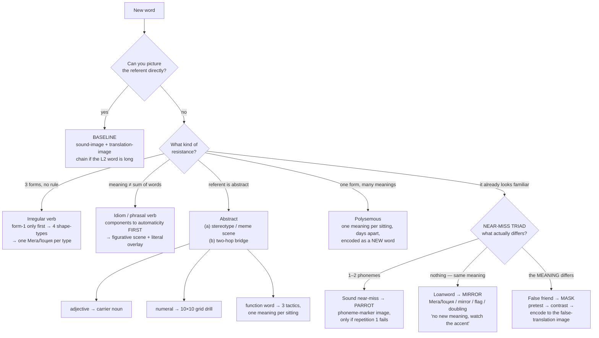

# Vocabulary Word-Type Routing

**Summary**: A routing page for foreign-language vocabulary: given a word-type, apply this encoding move, *because this is why the type resists the default*. The default is the concrete/imageable word (sound-image + translation-image); every other row on this page is a named deviation from it, keyed to the specific thing that breaks. Also the owner page for **МегаЛоция** — a whole-environment re-skin applied per class, so class membership is read off the scene's genre instead of off a per-item tag.

**Sources**: Ягодкин Н.А., Згода А.Н. - Учись учиться - 2023.pdf (chapter «Запоминание разных типов слов»).

**Last updated**: 2026-09-02 (§Polysemous words — the rule identified as the *dissolve* route of [multi-valued-attributes](./multi-valued-attributes.md), with the boundary that makes it a routing call rather than a universal one); 2026-07-16.

---

Most vocabulary advice is a single technique applied to every word. This page is the opposite claim: **the technique is a function of the word-type**, and the reason a type needs its own technique is always concrete and nameable — the referent isn't picturable, or the meaning isn't the sum of the parts, or the word already looks familiar and that familiarity is the trap.

The shape is the same as code-memorization — that page routes source code into five layers because verbatim is almost never the right target; this one routes vocabulary into word-types because the concrete-noun default is almost never the whole curriculum. See §Same shape, different domain.

## Visual

## The routing table

| Word type | Why it resists the baseline | Routing move |
|---|---|---|
| **Concrete / imageable** (baseline) | Nothing — the referent pictures itself | Sound-image + translation-image; chain 2+ images if the L2 word is long or unfamiliar in sound |
| **Irregular verbs** | Three forms instead of one, and no rule generating them | Form-1 only first → classify into AAA / ABB / ABA / ABC → one МегаЛоция per shape-type → images only where rote fails → drill blocks separately, then interleave → automatize via pattern-translation |
| **Idioms / sayings** | Whole meaning is not the sum of the parts | Pre-memorize every component word to automaticity FIRST → one scene from figurative meaning + literal word-for-word overlay → say aloud 3× |
| **Phrasal verbs** | Verb + preposition = a *new* meaning | Same algorithm + a pre-coded preposition→image alphabet, so verb-image and preposition-image compose |
| **Situational / etiquette phrases** | The situation *feels* obvious, so its image silently drifts | Stabilize one non-drifting situation image first, *then* populate with sound-images; defer them — don't open a language with them |
| **Abstract words** | No referent to picture; any image is subjective | (a) stereotyped scene / meme attached to the meaning, or (b) the two-hop bridge |
| ↳ **Adjectives** | A characteristic can't be pictured apart from its object | Attach a carrier noun ("green" → "green grass"), taking your first association |
| ↳ **Numerals** | "Champions among abstract concepts" | Image as usual, then a dedicated 10×10 spontaneous-naming grid drill for *output speed* |
| ↳ **Function words** | No firm L1 word→image link exists to build on | 3 tactics (L1-bridge / pop-culture-quote anchor / memorable full sentence) + **one meaning per sitting** + flashcards |
| **Polysemous words** | Meanings live at different retrieval addresses | One meaning per sitting, days apart, encoded as if a new word — never a joint list |
| **Sound near-misses** | Differ 1–2 phonemes from a familiar word | Phoneme-marker image — **but only if the first repetition already fails** |
| **English loanwords** | Meaning is identical; the risk is *pronunciation* drift | Tag with МегаЛоция / mirror / flag / doubling: "no new meaning, watch the accent" |
| **False friends** | Surface is identical, meaning is *wrong* | Guess-then-reveal pretest → contrast → encode keyed to the **false-translation** image |
| **Rare initial phonemes** | No native phonetic analogue for the sound | One fixed image or characteristic assigned once and for all |
| **New in the native language too** | You don't own the concept yet, in any language | Memorize the L1 word first, then add the L2 images (no new transferable method) |
| **Near-synonyms** | You can't see the meaning difference | Understand and memorize the *difference* first, then encode normally |
| **Plural exceptions** | Irregular plural is effectively a second word | Separate flashcard (no new transferable method) |

---

## МегаЛоция

**МегаЛоция** (*MegaLocus*) is a **whole-environment re-skin applied per class**: pick a colourful setting — winter, summer beach, medical, medieval, forest, Chinese, Russian-folk, stone — and render *every* item of one class inside that setting's genre. Class membership is then read off the scene's genre at zero extra working-memory cost per item, because it is already in the background. (source: Ягодкин Н.А., Згода А.Н. - Учись учиться - 2023.pdf)

The source presents this as one of two options for memorizing several groups or classifications, and names the rival explicitly: take an attribute and assign it to each object individually — a feather on every high-tone word, a kettlebell on every low-tone word. (source: Ягодкин Н.А., Згода А.Н. - Учись учиться - 2023.pdf) That per-item tagging move is what [mental-markers-category-importance-order](./mental-markers-category-importance-order.md) owns; МегаЛоция is the other option, and the difference is where the attribute lives — on each item, or in the air around all of them.

It is also **not** the sequencing device. Ordinary loci in [memory-palace](./memory-palace.md)'s Method of Loci carry *order*; the source is explicit that МегаЛоции carry *classification* instead. (source: Ягодкин Н.А., Згода А.Н. - Учись учиться - 2023.pdf) The two axes compose rather than compete — a route gives you position, a re-skin gives you category.

Two design rules from the source:

1. **The environment should itself contain the hint.** "Winter" says everything is frozen and changes are slow, almost imperceptible — which is exactly what an AAA verb does with its three identical forms. (source: Ягодкин Н.А., Згода А.Н. - Учись учиться - 2023.pdf)
2. **The association must restyle cheaply** into the characteristic — by adding a background, by transforming the images themselves, or both. (source: Ягодкин Н.А., Згода А.Н. - Учись учиться - 2023.pdf)

МегаЛоции reappear below as the loanword safeguard, which is the tell that they are a general classification device rather than a verb-specific trick.

---

## Irregular verbs

Irregular verbs change by their own rules or by none. (source: Ягодкин Н.А., Згода А.Н. - Учись учиться - 2023.pdf) The source's arithmetic: English has around two hundred, of which the frequent ones number fewer than one hundred thirty, and they include the most important verbs — *be, do, eat, drink*. Frequency makes them easier to meet, but you learn three forms rather than one; a hundred such verbs is three hundred new words. (source: Ягодкин Н.А., Згода А.Н. - Учись учиться - 2023.pdf)

### Step 1 — form 1 only, sorted into shape-types

Learn every irregular verb in the first form only, as an ordinary word (*run* = «бежать»; *run* sounds like «рана» → a wounded runner). (source: Ягодкин Н.А., Згода А.Н. - Учись учиться - 2023.pdf)

The forms then split four ways. This is a **category split, not an ordered progression** — the four types are not a ladder and nothing ranks them:

| Shape-type | Description | Example | What you must add |
|---|---|---|---|
| **A — A — A** | all three forms identical | put — put — put | nothing beyond the word itself |
| **A — B — B** | 2nd and 3rd coincide | build — built — built | one more form |
| **A — B — A** | 1st and 3rd coincide | run — ran — run | one more form |
| **A — B — C** | all three differ | do — did — done | all three forms |

(source: Ягодкин Н.А., Згода А.Н. - Учись учиться - 2023.pdf)

Because you must know *which group* a verb belongs to in order to reproduce it correctly, each block is memorized separately and the block's shared characteristic is added to the association — i.e. one МегаЛоция per shape-type. AAA verbs go in the winter МегаЛоция: the action happens in winter, everyone is dressed warmly, snow all around — frozen, unchanging, three forms stuck in one position. The other groups get their own. (source: Ягодкин Н.А., Згода А.Н. - Учись учиться - 2023.pdf)

### Step 2 — forms 2 and 3, images only where rote fails

The target is instant, error-free reproduction of the three-form "tongue-twister", which takes a large number of repetitions. (source: Ягодкин Н.А., Згода А.Н. - Учись учиться - 2023.pdf)

The source is deliberately restrained about mnemonics here — **add images only where a few repetitions fail or the forms get confused with each other**, because for most people the grouping association alone is enough. (source: Ягодкин Н.А., Згода А.Н. - Учись учиться - 2023.pdf) Concretely: AAA needs nothing — just repeat form 1 three times. ABB adds one image (the second form, which is also the third); recalling from the picture, you see the МегаЛоция and therefore know 2 and 3 are the same. ABA works the same way. ABC adds two. (source: Ягодкин Н.А., Згода А.Н. - Учись учиться - 2023.pdf)

Images can attach to the whole form *or* to just the differing sound or type of change: for *build — built — built* make the top of the building soft, or put a huge chunk of foam on it; for *smell — smelt — smelt*, add an image for the "т" sound — an axe (топор) in the fish soup the brave man is sniffing. (source: Ягодкин Н.А., Згода А.Н. - Учись учиться - 2023.pdf) When a МегаЛоция alone doesn't hold, the source routes the failure back through [yagodkin-advance-mnemonics](./yagodkin-advance-mnemonics.md)' «воронка» algorithm — defined on that page. (source: Ягодкин Н.А., Згода А.Н. - Учись учиться - 2023.pdf)

### Step 3 — blocks separately, then interleave

Critically important at this stage: learn strictly by block, ideally one block per day. Only once reproduction is automatic *within* each block do you combine them and repeat mixed. (source: Ягодкин Н.А., Згода А.Н. - Учись учиться - 2023.pdf) The blocked-then-interleaved order is the operative constraint — [interleaving](./interleaving.md) early is what makes the four shape-types bleed together.

### Step 4 — pattern drill to kill the "counting-off" stage

Unlike ordinary words, irregular verbs have a stage where you must "count off" from the memorized tongue-twister which form you need, reciting the whole thing. The source calls this an absolutely normal stage and prescribes pattern exercises to pass it quickly. (source: Ягодкин Н.А., Згода А.Н. - Учись учиться - 2023.pdf)

The drill is a Russian→English pattern-translation loop, an [active-recall](./active-recall.md) production exercise:

1. Table: Russian phrase left, English right. Cover the English with a sheet of paper. (source: Ягодкин Н.А., Згода А.Н. - Учись учиться - 2023.pdf)
2. Read the Russian, say it in English without looking. (source: Ягодкин Н.А., Згода А.Н. - Учись учиться - 2023.pdf)
3. Move the paper, compare. If your version had an error, say the correct variant several times. (source: Ягодкин Н.А., Згода А.Н. - Учись учиться - 2023.pdf)
4. Work **five sentences** this way, then do it again and again **until reproduction speed levels out** — the same speed-match criterion used for words. Then move to the next block. (source: Ягодкин Н.А., Згода А.Н. - Учись учиться - 2023.pdf)

Patterns use the simplest uses of the verb across all three forms (*I shut the door* / *I shut the gate* / *I have just shut the book*), and translating through them automatizes substituting the right form. If Russian→English is too hard at first, read all the English patterns once, then go from Russian. (source: Ягодкин Н.А., Згода А.Н. - Учись учиться - 2023.pdf)

---

## Idioms, sayings, and phrasal verbs

These resist the baseline for one reason: the overall meaning is not identical to the meanings of the individual words composing it. (source: Ягодкин Н.А., Згода А.Н. - Учись учиться - 2023.pdf)

### The mandatory prerequisite

Before working with the expression at all, **every word in it must already be memorized separately and driven to automaticity by repetition**. The source marks this as an obligatory stage, not a suggestion. (source: Ягодкин Н.А., Згода А.Н. - Учись учиться - 2023.pdf) The algorithm: pick out all unfamiliar words → memorize them → repeat to automaticity → only then memorize the expression itself. (source: Ягодкин Н.А., Згода А.Н. - Учись учиться - 2023.pdf)

### The two-layer scene

Memorizing the expression means creating a link between its **meaning** and a picture built from the **direct word-for-word representation** of all its words plus the links between them. Start from the meaning of the expression as a whole, then place the literal words inside it in the right order. (source: Ягодкин Н.А., Згода А.Н. - Учись учиться - 2023.pdf)

| Expression | Figurative meaning (the frame) | Literal overlay (placed inside it) |
|---|---|---|
| *piece of cake* | «проще простого» — trivially easy | you run up, grab a piece of cake, and it turns out very easy |
| *don't count your chickens before they are hatched* | the uncertainty of the future — **not** counting | a farmer guessing how many chicks he has, lost in conjecture, in an autumn landscape |
| *it's raining cats and dogs* | very heavy rain («льёт как из ведра») | cats and dogs falling with the water, meowing and barking for vividness |
| *think out of the box* | «мыслить нестандартно» | sages inside a box trying to get out non-standardly — thinking on their heads, arguing about how |

(source: Ягодкин Н.А., Згода А.Н. - Учись учиться - 2023.pdf)

The load-bearing instruction is the ordering: understand the *overall* sense, but visualize from the *literal* translation. (source: Ягодкин Н.А., Згода А.Н. - Учись учиться - 2023.pdf) Then **say the idiom aloud three times** — the source's rationale is activating the neurons responsible for speech. (source: Ягодкин Н.А., Згода А.Н. - Учись учиться - 2023.pdf) Practice on the source's idiom list is to be done under the «антибаран» principle, defined on [yagodkin-advance-mnemonics](./yagodkin-advance-mnemonics.md). (source: Ягодкин Н.А., Згода А.Н. - Учись учиться - 2023.pdf)

### Relation to the [речевой штамп](./phrase-based-acquisition.md) protocol

This algorithm is a **lighter, non-automaticity-tracked sibling** of the protocol on [phrase-based-acquisition](./phrase-based-acquisition.md). Both refuse word-by-word assembly and treat the multi-word unit as the atom of acquisition; the difference is instrumentation. Yagodkin's version tracks one gate (components automatic before the whole is encoded) and then hands off to a vivid scene, where the речевой штамп protocol carries the phrase through a tracked progression into production. Reach for this page's version when you need the encoding move for a specific expression; reach for that one when the phrase inventory itself is the object under management.

### Phrasal verbs: the pre-coded preposition alphabet

The formula is **Verb + Preposition = New meaning** (*go* = «идти», but *go on* = «продолжать», which is not the literal sum). (source: Ягодкин Н.А., Згода А.Н. - Учись учиться - 2023.pdf) So the encoding joins three things: the image of the verb's main meaning, the image of the preposition, and the new phrasal meaning. First memorize the verbs in their main meaning; then, encoding the phrasal, fuse the main-meaning image with the phrasal meaning. (source: Ягодкин Н.А., Згода А.Н. - Учись учиться - 2023.pdf)

The addition that makes this cheap is a **pre-coded preposition→image alphabet**: all prepositions are converted to images and characteristics *in advance*, by sound and/or meaning, or by simply assigning them. (source: Ягодкин Н.А., Згода А.Н. - Учись учиться - 2023.pdf) The source ships one such table; a sample:

| Preposition | Assigned image |
|---|---|
| of | овца (sheep) |
| with | винтик, вигвам |
| at | этикетка |
| from | факел |
| into | индюк |
| to | тукан |
| on | оса |
| by | баран, баранка |
| through | труба |
| over | овчарка |
| before | берёза |
| under | антенна |

(source: Ягодкин Н.А., Згода А.Н. - Учись учиться - 2023.pdf. The table runs to roughly four dozen prepositions and conjunctions; the exact entry count is **not verifiable** from the OCR conversion used here — re-derive from the PDF if the number is load-bearing.)

Fixing the code once and reusing it everywhere is the same pattern as [kozarenko-mnemotechnics](./kozarenko-mnemotechnics.md)' image-codes for rare phonemes — a sibling instance, not the same system. It reappears inside this very source at §Rare initial phonemes below, which is the third sighting of the fixed-code move.

Two grouping options for the drill, and the source declines to pick: memorize all phrasals sharing one verb (*take on*, *take off*), or all verbs sharing one preposition (*go on*, *put on*). Whichever you use, one side of the pair is easier to picture. Try ten or twenty verbs and you will quickly see which suits you. (source: Ягодкин Н.А., Згода А.Н. - Учись учиться - 2023.pdf)

---

## Situational / etiquette phrases

These look like the easiest row and are not. The source's argument: the "hello — goodbye" situations are known and understood, easy to picture — but that is an **illusion**, like trying to picture a hundred-rouble note. It seems clear, yet the elements of the image get muddled. Memorization needs *one stable image*, so the first thing to learn is to represent a stable situation that won't "swim at the contour". (source: Ягодкин Н.А., Згода А.Н. - Учись учиться - 2023.pdf)

Only then do you substitute sound-images into the situation, and — as with all fixed expressions — every word must be known separately. (source: Ягодкин Н.А., Згода А.Н. - Учись учиться - 2023.pdf) *Good morning* is literally the adjective "good" plus the noun "morning": picture a good-morning situation, a person waking. Then place images echoing the English sound — *good* ≈ «гудок», *morning* ≈ «моргать»: a horn sounds early in the morning (at a noble distance, so the sound arrives soft and pleasant and the morning stays good) and the person blinks, opening his eyes, stretching with pleasure. (source: Ягодкин Н.А., Згода А.Н. - Учись учиться - 2023.pdf)

**Sequencing verdict**: don't open a language with them. The source reports reversing its own course practice here — almost every language school starts with etiquette formulas because dialogue exercises need greetings, and they did too; but since these are among the *hardest* words to memorize, they belong after the image alphabet is formed and basic experience exists — mid-course, not week one or two. Speech exercises can start without them. (source: Ягодкин Н.А., Згода А.Н. - Учись учиться - 2023.pdf)

---

## Abstract words

This is the hard case for **all** image-based mnemonics, and the reason the rest of this page exists.

If a word has no concrete image, the only source of one is imagination. (source: Ягодкин Н.А., Згода А.Н. - Учись учиться - 2023.pdf) An abstract word *can* have an image, but that image is frequently **not the same across people** — it's subjective. Concrete nouns and action verbs don't have this problem: the dogs differ, but they're all dogs. (source: Ягодкин Н.А., Згода А.Н. - Учись учиться - 2023.pdf) The task is unchanged — build a firm, unambiguous link between the word and an image — but you can no longer borrow the referent to do it. (source: Ягодкин Н.А., Згода А.Н. - Учись учиться - 2023.pdf)

This is also why the baseline is trained first. Start on imageable nouns, which cost no time to find an image for; after the first two hundred words move to adjectives and verbs carrying a concrete feature or action; after a hundred each of easily-visualized verbs and adjectives you will have formed an image alphabet and the coding skill — and only then are you ready for abstract words and harder lexis. (source: Ягодкин Н.А., Згода А.Н. - Учись учиться - 2023.pdf)

There are two moves.

### Move (a) — attach a stereotype or meme directly to the meaning

Fixed expressions and stereotypes of thinking can carry an abstract concept where a referent can't. For «просто», the source uses the Lord of the Rings meme — "Нельзя просто так взять и войти в Мордор". *Simply* is coded as a phone SIM card, dropped into the meme: Boromir holds a giant SIM card and says, in his characteristic tone, "Нельзя просто так взять и вставить сим-карту в телефон!" (source: Ягодкин Н.А., Згода А.Н. - Учись учиться - 2023.pdf)

Same shape for *be back*: take the famous line from *Terminator 2*, code the Russian meaning phonetically as «вермишель», and picture the Terminator menacingly promising a plate of vermicelli that he'll return, putting on dark glasses — I'll be back. (source: Ягодкин Н.А., Згода А.Н. - Учись учиться - 2023.pdf)

The move works because the meme is *already* a stable, shared, vivid scene — it borrows the stability that an abstract word lacks. Use your first association even if it isn't the most logical; if it doesn't come back during repetitions, swap it. (source: Ягодкин Н.А., Згода А.Н. - Учись учиться - 2023.pdf)

### Move (b) — route to the two-hop bridge

When no meme is available, the source's other route concretizes the **native-language** abstract word first (заслуга → «за слугой»; изречение → «из речки»; фиаско → «фиалка»; давность → «удав + нос»), stabilizes that L1 word→image link, and only then welds the foreign word's sound onto the now-concrete L1 proxy. (source: Ягодкин Н.А., Згода А.Н. - Учись учиться - 2023.pdf)

**Routing decision only: abstract referent + no usable meme → route to the two-hop bridge.** The mechanism — the L1 sound-alike, the deliberate delay, the interference-flush filler («Лабиринт»), and the L2 weld — is documented on [substitute-word-system](./substitute-word-system.md), which owns the phonetic-bridge move. Don't reconstruct it here.

Two consequences worth flagging at the routing level, because they change your *schedule* rather than your imagery:

- The source recommends **separating the representation stage in time** and adding repetition cycles for the L1 word→image link specifically — not the L2 link. (source: Ягодкин Н.А., Згода А.Н. - Учись учиться - 2023.pdf)
- You can start days ahead of the vocabulary itself: memorize images for the abstract words, repeat them for several days, and only then memorize the actual words. (source: Ягодкин Н.А., Згода А.Н. - Учись учиться - 2023.pdf) That is a [spaced-repetition](./spaced-repetition.md) schedule wrapped around a *prerequisite*, and it means abstract vocabulary has a lead time that concrete vocabulary does not.

### Adjectives → carrier noun

An adjective is a characteristic of an object, so **it cannot be pictured apart from the object**. Track your first association linking the adjective to a concrete object: «зелёный» → «зелёная трава». Then the L2 word rides on it — *green* sounds like «гриль», so the natural association is grilling on a green lawn. (source: Ягодкин Н.А., Згода А.Н. - Учись учиться - 2023.pdf)

The carrier noun isn't decoration; it's the thing that gives the adjective a surface to attach to. Pick it first, then encode.

Repair rule for this row: if particular adjectives won't stick, mark them and try not merely re-linking the images but **understanding what error you made at load time** — the diagnosis, not another attempt. (source: Ягодкин Н.А., Згода А.Н. - Учись учиться - 2023.pdf)

### Numerals → the 10×10 grid drill

Numerals stand as a separate group inside the abstract words: digits are always the hardest — "champions among abstract concepts". (source: Ягодкин Н.А., Згода А.Н. - Учись учиться - 2023.pdf) The encoding itself is unremarkable — invent the image, then drill for speed. (source: Ягодкин Н.А., Згода А.Н. - Учись учиться - 2023.pdf) What this row actually owns is an **output-speed drill**, useful regardless of how you encoded the digits:

1. Take a ten-by-ten table filled with digits. (source: Ягодкин Н.А., Згода А.Н. - Учись учиться - 2023.pdf)
2. Name a digit **in English** and immediately cross or colour it, so it's visible that you named it. (source: Ягодкин Н.А., Згода А.Н. - Учись учиться - 2023.pdf)
3. Name any **neighbouring** digit, in any direction. Never name the same cell twice. (source: Ягодкин Н.А., Згода А.Н. - Учись учиться - 2023.pdf)
4. Move **spontaneously** and time how long it takes to cross out — and therefore name — the whole grid. (source: Ягодкин Н.А., Згода А.Н. - Учись учиться - 2023.pdf)

Each digit appears ten times, so one pass is a complete consolidation cycle in game format. (source: Ягодкин Н.А., Згода А.Н. - Учись учиться - 2023.pdf) The spontaneous movement is what prevents the drill from degenerating into reciting a sequence — you can't route-cache your way through it.

### Function words → three tactics, one meaning per sitting

Function words (conjunctions, prepositions) are few, but nobody wants to cram them. (source: Ягодкин Н.А., Згода А.Н. - Учись учиться - 2023.pdf) They resist for a specific reason worth stating precisely: there is **no firm "native word → image" link** to build on, so you must memorize not only "English sound → meaning" but also "meaning → image" — two links where other words need one. Hence they need more repetitions, and flashcards (paper or digital) earn their keep here. (source: Ягодкин Н.А., Згода А.Н. - Учись учиться - 2023.pdf)

Three tactics:

| Tactic | How it runs | Example |
|---|---|---|
| **L1-bridge** | Invent images, learn the native word→image pairs, then *several days later* add images for the English sound — as with all abstract words | the general abstract route |
| **Pop-culture quote anchor** | Because they're few and frequent, function words are immortalized in titles of songs, books, films. Take a famous line containing the word in the needed meaning | *under* → RHCP's *Under the Bridge* = «под мостом» |
| **Memorable full sentence** | Compose a phrase containing the translation; the picture comes easily and the phrase reproduces from it. Ideally funny | *rare* = «редко», sounds like «раритет» → "Редко сейчас встретишь такой раритет," says a visitor to a pawnshop |

(source: Ягодкин Н.А., Згода А.Н. - Учись учиться - 2023.pdf)

The quote anchor has an honest limitation the source states outright: **much depends on your vocabulary and erudition**. (source: Ягодкин Н.А., Згода А.Н. - Учись учиться - 2023.pdf) It's a tactic with a prerequisite, not a universal one.

Finally, function words are often polysemous — **always memorize one meaning per sitting**. Dictionaries dump a sea of meanings on exactly these words; find the relevant one in a textbook at your level. (source: Ягодкин Н.А., Згода А.Н. - Учись учиться - 2023.pdf)

---

## Polysemous words

Memorizing all meanings is useless, and the source gives a mechanism rather than a preference: **identical words with different meanings are stored in different places in memory and are reproduced as different words depending on context.** (source: Ягодкин Н.А., Згода А.Н. - Учись учиться - 2023.pdf)

So if you do manage to hang several images on one sound, you will struggle not only to *use* the word in the right context but to *recognize* it when reading or listening — and that persists until separate links exist at the right addresses (contexts). (source: Ягодкин Н.А., Згода А.Н. - Учись учиться - 2023.pdf)

The routing move: **one meaning per sitting; the next meaning several days later, encoded as if it were a new word.** (source: Ягодкин Н.А., Згода А.Н. - Учись учиться - 2023.pdf)

This rule generalizes past vocabulary, and [multi-valued-attributes](./multi-valued-attributes.md) carries the generalization: a polysemous word is the **dissolve** case of a multi-valued attribute — context supplies the key at every use, so the full set is never demanded and building one is a net loss. That page's other two routes (a closed ordered key grid → a table; a set that genuinely must come back whole → a count-shape completeness checksum) are what the same material needs when the demand is *not* context-keyed, which is why the rule above is a routing call rather than a universal one.

The image may be reused from the first encoding — either the sound-image or the meaning-image. *Set* memorized as «набор» via a сетка (net): encoding it later as the verb «устанавливать», you may use the net again, or take the meaning-image (набор) and attach a fresh association for «устанавливать». (source: Ягодкин Н.А., Згода А.Н. - Учись учиться - 2023.pdf)

Choosing which meaning to take first: from context or the translation if you're working through a phrase, text, or song; if you're learning from lists with several meanings given, take the first or the one that seems more important — dictionaries order meanings by frequency of use. (source: Ягодкин Н.А., Згода А.Н. - Учись учиться - 2023.pdf) Card handling: the same card can carry the new meaning written in a different colour, which lets you separate those cards out when you need them. (source: Ягодкин Н.А., Згода А.Н. - Учись учиться - 2023.pdf)

---

## The near-miss triad

Three rows in the source look like the same problem — "this foreign word already looks familiar" — and are in fact **three structurally different traps with three different safeguards**, each keyed to what actually differs. This is the page's central structural insight, and getting it wrong means applying the right safeguard to the wrong trap.

| Variant | What's familiar | What actually differs | Safeguard | Icon |
|---|---|---|---|---|
| **Sound near-miss** | the sound-shape of a native word | **1–2 phonemes** | phoneme-marker image, *conditionally* | parrot |
| **Loanword** | sound *and* meaning — genuinely the same word | **pronunciation only** | МегаЛоция / mirror / flag / doubling | mirror |
| **False friend** | the surface form | **the meaning** | pretest → contrast → encode to the false translation | mask |

### 1. Sound near-misses → the parrot

Sometimes an English word sounds almost like a Russian one (or another English one) but differs by one or two sounds in the first syllable, or in the very first sound: English *love* is close to Russian «сплав», a difference of two "extra" letters. (source: Ягодкин Н.А., Згода А.Н. - Учись учиться - 2023.pdf)

The tension is real and the source names both sides: we recognize a word by its first sounds, so it matters a great deal that those match — but the ending, the length, and the melody of the word are so similar that it's a shame to give the association up. (source: Ягодкин Н.А., Згода А.Н. - Учись учиться - 2023.pdf)

**The safeguard is conditional, and that condition is the whole point.** Judge by the first repetition: if the word reproduces quickly and without error, do nothing at all. Only if the error shows up precisely on those differing sounds do you act — either repeat the word's sound aloud a few more times, or add "pointers" to the differing sounds into the picture. (source: Ягодкин Н.А., Згода А.Н. - Учись учиться - 2023.pdf) The source's example: to handle a [p] sound, add a попугай (parrot) to the picture. (source: Ягодкин Н.А., Згода А.Н. - Учись учиться - 2023.pdf)

Other pairs in the source's list: *tree* ≈ «вытри», *star* ≈ «паста», *soul* ≈ «посол», *duck* ≈ «судак», *live* ≈ «залив», *teen* ≈ «сатин», *bean* ≈ «рубин». (source: Ягодкин Н.А., Згода А.Н. - Учись учиться - 2023.pdf)

Marking every near-miss preemptively would be the error here — you'd pay the marker cost on words that were never going to fail.

### 2. English loanwords → the mirror

Russian has many English loanwords, so frequent and habitual that their English origin can surprise you. They were borrowed in different ways, so some match the English **sound** (*risk* → «риск») and others the English **spelling** (*radio* → «радио»). (source: Ягодкин Н.А., Згода А.Н. - Учись учиться - 2023.pdf)

This creates the illusion that they need no memorizing. In writing you'll always recognize them — but **pronunciation and recognition by ear** produce difficulties and errors. (source: Ягодкин Н.А., Згода А.Н. - Учись учиться - 2023.pdf) That's the actual risk: not meaning, accent.

The goal is stated precisely by the source and is unusual: **not to memorize pronunciation, but to set a notch** — a reminder that you already know this word in English. (source: Ягодкин Н.А., Згода А.Н. - Учись учиться - 2023.pdf) Four devices, all doing the same job:

- **МегаЛоция** — as with the irregular verbs; put these images on the Moon, or on Red Square. (source: Ягодкин Н.А., Згода А.Н. - Учись учиться - 2023.pdf)
- **A shared characteristic** — restyle the images "Russian-folk" (balalaika, samovar, kokoshnik, sarafan) or similar — but *always the same one*, so you don't get confused. (source: Ягодкин Н.А., Згода А.Н. - Учись учиться - 2023.pdf)
- **A mirror** — a mirror gives a reflection, so the picture is the same. Convenient for encoding "this word barely changes". (source: Ягодкин Н.А., Згода А.Н. - Учись учиться - 2023.pdf)
- **A flag** — easy to picture and fits into any interaction. (source: Ягодкин Н.А., Згода А.Н. - Учись учиться - 2023.pdf)
- **Doubling** — take a second identical image. *panda* has the absolute Russian analogue «панда»; picture the panda playing with another panda. Essentially the same reflection, as a full-fledged image. (source: Ягодкин Н.А., Згода А.Н. - Учись учиться - 2023.pdf)

Such a word usually differs by one sound, generally a vowel. To catch it, either use repetition aloud or add an image for the differing sound. In short: one image, only modified, to hint to the brain that this word is close to the foreign one — and add sound-images where the pronunciation needs pinning down. (source: Ягодкин Н.А., Згода А.Н. - Учись учиться - 2023.pdf)

The device choice is left to you; the source combines them in its own courses so it doesn't get boring, and suggests trying them to see which works personally. (source: Ягодкин Н.А., Згода А.Н. - Учись учиться - 2023.pdf)

### 3. False friends → the mask

[language-family-clustering](./language-family-clustering.md) owns *false friends* as a concept — the systematic negative transfer within language families, and the strategic blind spot of over-trusting resemblance. What that page doesn't carry is the **encoding technique**, which is what this row contributes.

The technique has three steps, and the first one is not encoding at all:

1. **Guess-then-reveal pretest.** Cover the translation and guess the meaning from the English word. Open the translation; if you were wrong — *or right but unsure* — mark the word for memorization. This prepares the list. (source: Ягодкин Н.А., Згода А.Н. - Учись учиться - 2023.pdf) The source opens the whole section with this as a live test on the reader (*"I like my prospects" / "Logan is the aspirant for this position" / "Give me the shopping list"*), which is the point: the trap has to spring on you before the contrast means anything.
2. **Contrast.** The correction is stated as an opposition, not a definition: *aspirant* = candidate, **and not** «аспирант»; *codex* = an ancient manuscript, **not** «кодекс»; *list* = a list, **not** «лист»; *patron* = a chief or benefactor, **but not** «патрон» in the ammunition sense; *anecdote* = a story from life, **not** «анекдот»; *wallet* = a billfold, **not** «валет». (source: Ягодкин Н.А., Згода А.Н. - Учись учиться - 2023.pdf)
3. **Encode keyed to the false-translation image.** False friends are memorized like ordinary words — meaning joined to sound — and the sound is **easily coded through the Russian word that is the false translation**, if that false translation has a concrete image; if the false translation isn't imageable, code by the first sounds instead. (source: Ягодкин Н.А., Згода А.Н. - Учись учиться - 2023.pdf)

Step 3 is the elegant part and the counterintuitive one: the wrong meaning is not an obstacle to route around — it is the **best available sound-handle**, because it's already vivid and already attached to this exact sound-shape. The pretest in step 1 is what makes this safe; without the contrast already burned in, encoding to the false image would just reinforce the error.

> **Source-error flag.** The same list glosses *matrass* as «больничная утка» (bedpan). Dictionaries define *matrass* primarily as a long-necked chemistry flask. **(needs verification — possible source error.)** Prefer the well-attested entries above when drilling this row.

---

## Rare initial phonemes

Adjacent to the triad and worth separating from it. Many English words begin with vowel sounds that have **no comfortable Russian phonetic analogue** — [æ] resembles Russian «э» (*again*, *apple*, *arrive*); the diphthong in *icon*, *idol*, *identity* lands as «ай». (source: Ягодкин Н.А., Згода А.Н. - Учись учиться - 2023.pdf)

The routing move is to code such words **once and for all with a single image or characteristic**. For the *icon/idol* sound, the source uses the image of Айболит, or the characteristic "medical" — hospital, white coats, and so on. It calls this a very convenient addition to the image alphabet. (source: Ягодкин Н.А., Згода А.Н. - Учись учиться - 2023.pdf)

Note the "characteristic" option is a МегаЛоция in everything but name — which is the third appearance of the environment-re-skin move in this one chapter. Note also the source's observation that in Russian, words starting with these sounds are usually borrowings and are often abstract in meaning — so this row overlaps the loanword and abstract rows by construction. (source: Ягодкин Н.А., Згода А.Н. - Учись учиться - 2023.pdf)

---

## Minor rows

**These carry no new transferable method.** Stating that plainly is more useful than dressing them up: each reduces to "treat it as a normal word, plus a flag or a card."

**Words new in the native language too.** Understand the meaning first and add it to your lexicon. Use mnemonics to memorize the *new native word* — create an image — and only then add the images for the English word. If the word has no analogue at all, memorize it by situation and use it very cautiously until you learn the correct native equivalent. (source: Ягодкин Н.А., Згода А.Н. - Учись учиться - 2023.pdf) The only real content is ordering: L1 first, L2 second.

**Near-synonyms — words between which we see no difference.** Alligators and crocodiles are different reptiles, but because they look alike, for many people they're synonyms. If you need both in a foreign language, **first understand and memorize the difference, and only then learn the words**. (source: Ягодкин Н.А., Згода А.Н. - Учись учиться - 2023.pdf) The disambiguation is the work; the encoding is ordinary. The source's own difference: alligators eat mainly fish and hunt in water; crocodiles don't refuse mammals and often hunt on the shore. So encode the alligator with an акула (shark) — also starting with "а" — and the fish-eating is legible. (source: Ягодкин Н.А., Згода А.Н. - Учись учиться - 2023.pdf) The recommendation stays constant: pick associations to the Russian words by sound. (source: Ягодкин Н.А., Згода А.Н. - Учись учиться - 2023.pdf)

**Plural exceptions.** Mark it on the card and make a **separate card** for the plural — *woman* / *women*. The separate card is preferable because you need to get used to producing the right word immediately when you meet the plural. (source: Ягодкин Н.А., Згода А.Н. - Учись учиться - 2023.pdf)

---

## Same shape, different domain

code-memorization and this page are the same routing pattern instantiated on different material, and the parallel is exact enough to be useful:

| | code-memorization | This page |
|---|---|---|
| **The default that's usually wrong** | verbatim token recall | one-technique-fits-all imagery |
| **The split axis** | five layers (shape · structure · procedure · tokens · indentation) | word-type |
| **The routing claim** | each layer goes to the encoder that fits it | each type deviates from the concrete baseline for a nameable reason |
| **The threshold rule** | >5 lines verbatim → you're at the wrong layer | can't picture the referent → you're on the wrong row |
| **Exit condition** | automatic under time pressure → stop encoding | reproduction speed levels out → move to the next block |

Both pages also share a discipline: a **frozen** vocabulary. Code-memorization freezes its sensation palette because drift collapses the discrimination cue; this page freezes the preposition alphabet and the rare-phoneme codes for the same reason. A МегаЛоция re-skinned differently on Tuesday than on Monday is not a classification device.

The difference: code layers are **simultaneous** — one snippet needs several at once. Word-types are **exclusive** — you route each word down one row. That's why this page is a decision tree and that one is a decomposition table.

## Mnemonic

**A sorting hall with one open lane and three impostors at the far end.**

Words file into a customs hall. The **open lane** is for anything you can point at — it walks straight through on the baseline (sound-image + translation-image), and if the word is long it walks through as a chain of two.

Along the wall, the specialist doors: the **winter door** (irregular verbs — everything behind it is frozen, three forms stuck in one position: that's AAA, and the winter *is* the label); the **kitchen door** (idioms — a heavy rain of cats and dogs inside, but you cannot open it until every component word is already automatic); the **imagination door** (abstract — Boromir standing there holding a giant SIM card, because when there's no referent, a meme is the most stable scene you can borrow).

And at the far end, three figures who all claim to be old friends — **the near-miss triad**. The **parrot** squawks a word that's *almost* right, off by one or two sounds; you only reach for him if the first repetition already failed. The **mirror** shows a word identical to one you know — same meaning, genuinely — and the only thing to watch is the accent. The **mask** is the dangerous one: the face is completely familiar, and the person behind it is someone else entirely.

**Parrot, mirror, mask.** Sound off, accent off, *meaning* off. Everything that looks familiar in a foreign language is one of those three, and each needs a different guard.

## Checksum

1. What is the baseline every other row deviates from, and what makes a word qualify for it? (Sound-image + translation-image, chained if the L2 word is long — for words whose referent you can picture directly. Every other routing move exists because a type breaks this.)
2. Name the four irregular-verb shape-types and say what kind of structure they form. (AAA / ABB / ABA / ABC — a **category split, not an ordered progression**. Nothing ranks them; they name which forms coincide.)
3. Why does "winter" get assigned to AAA specifically rather than arbitrarily? (Because a МегаЛоция should carry its own hint: winter = frozen, changes almost imperceptible = three identical forms. The environment encodes the rule, not just the group.)
4. Distinguish МегаЛоция from Method of Loci and from per-item marker tagging. (Method of Loci sequences — loci carry *order*; МегаЛоции carry *classification*. Per-item tagging puts one attribute on each object; МегаЛоция puts it in the environment, so membership costs nothing extra per item.)
5. State the near-miss triad and the safeguard for each. (Sound near-miss → 1–2 phonemes differ → phoneme-marker image, **only if the first repetition fails**. Loanword → nothing differs but pronunciation → МегаЛоция/mirror/flag/doubling as a "no new meaning, watch the accent" notch. False friend → the *meaning* differs → pretest, contrast, then encode keyed to the false-translation image.)
6. Why encode a false friend to its *wrong* meaning's image rather than avoiding it? (The false translation is already vivid and already attached to that exact sound-shape — it's the best sound-handle available. The guess-then-reveal pretest is what makes it safe by burning in the contrast first.)
7. What must be true before an idiom is encoded at all? (Every component word memorized separately and driven to automaticity by repetition — an obligatory stage, not a suggestion. Only then: figurative-meaning frame + literal word-for-word overlay, said aloud 3×.)
8. Which abstract sub-row needs a schedule change rather than an imagery change, and what is it? (The two-hop bridge — the L1 word→image link is stabilized in its own repetition cycles, potentially starting days before the vocabulary itself. Abstract vocabulary has a lead time concrete vocabulary doesn't.)

## Related pages

- [word-knowledge-links](./word-knowledge-links.md) — the coverage lens this page's link-counting feeds; the function-word "two links where other words need one" case is its clearest instance
- code-memorization — sibling routing page; same shape, different domain (layers instead of word-types)
- [substitute-word-system](./substitute-word-system.md) — owns the phonetic-bridge move; the two-hop bridge for abstract words lives there
- [phrase-based-acquisition](./phrase-based-acquisition.md) — the речевой штамп protocol; this page's idiom algorithm is its lighter, non-automaticity-tracked sibling
- [language-family-clustering](./language-family-clustering.md) — owns *false friends* as strategic negative transfer; this page adds the encoding technique
- [kozarenko-mnemotechnics](./kozarenko-mnemotechnics.md) — sibling instance of the fixed image-code pattern (rare-phoneme codes)
- [yagodkin-advance-mnemonics](./yagodkin-advance-mnemonics.md) — the lineage Facade for this source; «Антибаран» and «Воронка» are defined there
- [memory-palace](./memory-palace.md) — Method of Loci; sequencing, as distinct from МегаЛоция's classification
- [mental-markers-category-importance-order](./mental-markers-category-importance-order.md) — per-item attribute tagging; the alternative МегаЛоция is defined against
- [spaced-repetition](./spaced-repetition.md) — the delay-and-repeat schedule the abstract and polysemous rows depend on
- [active-recall](./active-recall.md) — the retrieval shape of the pattern-translation drill and the guess-then-reveal pretest
- [chunking](./chunking.md) — why idioms and phrasal verbs are encoded as single units rather than assembled

---

## U — See (CAST)

1. One baseline (concrete word) + a fan of typed deviations
2. Near-miss triad: three variants of one surface-similarity trap, three different safeguards
3. МегаЛоция = class → environment; Method of Loci = order → route

## D — Name (NEDF)

1. Vocabulary word-type routing = pick the encoding move from the word-type
2. Distinguisher: the reason a type deviates is always nameable (no referent / meaning ≠ sum of parts / already looks familiar)
3. Failure mode: applying the concrete-noun default to abstract, idiomatic, or near-miss words

## F — Do (SPEAR)

1. Can you picture the referent? → yes: baseline. No: name the resistance, then route.
2. Looks familiar? → ask what *actually* differs (phonemes / accent / meaning) before choosing the guard

## B — Watch (HEART)

1. Marking every near-miss preemptively instead of waiting for repetition 1 to fail
2. Encoding an idiom before its component words are automatic
3. Interleaving irregular-verb blocks before each block is automatic on its own
4. Hanging several meanings of one polysemous word on a single sound

## L — Predict (ORACLE)

1. Word-type identified → predict which move and which prerequisite it carries
2. Abstract word with no meme available → predict a lead time, not just an image
3. Loanword recognized in writing → predict the error will surface by ear

## R — Act (GRACE)

1. New word → classify the type before reaching for imagery
2. "I already know this one" → run the triad check (parrot / mirror / mask)
3. Recall failure on a differing sound → diagnose the load-time error, don't just re-link
