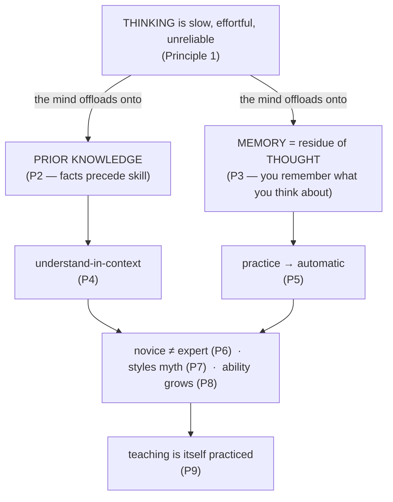

# Willingham's Cognitive Principles (*Why Don't Students Like School?*)

**Summary**: *Why Don't Students Like School? A Cognitive Scientist Answers Questions About How the Mind Works and What It Means for the Classroom* (Daniel T. Willingham, Jossey-Bass 2009) distills cognitive science into **nine principles** for how the mind actually learns. Its through-line: **thinking is slow, effortful, and unreliable, so the mind leans on memory — and memory is built from whatever you spend cognitive effort thinking about.** This is the wiki's third T1-canonical scientific spine (alongside [brown-make-it-stick](./brown-make-it-stick.md) and [ericsson-peak](./ericsson-peak.md)); this page is the source-summary / routing owner — most of the nine principles are *defined on their own concept pages*, not here.

**Sources**:
- Willingham, D. T. (2009). *Why Don't Students Like School?* Jossey-Bass. (9-principle structure; one principle per chapter.)
- Internal concept owners: [factual-knowledge-precedes-skill](./factual-knowledge-precedes-skill.md), [memory-is-residue-of-thought](./memory-is-residue-of-thought.md), [mental-models-for-learning](./mental-models-for-learning.md), [practice-is-required-not-optional](./practice-is-required-not-optional.md), [novice-vs-expert-cognition](./novice-vs-expert-cognition.md), [learning-styles-myth](./learning-styles-myth.md), [growth-mindset](./growth-mindset.md).

**Last updated**: 2026-07-10

---

## What the book is

A T1-canonical scientific spine for the wiki's `learning-systems/` cluster, and its **citation backstop + routing** page. Before this source was ingested, the cluster leaned on secondary citations (Kwik-derivative, Foer-relayed) for principles that Willingham states directly from the cognitive-science literature. Its job in Neural OS is to be the named source behind those principles — but, like [brown-make-it-stick](./brown-make-it-stick.md), it does **not** own their operational definitions. The concept pages do.

The book is written for teachers, but every principle is a claim about the *learner's* mind, which is why it maps so cleanly onto Neural OS's encoder and drill machinery.

## The central claim — the mind avoids thinking, so design for memory

Willingham's load-bearing argument: **the brain is not built for thinking**; deliberate reasoning is slow, effortful, and error-prone, so we offload as much as possible onto memory and prior knowledge. The instructional (and mnemonic) consequence follows directly — you cannot control what a learner *understands* except by controlling what they *think about*, because **[memory is the residue of thought](./memory-is-residue-of-thought.md)**. (source: Why Don't Students Like School?, Ch 1–3)

## The nine principles — each routed to its owner

This table *routes*; it does not redefine. Each row gives Willingham's framing of a principle whose full definition lives on the linked owner page. (The nine principles are Willingham's own chapter structure, not a wiki-registered stage ladder.)

| # | Willingham's principle | Owner page |
|---|---|---|
| 1 | **People are naturally curious, but are not naturally good thinkers** — thinking is slow/effortful/uncertain; we avoid it unless the problem is pleasurably solvable | *this page* (§Principle 1 & 9) |
| 2 | **Factual knowledge precedes skill** — you cannot think critically about material you don't know; background knowledge is the precondition, not the enemy, of skill | [factual-knowledge-precedes-skill](./factual-knowledge-precedes-skill.md) |
| 3 | **Memory is the residue of thought** — you remember what you think about; design the thinking, and the memory follows | [memory-is-residue-of-thought](./memory-is-residue-of-thought.md) |
| 4 | **We understand new things in the context of what we already know** — comprehension is anchoring the new to existing mental structures | [mental-models-for-learning](./mental-models-for-learning.md) |
| 5 | **Proficiency requires practice** — practice past the point of "getting it" to make skills automatic and free up working memory | [practice-is-required-not-optional](./practice-is-required-not-optional.md) |
| 6 | **Cognition is fundamentally different early and late in training** — novices reason from surface features; experts from deep structure. You cannot make a novice think like an expert by telling them to | [novice-vs-expert-cognition](./novice-vs-expert-cognition.md) |
| 7 | **Children are more alike than different in how they learn** — the visual/auditory/kinesthetic "learning styles" theory lacks support; match modality to the *content*, not the learner | [learning-styles-myth](./learning-styles-myth.md) |
| 8 | **Intelligence can be changed through sustained hard work** — ability is developable, not fixed; praise effort and strategy, not innate talent | [growth-mindset](./growth-mindset.md) |
| 9 | **Teaching, like any complex cognitive skill, must be practiced to be improved** — expertise in instruction is itself built by deliberate practice + feedback | *this page* (§Principle 1 & 9) |

## Principles 1 & 9 — owned here

Two principles have no separate concept page; this summary owns them.

- **Principle 1 — the mind is not designed for thinking.** Working memory is small and slow; long-term memory and the environment carry most of the load. The practical corollary the wiki runs on: reduce extraneous load (see [working-memory](./working-memory.md)), and convert effortful reasoning into retrievable memory via the encoders. Curiosity is engaged only when a problem is *solvable with moderate effort* — too easy or too hard both kill it, which is the cognitive basis for the wiki's drill-ladder gating (see [skill-progression-stages](./skill-progression-stages.md)). (source: Ch 1)
- **Principle 9 — teaching is a practiced skill.** Expertise at *explaining* is not a by-product of subject mastery; it is a separate skill built by feedback and rehearsal. In Neural OS terms, this is why the [gym](./red-queen-skill-gym.md) and METER measure retrieval and transfer, not just exposure — and why "I taught it" is not evidence it was taught well. (source: Ch 9)

## What it debunks

- **Learning styles** — matching instruction to a claimed visual/auditory/kinesthetic style does not improve outcomes (Principle 7). The wiki owns this at [learning-styles-myth](./learning-styles-myth.md). (source: Ch 7)
- **"Critical thinking as a transferable skill you can teach content-free"** — critical thinking is *domain-bound*; without domain knowledge there is nothing to think critically *with* (Principle 2). (source: Ch 2)
- **"Slow learners just need it explained differently, not learned differently"** — novices genuinely cannot process like experts yet; the fix is knowledge + practice, not a cleverer explanation (Principle 6). (source: Ch 6)

## How it sits in Neural OS

Willingham is the **precondition spine** under the other two T1 sources: [Brown's](./brown-make-it-stick.md) retrieval practice only has something to retrieve once **factual knowledge is in place** (Principle 2), and [Ericsson's](./ericsson-peak.md) deliberate practice is Principle 5 stated as a training program. Principle 3 (**[memory is the residue of thought](./memory-is-residue-of-thought.md)**) is the cognitive justification for the entire encoder layer — the wiki's mnemonic devices work precisely because they *force* elaborative thought about the target material, which is what gets encoded. Principle 8 is owned by [growth-mindset](./growth-mindset.md) as the belief-gate above every drill ladder. Registered convergences in [composability-index](./composability-index.md): the Brown × Ericsson × Willingham 3-spine agreement (Principle 5) and the 4-source learning-styles debunk (Principle 7).

## Visual

## Mnemonic

**"Think leaves a residue."** The whole book collapses to one image: a mind that *hates* to think (P1) leaves behind, as **residue**, only what it was forced to think *about* (P3) — and that residue sticks only to the **facts already on the shelf** (P2) and hardens into skill through **practice** (P5). Everything else (P4, P6, P7, P8, P9) is a rule for arranging the thinking so the right residue forms.

## Checksum

1. State the book's central claim in one sentence. (The mind is built to avoid thinking and lean on memory; therefore you learn what you are made to think about — "memory is the residue of thought.")
2. Which principle is the precondition for [Brown's](./brown-make-it-stick.md) retrieval practice, and why? (Principle 2, factual knowledge precedes skill — retrieval practice needs something already stored to retrieve.)
3. Name the two principles that have no separate wiki owner page and are owned here. (Principle 1 — the mind is not designed for thinking; Principle 9 — teaching is a practiced skill.)

## Related pages

- [brown-make-it-stick](./brown-make-it-stick.md) · [ericsson-peak](./ericsson-peak.md) — the other two T1 scientific spines this one anchors
- [memory-is-residue-of-thought](./memory-is-residue-of-thought.md) — Principle 3; the cognitive basis of the whole encoder layer
- [factual-knowledge-precedes-skill](./factual-knowledge-precedes-skill.md) — Principle 2; the precondition for retrieval and critical thinking
- [mental-models-for-learning](./mental-models-for-learning.md) — Principle 4; understanding as anchoring to prior structure
- [practice-is-required-not-optional](./practice-is-required-not-optional.md) — Principle 5; practice to automaticity
- [novice-vs-expert-cognition](./novice-vs-expert-cognition.md) — Principle 6; surface- vs deep-structure processing
- [learning-styles-myth](./learning-styles-myth.md) — Principle 7; the debunk it supports
- [growth-mindset](./growth-mindset.md) — Principle 8; ability is developable
- [working-memory](./working-memory.md) — the small/slow workspace Principle 1 is about
- [composability-index](./composability-index.md) — the two registered convergences that cite Willingham
