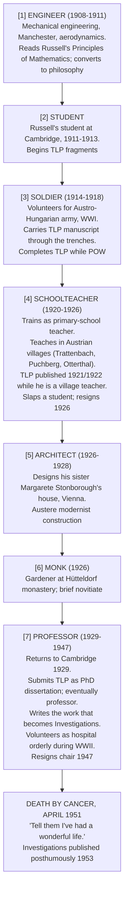

# Ludwig Wittgenstein (1889–1951)

**Summary**: Austrian-British philosopher; Russell's student; author of [*Tractatus Logico-Philosophicus*](./tractatus-logico-philosophicus.md) (1921) and (posthumously) *Philosophical Investigations* (1953). **The only major 20th-century philosopher to publish two foundational works whose positions are largely *opposed* to each other** — TLP early Wittgenstein vs *Investigations* late Wittgenstein. Case 5 of the [logicians-madness-substrate-thesis](./logicians-madness-substrate-thesis.md): ascetic withdrawal, repeated career renunciations, self-flagellation, lifelong identity instability. **Logicomix portrays him as the "moral commando"** — brilliant, cruel, possessed — who effectively takes over Russell's intellectual life during the *Principia* years.

**Sources**:
- Ray Monk, *Ludwig Wittgenstein: The Duty of Genius* (Free Press 1990) — the standard scholarly biography; the most-cited single-volume Wittgenstein source.
- Wittgenstein's primary works: *Tractatus Logico-Philosophicus* (1921 German, 1922 English with Russell's introduction); *Philosophical Investigations* (posthumous 1953); *On Certainty* (posthumous 1969); *Remarks on the Foundations of Mathematics* (posthumous 1956).
- Bertrand Russell's portrayal of Wittgenstein in Russell's *Autobiography* (1967-1969).
- [logicomix-graphic-novel](./logicomix-graphic-novel.md) — narrative depiction as "moral commando" who effectively takes over Russell's intellectual life.

**Last updated**: 2026-05-25

---

## One-line

> Russell's student → TLP (1921) → schoolteacher in a Austrian village → architect of his sister's house → ascetic monastery → Cambridge professor → *Philosophical Investigations* (refuting his own earlier work) → cancer, age 62, 1951. Last words: *"Tell them I've had a wonderful life."* Repeatedly renounced career, money, and reputation. Few sustained relationships. **Self-acknowledged moral perfectionism that produced both work and pain.**

## Unlocks (lead, not footer)

1. **The only philosopher who effectively refuted himself in published form.** Wittgenstein's TLP attempts a complete picture-theoretic account of language and the limits of meaning. His *Investigations* (posthumous 1953) **explicitly attacks** the TLP position — pictures, simples, atomic facts, truth-functional reduction all questioned. **Late Wittgenstein argues that early Wittgenstein was confused.** This is the most striking instance in modern philosophy of a thinker *outliving* and *outthinking* their own canonical work. The wiki's stance per [Genova's take-seriously-but-hold-lightly rule](./memory-paradox.md): take TLP seriously enough to ingest its picture theory + show-vs-say; hold it lightly enough to allow that the author himself moved past it.

2. **Substrate-thesis case 5 — the deepest instance.** Three-component mechanism present in unusual completeness: (a) regress-pursuing into the foundations of language (TLP); (b) social isolation by design (monastic phases, village teaching, monastic withdrawal, few sustained intimate relationships); (c) abstract perfection as personal standard producing **explicit self-flagellation** (the documented episodes are unusual; Monk's biography treats them as load-bearing for understanding the work). Outcome: not sanatorium or suicide, but **repeated identity collapse and reconstruction** — the multiple career renunciations are the visible signature.

3. **The 1929 return as the wiki's load-bearing reframing event.** From 1918 to 1929 Wittgenstein effectively *left philosophy* (village schoolteacher in Austria; architect of his sister's house in Vienna; gardener at a monastery; visited Russell occasionally but did not publish or teach philosophy). In 1929 he returned to Cambridge and began the work that would become *Philosophical Investigations*. **The 11-year hiatus is structurally similar to Russell's field-leaving** — but Wittgenstein returned, while Russell extended his exit. The two trajectories illuminate the [substrate thesis](./logicians-madness-substrate-thesis.md): leaving briefly is protective; returning to the same regress-pursuit is risky.

4. **The "moral commando" framing from Logicomix.** [logicomix-graphic-novel](./logicomix-graphic-novel.md) portrays Wittgenstein arriving at Russell's Cambridge rooms in 1911 as a tortured Viennese engineer and progressively taking over Russell's intellectual life. Russell wrote (in his autobiography) of Wittgenstein: *"He has the pure intellectual passion in the highest degree; it makes me love him."* And later: *"He thought I was no better than a journalist."* The relationship is one of the load-bearing emotional anchors of the [foundations-crisis](./foundations-crisis.md) narrative.

## Mnemonic

**1921 → 1929 → 1953** = *TLP · returns to Cambridge · Investigations (posthumous).*

Three anchor dates: the famous early book; the return from the 11-year hiatus; the famous late book.

For the seven trajectory phases: **engineer → student → soldier → schoolteacher → architect → monk → professor**.

## Memory checksum

1. **What is TLP and when was it published?** ([*Tractatus Logico-Philosophicus*](./tractatus-logico-philosophicus.md) — Wittgenstein's only book published in his lifetime. 1921 German (in *Annalen der Naturphilosophie*); 1922 English (Kegan Paul, with Russell's introduction). Composed during WWI, in the trenches. Picture theory + truth-function reduction + show-vs-say + the mystical + proposition 7.)
2. **What is *Philosophical Investigations*?** (Posthumous 1953. Wittgenstein's "later philosophy". Attacks the TLP position — explicit critique of picture theory, simples, atomic facts. Introduces *language games* and *meaning as use*. Inspires "ordinary language philosophy".)
3. **What was the 1918-1929 hiatus?** (Wittgenstein effectively left philosophy. Trained as a primary-school teacher; taught in small Austrian villages 1920-1926. Designed his sister Margarete's house in Vienna 1926-1928. Returned to Cambridge philosophy 1929.)
4. **How did Wittgenstein die?** (Prostate cancer; age 62; April 29, 1951; Cambridge. Last words to his housekeeper: *"Tell them I've had a wonderful life."*)
5. **State the substrate-thesis mechanism for Wittgenstein.** (Regress-pursuing into language's foundations + lifelong social isolation by design + explicit moral perfectionism with self-flagellation episodes → recurrent identity collapse and reconstruction, career renunciations, monastic phases. Did not collapse into sanatorium or suicide; sustained intellectual production via the *Investigations* in his later years.)

## Visual — the seven phases

Seven phases. Five career-level renunciations (philosophy → soldier → teacher → architect → monk → philosophy → retirement). **The pattern is the biography.**

---

## TLP (1921) — see [tractatus-logico-philosophicus](./tractatus-logico-philosophicus.md) for the full treatment

Composed 1914-1918 during WWI, partly in the trenches of the Austro-Hungarian army, completed during Italian POW captivity. Published 1921 German, 1922 English with Russell's introduction.

The seven top-level propositions:
1. The world is all that is the case.
2. What is the case is the existence of states of affairs (atomic facts).
3. A logical picture of facts is a thought.
4. A thought is a proposition with a sense.
5. A proposition is a truth-function of elementary propositions.
6. The general form of a truth-function is *[p̄, ξ̄, N(ξ̄)]*.
7. *Whereof one cannot speak, thereof one must be silent.*

Key contributions:
- **[Picture theory](./picture-theory-of-language.md)** (TLP 2.1-4.06) — the philosophical antecedent of the wiki's encoder paradigm.
- **[Truth-function reduction](./truth-function-machine.md)** (TLP 5-6) — invented truth-tables at 4.31; demolished in scope by Gödel 1931.
- **[Show-vs-say boundary](./show-vs-say.md)** (TLP 4.121-4.1212) — the philosophical home of the wiki's visual-per-concept rule.
- **[Limits of language](./limits-of-language-tlp.md)** (TLP 5.6-5.641) — *the limits of my language mean the limits of my world*.
- **[The mystical](./the-mystical-tlp.md)** (TLP 6.44-6.522) — what shows itself but cannot be said.

Wittgenstein's claim in TLP's preface: *"the truth of the thoughts communicated here seems to me unassailable and definitive. I am, therefore, of the opinion that the problems have in essentials been finally solved."*

He proceeded to spend the next decade *not doing philosophy*.

## The 11-year hiatus (1918-1929)

After completing TLP, Wittgenstein concluded he had solved philosophy. He renounced his inheritance (a substantial portion of the Wittgenstein family fortune, redistributed to his siblings), trained as a primary-school teacher, and taught children in remote Austrian villages from 1920 to 1926.

**The Otterthal incident (1926)**: Wittgenstein struck a student (Josef Haidbauer) hard enough to knock him unconscious. The boy recovered; Wittgenstein was investigated; he resigned. He never taught children again. The episode is one of the most-cited instances of his self-flagellating perfectionism — both the violence (the student had given a "wrong" answer) and the immediate self-condemnation that followed.

From 1926 to 1928 he co-designed and supervised the construction of his sister Margarete Stonborough's house in Vienna (Kundmanngasse 19, still standing as the *Haus Wittgenstein*). The design is severe modernist — Wittgenstein himself fabricated door handles and supervised every detail. He reportedly raised one ceiling 30mm to achieve perfect proportions.

He worked briefly as a gardener at a monastery and considered taking holy orders. He did not.

In 1929 he returned to Cambridge.

## The later work (1929-1947)

The 1929 return to Cambridge began the "late Wittgenstein" period. Submitted TLP as his PhD dissertation in 1929 (G.E. Moore and Russell as examiners); awarded the doctorate.

The work he produced from 1929 onward was *not published in his lifetime*. He worked extensively on a manuscript that would become *Philosophical Investigations*, but published nothing major after TLP (and TLP itself was largely the work he was now refuting).

Core themes of the late work:
- **Language games**: meaning is constituted by use within forms of life, not by picture-theoretic correspondence to facts.
- **Family resemblance**: concepts don't have necessary-and-sufficient definitions but webs of overlapping similarities (the *Spielen* "games" example — what do chess, tennis, ring-around-the-rosie share? Not one essence but family resemblances).
- **Private language argument**: a strictly private language is impossible because meaning requires shared criteria.
- **Rule-following**: famous skeptical argument about what it means to follow a rule consistently.

**The late position is largely *against* the TLP position.** Where TLP says meaning is picture-theoretic correspondence, *Investigations* says meaning is use. Where TLP says language has a clear logical structure, *Investigations* says language is a vast collection of overlapping practices.

## The death (1951)

Wittgenstein was diagnosed with prostate cancer in 1949. He spent his last years staying with various friends and acquaintances — never owning a home of his own. He died at his doctor's house in Cambridge, April 29, 1951; age 62.

His last words to his housekeeper Mrs. Bevan: *"Tell them I've had a wonderful life."*

The line is much-discussed. Given the suffering and self-laceration documented across his biography, the line is either:
- A genuine final assessment that the work + the engagement made the life worth living;
- A wry final irony;
- Or both.

His grave is in the Ascension Burial Ground in Cambridge.

## Substrate-thesis case 5

Three-component mechanism present in unusual completeness:

| Component | Present in Wittgenstein? |
|---|---|
| Regress-pursuing inside a closed formal system | YES — first into the foundations of logic (TLP), then into the foundations of language (Investigations) |
| Social isolation from non-domain peers | YES, by design — village teaching alone; monastery; minimal sustained intimate relationships; reportedly only a handful of close friendships in life (Russell, Moore, Pinsent, Skinner, von Wright); never married |
| Abstract perfection as personal standard | YES, *extreme* — the self-flagellation episodes are documented (Otterthal student-strike + ensuing self-condemnation); repeated career renunciations as failed-purity acts; the Stonborough house ceiling-30mm story |

Outcome: not sanatorium (Cantor), not suicide (Boltzmann), not self-starvation (Gödel) — but **recurrent identity collapse and reconstruction**. The seven biographical phases are the visible signature; each phase is preceded by a renunciation of the prior phase.

**The protective factor was the work itself, partially.** *Investigations* is a substantial 25-year project — sustained intellectual production. Wittgenstein did not collapse intellectually. The substrate damage manifested as identity instability, not cognitive decline.

The wiki's reading: Wittgenstein is the **deepest worked instance** of the substrate thesis among the foundations cast. The three components are present with unusual completeness; the outcome was attenuated by sustained intellectual production but the cost was severe.

## The Logicomix portrayal

[Logicomix](./logicomix-graphic-novel.md) introduces Wittgenstein arriving at Russell's Cambridge rooms in 1911 as a tortured Viennese engineer. Russell is initially uncertain whether Wittgenstein is a genius or a madman. Over the next two years, Wittgenstein progressively takes over Russell's intellectual life — challenging *Principia*, demanding rigor, undermining Russell's confidence in his own work.

The portrayal is sympathetic but unflinching about Wittgenstein's intensity. Logicomix's Wittgenstein is brilliant, cruel, ascetic, possessed. The book parallels the relationship between Russell and Wittgenstein with several historical mentor-disciple destructive dynamics; the parallel is not subtle.

The most striking Logicomix scene: Wittgenstein in the WWI trenches with the TLP manuscript; Russell receiving the manuscript after the war; Russell's mixed feelings about being intellectually overtaken by his student.

## Cross-link to the wiki

| Wiki layer | Wittgenstein's contribution |
|---|---|
| [picture-theory-of-language](./picture-theory-of-language.md) | TLP 2.1-4.06; the encoder-paradigm antecedent |
| [truth-function-machine](./truth-function-machine.md) | TLP 4.31 (first truth-table); TLP 5-6 (N-operator) |
| [show-vs-say](./show-vs-say.md) | TLP 4.121-4.1212; the visual-per-concept rule's home |
| [the-mystical-tlp](./the-mystical-tlp.md) | TLP 6.44-6.522; what shows itself but cannot be said |
| [limits-of-language-tlp](./limits-of-language-tlp.md) | TLP 5.6-5.641; *the limits of my language* |
| [atomic-fact-tlp](./atomic-fact-tlp.md) | TLP 2; *Sachverhalt* vs *Tatsache*; the smallest unit of reality |
| [memory-paradox](./memory-paradox.md) | take-seriously-but-hold-lightly applied to TLP given the *Investigations* refutation |
| [logicians-madness-substrate-thesis](./logicians-madness-substrate-thesis.md) | Wittgenstein as case 5; the most worked instance |

## METER integration

| Drill | Pass floor | Source |
|---|---|---|
| Name the 7 biographical phases | <30 s | this page §Visual |
| Distinguish early-Wittgenstein (TLP) from late-Wittgenstein (Investigations) | <60 s | this page §Later work |
| Quote the last words + context | <30 s | this page §Death |
| State the substrate-thesis mechanism for Wittgenstein | <60 s | this page §Substrate case 5 |
| Place Wittgenstein on the foundations-crisis timeline | <15 s | [foundations-crisis](./foundations-crisis.md) |

## Related pages

- [logicomix-graphic-novel](./logicomix-graphic-novel.md) — narrative source
- [tractatus-logico-philosophicus](./tractatus-logico-philosophicus.md) — TLP source summary
- [picture-theory-of-language](./picture-theory-of-language.md) · [truth-function-machine](./truth-function-machine.md) · [show-vs-say](./show-vs-say.md) · [the-mystical-tlp](./the-mystical-tlp.md) · [limits-of-language-tlp](./limits-of-language-tlp.md) · [atomic-fact-tlp](./atomic-fact-tlp.md) — TLP concept pages
- [foundations-crisis](./foundations-crisis.md) — Wittgenstein in the timeline
- [logicians-madness-substrate-thesis](./logicians-madness-substrate-thesis.md) — Wittgenstein as case 5
- [memory-paradox](./memory-paradox.md) — take-seriously-but-hold-lightly applied to TLP given the *Investigations* reversal
- [principia-mathematica](./principia-mathematica.md) — Russell-Whitehead's work that Wittgenstein effectively took over
- [godels-incompleteness](./godels-incompleteness.md) — Gödel demolished TLP 5's scope
- [glossary](./glossary.md) — Logic layer registration
