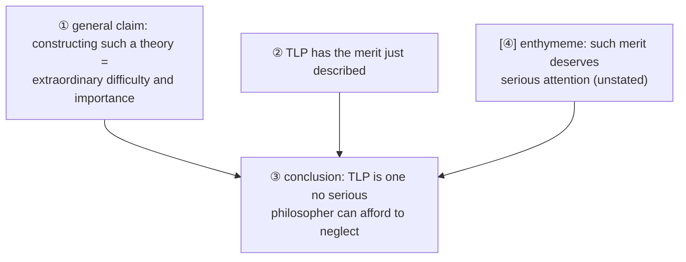
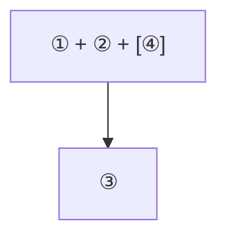

# Worked Argument Extraction

**Summary**: A **full worked example** of extracting + diagramming an argument from real English prose. The example uses a passage from [Russell](./bertrand-russell.md)'s 1922 introduction to TLP — making the example cross-domain (logic about logic) and the wiki-internal source self-referential. **Demonstrates the [copi-analyzing-arguments](./copi-analyzing-arguments.md) Ch 2 procedure in full**: identify propositions → assign roles → diagram support relations → surface enthymemes → write structural conclusion. **Page-tier in [logic-atomic-design](./logic-atomic-design.md)**: theory pages explain extraction; this page shows it in operation.

**Sources**:
- [Copi/Cohen/McMahon](./copi-introduction-to-logic.md) *Introduction to Logic* 14th ed, Ch 2 — analyzing arguments.
- [copi-analyzing-arguments](./copi-analyzing-arguments.md) — wiki theory page.
- [argument-anatomy](./argument-anatomy.md) — Ch 1 atoms (premise · conclusion · inference · enthymeme · indicators).
- [russells-introduction-to-tlp](./russells-introduction-to-tlp.md) — the source passage to extract.

**Last updated**: 2026-05-25

---

## One-line

> Take Russell's actual prose from his 1922 introduction to TLP. Identify each proposition. Diagram premise → conclusion relations. Surface the enthymeme. Write the structural diagram. **A complete extraction in <300 s.**

## Unlocks (lead, not footer)

1. **Theory + operational walkthrough closes the gap.** [copi-analyzing-arguments](./copi-analyzing-arguments.md) explains *how* to diagram arguments; this page shows it on a real text. **Russell's prose isn't a textbook exercise** — it has compound sentences, embedded clauses, indicator words that *also* function as connectives, and an enthymeme premise that needs surfacing.

2. **The source passage is itself meta-logical.** Russell is arguing *about TLP* in 1922. The argument structure he uses is the same kind he describes in his introduction. **Argument-extraction on Russell's own argument-about-Wittgenstein** is a doubled exercise: you're using logic-tools to analyze how a logician argues about another logician's claims.

3. **The procedure scales.** Once a practitioner can extract + diagram a 5-sentence Russell argument in <300 s, the same procedure works on op-eds, scientific papers, philosophical arguments, security cases, financial analyses, Bible passages, and engineering documents. **Argument-extraction is the most-cross-domain wiki skill.**

4. **METER target**: extract + diagram a 5-proposition argument from real prose in <120 s with ≥80% accuracy. This page provides a worked instance for calibration; drill on similar passages to reach the floor.

## Mnemonic

**N-S-A-D** = *Number propositions · Identify Support roles · Add arrows · Diagram.*

Four steps. Same as [copi-analyzing-arguments](./copi-analyzing-arguments.md)'s procedure.

## Memory checksum

1. **State the source passage.** (Bertrand Russell's introduction to TLP, 1922, regarding Wittgenstein's logicism and the hierarchy-of-languages objection.)
2. **What is the conclusion of Russell's argument in the source?** (Roughly: TLP is "one which no serious philosopher can afford to neglect" — but the argument structure leading to this conclusion involves Russell's reservations about the hierarchy-of-languages question.)
3. **What is the enthymeme premise we surface?** ((Russell implicitly assumes that a theory of logic which is *not at any point obviously wrong* deserves serious attention. This is left unstated but is necessary for the argument to work.))
4. **What is the diagrammatic structure?** (Premises: (P1) TLP constructs a theory of logic. (P2) The theory is not at any point obviously wrong. (P3) The work is of extraordinary difficulty and importance. [P4 unstated]: Such work deserves serious attention. ∴ TLP is one which no serious philosopher can afford to neglect.)
5. **What translation move was needed?** (The English passage is one long sentence with compound subjects and a clear conclusion. Translation: identify the main clause as the conclusion; identify the support clauses as premises; surface the [P4] implicit principle that makes the inference complete.)

## Visual — the worked extraction

**Source passage** — Russell (1922), Introduction to TLP, closing paragraph:

> To have constructed a theory of logic which is not at any point obviously wrong is to have achieved a work of extraordinary difficulty and importance. This merit, in my opinion, belongs to Mr. Wittgenstein's book, and makes it one which no serious philosopher can afford to neglect.

**Step 1 — number the propositions**:

- **①** "To have constructed a theory of logic which is not at any point obviously wrong is to have achieved a work of extraordinary difficulty and importance." — a general claim: constructing-such-a-theory = extraordinary-difficulty-and-importance.
- **②** "This merit ... belongs to Mr. Wittgenstein's book" — specific claim: TLP has the merit just described.
- **③** "[TLP] is one which no serious philosopher can afford to neglect." — the conclusion: serious philosophers must engage with TLP.
- **[④] IMPLICIT (unstated)**: Achievements of extraordinary difficulty and importance deserve the serious attention of philosophers. This is the enthymeme premise — left unstated by Russell because he considered it obvious.

**Step 2 — identify roles**:

- ① is a *general* claim about theories-of-logic-not-obviously-wrong.
- ② applies the general claim to TLP specifically.
- [④] is the unstated bridge: such achievements deserve attention.
- ③ is the conclusion.

The argument structure: ① (general claim) + ② (TLP has this merit) + [④] (such merit deserves attention, enthymeme) &there4; ③ (TLP deserves serious attention by philosophers).

Indicator words: "makes it" (subtle conclusion indicator in the prose).

**Step 3 — draw the support diagram**:

All three premises (① stated, ② stated, [④] enthymeme) combine to support the conclusion. No sub-arguments here — it's a single inference from 3 premises to 1 conclusion.

**Step 4 — write the structural conclusion**:

- A single inference (1 main argument, no sub-arguments).
- Uses combined support (all 3 premises needed; removing any breaks the inference).
- Contains 1 enthymeme premise ([④] is unstated).
- The enthymeme is *plausible* — most philosophers would accept that significant achievements deserve serious attention.
- The inference is *valid* if all 3 premises (including [④]) are accepted.
- Whether it is *sound* depends on whether ② is true (Russell asserts it; Wittgenstein himself was modest about TLP's merits; modern Wittgenstein scholarship contests certain TLP claims via Gödel and via the late-Wittgenstein period).

The extraction is complete. The argument is now in a form where validity + soundness can be evaluated.

---

## Step-by-step walkthrough

### Step 1 — Read and identify propositions

The original passage is one long sentence. Find each *proposition* (declarative content with truth-value):

> *"To have constructed a theory of logic which is not at any point obviously wrong is to have achieved a work of extraordinary difficulty and importance."*

This is one proposition — call it **①**. It asserts: *constructing-a-theory-of-logic-not-obviously-wrong = extraordinary-difficulty-and-importance*.

> *"This merit, in my opinion, belongs to Mr. Wittgenstein's book"*

This is the next proposition — call it **②**. It asserts: *TLP has the merit just described*.

> *"and makes it one which no serious philosopher can afford to neglect."*

This is the conclusion — call it **③**. It asserts: *TLP must not be neglected by serious philosophers*.

**Note**: the connective *"and"* joins ② to ③ in the prose, with *"makes it"* serving as a subtle conclusion-indicator. The English is compressed; the propositions are distinct.

### Step 2 — Identify roles

- **①** is a general claim — a principle.
- **②** is a specific application — TLP has the property in question.
- **③** is the conclusion — TLP deserves attention.

**But the inference from ① + ② to ③ requires an additional premise**: *"such achievements deserve serious attention"*. Russell doesn't say this; he assumes it. **This is the enthymeme** ([enthymeme premise](./argument-anatomy.md) §enthymeme).

Surface it as **[④]**: *Achievements of extraordinary difficulty and importance deserve the serious attention of philosophers.*

### Step 3 — Diagram

This is a single main argument with combined support:

All three premises (① stated, ② stated, [④] enthymeme) **combine** to support the conclusion. Removing any one of the three breaks the inference:

- Without ①, you can't establish that TLP's accomplishment is in the *category* of extraordinary-difficulty-and-importance.
- Without ②, you can't apply ① to TLP specifically.
- Without [④], you can't move from *TLP has the property* to *TLP must be attended to*.

**Combined support, not parallel.** ([copi-analyzing-arguments](./copi-analyzing-arguments.md) §Combined vs parallel for the distinction.)

### Step 4 — Evaluate

Now that the argument is structurally extracted, we can ask:

**Is the argument valid?** Yes, given all 3 premises (including [④]), the conclusion follows. The inference is essentially:
- All achievements of category X deserve serious attention.
- TLP is an achievement of category X.
- Therefore, TLP deserves serious attention.

This is a [categorical syllogism](./categorical-syllogism.md) (or a propositional-logic equivalent) — Barbara-style.

**Is the argument sound?** Soundness requires all premises to be *true*:

- **①** is plausible — *most* logicians would agree that constructing-such-a-theory is extraordinarily difficult. Some would argue Russell is too generous (some philosophers consider TLP *obviously wrong at points*; see [late Wittgenstein's own critique](./philosophical-investigations-overview.md)); some would argue it's understated (TLP's achievement may be even greater than Russell's framing).
- **②** is what Russell is asserting. He believes TLP has the merit. **Late Wittgenstein himself would have contested this** — the *Investigations* attacks key TLP claims.
- **[④]** is plausible — *most* philosophers would accept it. But it could be contested (achievements may deserve attention without philosophers being obligated to engage with them).

So the argument is **valid but soundness is contested** — exactly the kind of argument where the analytic work yields more than a binary verdict.

### Step 5 — Cross-link

The extracted structure connects to:

- **[validity-vs-soundness](./validity-vs-soundness.md)** — the argument is valid; soundness depends on premise truth.
- **[argument-anatomy](./argument-anatomy.md) §Enthymeme** — [④] is the enthymeme premise.
- **[fallacy-taxonomy](./fallacy-taxonomy.md)** — no fallacy is committed; the argument is straightforwardly structured.
- **[russells-introduction-to-tlp](./russells-introduction-to-tlp.md)** — the source passage; cross-link to the broader context of Russell's introduction.
- **[copi-analyzing-arguments](./copi-analyzing-arguments.md)** — the procedure applied here.

## Why Russell's argument is a good worked example

### It's real prose

Most argument-diagramming exercises in textbooks (including Copi Ch 2) use *constructed* arguments designed to fit the diagramming machinery cleanly. Russell's prose is **real text** — written by a leading philosopher in 1922 for an actual scholarly audience. The compression, compound clauses, and indicator-word ambiguities are real. **Practitioners need to handle real prose, not just textbook examples.**

### It contains an enthymeme

Most real arguments contain one or more unstated premises. The wiki's reflex: *"surface the enthymeme"* is a load-bearing analytic move. Russell's prose has exactly one enthymeme — [④] — which is plausible but contestable. **Real arguments often hinge on enthymemes that look obvious but aren't.**

### Its conclusion is famous

Russell's closing — *"one which no serious philosopher can afford to neglect"* — is one of the most-quoted endorsements in 20th-century philosophy. Generations of philosophers have engaged with TLP partly because Russell said this. **The argument's conclusion has had massive downstream effect**, so understanding the argument's structure matters historically.

### It's self-referential at the meta-level

We're using *Copi's logic-analysis procedure* (from a 2014 textbook) to extract *Russell's argument* (from a 1922 introduction) about *Wittgenstein's TLP* (1921). **The procedure is logic; the argument is about logic; the work being judged is itself about logic.** The doubled self-reference is itself instructive.

## Variations and exercises

### Exercise 1 — Diagram Frege's reply to Russell

From Frege's June 22, 1902 reply to Russell:

> *"Your discovery of the contradiction has surprised me beyond words and, I should almost like to say, left me thunderstruck, because it has rocked the ground on which I meant to build arithmetic. […] It is all the more serious as the collapse of my Law V seems to undermine not only the foundations of my arithmetic but the only possible foundations of arithmetic as such."*

Extract the propositions; surface any enthymemes; diagram the support structure.

### Exercise 2 — Diagram a Bible passage

From Romans 8:31 (KJV): *"What shall we then say to these things? If God be for us, who can be against us?"*

The passage is *interrogative* on the surface; the propositions are *rhetorical questions*. Extract the propositional content (per [argument-anatomy](./argument-anatomy.md) §Rhetorical questions); diagram the support structure.

### Exercise 3 — Diagram a news op-ed

Take a current op-ed (any source). Identify the main thesis. Identify the supporting claims. Surface any enthymemes. Diagram. Then ask: *which of the diagrammed premises is most contestable?*

### Exercise 4 — Diagram a security argument

Take a CISSP-style risk-acceptance argument:

> *"The probability of breach via this attack vector is low (< 0.1% / year). The cost of mitigation is high ($500K + ongoing). The expected loss if breach occurs is moderate ($200K). Therefore we accept the risk."*

This is a quantitative risk argument. Diagram it; check whether the math supports the conclusion; surface any enthymemes about *risk appetite* or *opportunity cost*.

## What argument-extraction does NOT do

Important boundaries:

- **It doesn't verify the premises.** Extraction shows *what* is being claimed; it doesn't establish *whether* the claims are true.
- **It doesn't catch all fallacies.** [Fallacy-recognition](./fallacy-taxonomy.md) is a separate skill that runs on the *extracted* argument.
- **It doesn't handle non-propositional content.** Pure expressive utterances ("How wonderful!") or pure directives ("Close the door!") aren't propositions; they don't get extracted in the same way.
- **It doesn't preserve nuance.** Real prose has tone, emphasis, rhetorical force that the extracted diagram loses. **The diagram is a model, not a replacement** for the original prose.

The wiki's reflex: extract + diagram first, then evaluate. The two-step approach makes the analytic work rigorous.

## METER integration

| Drill | Pass floor | Source |
|---|---|---|
| Identify the propositions in a 3-5-sentence passage | <30 s | this page §Step 1 |
| Identify roles (premise vs conclusion) | <60 s | this page §Step 2 |
| Surface the enthymeme | <60 s | this page §Step 2 |
| Diagram the support structure | <60 s | this page §Step 3 |
| Evaluate validity + soundness candidacy | <120 s | this page §Step 4 |
| Complete extraction on a *new* 5-sentence argument | <300 s | this page §Variations |

## Related pages

- [copi-analyzing-arguments](./copi-analyzing-arguments.md) — Ch 2 procedure this page operationalizes
- [argument-anatomy](./argument-anatomy.md) — Ch 1 atoms (premise · conclusion · inference · enthymeme · indicators)
- [validity-vs-soundness](./validity-vs-soundness.md) — what the evaluation produces
- [fallacy-taxonomy](./fallacy-taxonomy.md) — what to check after extraction
- [russells-introduction-to-tlp](./russells-introduction-to-tlp.md) — source passage
- [bertrand-russell](./bertrand-russell.md) — author of source
- [copi-syllogisms-in-ordinary-language](./copi-syllogisms-in-ordinary-language.md) — translating extracted arguments to standard syllogism form
- [logic-atomic-design](./logic-atomic-design.md) §Pages — this page realizes a Template for argument extraction
- [worked-syllogism-evaluation-barbara](./worked-syllogism-evaluation-barbara.md) — sister worked example for categorical logic
- [worked-natural-deduction-proof](./worked-natural-deduction-proof.md) — sister worked example for natural deduction
- bible-study-hebrews-11-1 — Bible argument-extraction parallel (the *hypostasis-elenchos* analysis is structurally similar)
- [glossary](./glossary.md) — Logic layer registration
