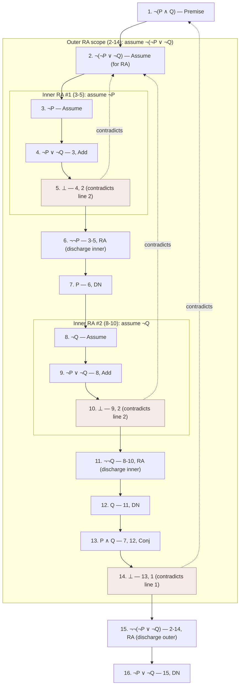

# Worked Natural Deduction Proof

**Summary**: A **full worked example** of a Copi-style natural-deduction proof, showing the systematic use of multiple inference rules + replacement rules + conditional proof + reductio ad absurdum. The example derives ***De Morgan's Law*** from more-basic rules — a *meta-result* that vindicates one of the 10 replacement rules from the 9 elementary inference rules + CP + RA. **Demonstrates the full machinery of [Copi Ch 9](./methods-of-deduction.md) in operation.**

**Sources**:
- [Copi/Cohen/McMahon](./copi-introduction-to-logic.md) *Introduction to Logic* 14th ed, Ch 9 — natural deduction.
- [methods-of-deduction](./methods-of-deduction.md) — rule inventory.
- Gerhard Gentzen, *Untersuchungen über das logische Schließen* (1934) — the original natural-deduction system.

**Last updated**: 2026-05-25

---

## One-line

> Prove *¬(P ∧ Q) ⊢ ¬P ∨ ¬Q* (one direction of De Morgan's Law) from the 9 elementary inference rules + CP + RA. **15 lines. 5 different rules invoked. All bookkeeping visible.**

## Unlocks (lead, not footer)

1. **Theory + operational walkthrough closes the gap.** [methods-of-deduction](./methods-of-deduction.md) explains *what* the 19 rules + CP + RA are; this page shows *how* to compose them into a multi-step derivation. The wiki's [logic-atomic-design](./logic-atomic-design.md) §Pages tier requires that worked instances exist; this is the worked instance for natural deduction.

2. **A natural-deduction proof is a chain of [pictures](./picture-theory-of-language.md).** Each line of the proof is a proposition; each justification cites which lines + which rule were used. **The proof's *structure* mirrors the logical-form chain** — you can read off the proof's geometry by looking at the line-and-rule references. This is operational [show-vs-say](./show-vs-say.md) at the proof layer.

3. **CP + RA are the strategy moves.** The 9 elementary inference rules and 10 replacement rules are *atomic*; CP and RA are *strategy*. This proof uses RA (reductio): assume the negation of the conclusion; derive a contradiction; conclude the original. **The strategy is what lets the proof get from the premise to the target conclusion when no direct chain works.**

4. **METER target**: construct a 5-15 line propositional natural-deduction proof in <300 seconds. Drilling on De Morgan → drilling on harder targets (tautologies, conditional theorems, predicate-logic proofs) → reflexive ability to construct moderate proofs.

## Mnemonic

**RA + DS + Add + Conj + DN** — *Reductio (strategy) + Disjunctive Syllogism + Addition + Conjunction + Double Negation*.

The 5 rules invoked in this proof.

## Memory checksum

1. **State De Morgan's Law (the form we're proving).** (*¬(P ∧ Q) ⊢ ¬P ∨ ¬Q*. Premise: NOT both P and Q. Conclusion: NOT P OR NOT Q.)
2. **Why use RA (reductio)?** (The conclusion is a disjunction *¬P ∨ ¬Q*. Disjunctions are often hard to derive directly. RA flips the move: *assume ¬(¬P ∨ ¬Q); derive a contradiction; conclude ¬P ∨ ¬Q via DN*.)
3. **What is the inner contradiction we derive in this proof?** (Inside the RA assumption, we derive both P ∧ Q (using DeM + DS) and ¬(P ∧ Q) (from the original premise). The contradiction P ∧ Q vs ¬(P ∧ Q) is the absurdity.)
4. **List the 5 rules invoked.** (RA strategy · DS (disjunctive syllogism, used to extract ¬P or ¬Q from a disjunction) · Add (addition, used to construct the disjunction we negated) · Conj (conjunction, to build P ∧ Q) · DN (double negation, to discharge RA).)
5. **What does this prove about De Morgan's Law?** (It shows De Morgan's Law can be *derived* from the more-basic rules; it's not an *independent* axiom, just a useful replacement rule that summarizes a multi-step derivation. Most of Copi's 10 replacement rules can be similarly derived.)

## Visual — the proof structure

**TARGET**: ¬(P ∧ Q) ⊢ ¬P ∨ ¬Q (De Morgan's Law, one direction)

**Strategy**:
1. Direct derivation is hard (we need to produce a disjunction).
2. Use REDUCTIO: assume ¬(¬P ∨ ¬Q); derive a contradiction.
3. The contradiction will be: P ∧ Q (from the assumption) vs ¬(P ∧ Q) (from the original premise).
4. Discharge RA &rarr; conclude ¬¬(¬P ∨ ¬Q) &rarr; by DN &rarr; ¬P ∨ ¬Q.

**Proof (16 lines) — a tree of nested RA scopes**:

&there4; ¬P ∨ ¬Q. QED. &#9632;

**Rules invoked**:
- Lines 4, 9 — Add (Addition: P ⊢ P ∨ Q)
- Lines 6, 11 — RA (Reductio: assume X; derive ⊥; ∴ ¬X)
- Lines 7, 12 — DN (Double Negation: ¬¬X ↔ X)
- Line 13 — Conj (Conjunction: X, Y ⊢ X ∧ Y)
- Lines 15-16 — RA + DN (outer reductio + double-negation discharge)

**Structural reading**:
- 1 outer RA scope (lines 2-14)
- 2 inner RA scopes (lines 3-5 and 8-10)
- 2 contradictions identified (lines 5, 10, 14)
- 4 instances of DN (extracting ¬¬X to X)
- The structure is a tree of nested RA scopes.

The proof's geometry shows the strategy: nested reductios + double-negation cleanup.

---

## Why this proof matters

### It vindicates a replacement rule from elementary rules

De Morgan's Law is listed as one of Copi's 10 *replacement rules* — bidirectional equivalences used as shortcuts. This proof shows that De Morgan can be *derived* from the more-basic 9 elementary inference rules + CP + RA + DN.

**Implication**: most of Copi's 10 replacement rules are *not independent axioms*. They are useful shortcuts that summarize multi-step derivations.

### It uses RA (the strategy move)

Many target conclusions cannot be reached by direct chaining of MP/MT/HS/DS + replacement rules. The conclusion is a *disjunction*, and disjunctions are hard to derive directly from the original premise.

**RA flips the move**: instead of deriving the disjunction directly, *assume its negation* and derive a contradiction. From the contradiction, the original target follows via DN.

**RA is what makes natural deduction *complete*** for propositional logic. Without RA (and CP), the system is too weak to derive all tautologies.

### It uses nested scopes

The proof has 3 scopes:
- Outermost: lines 1-16 (the original argument).
- Outer RA: lines 2-14 (assuming ¬(¬P ∨ ¬Q)).
- Inner RA #1: lines 3-5 (assuming ¬P).
- Inner RA #2: lines 8-10 (assuming ¬Q).

**Each scope has its own assumption and discharges when it closes.** The inner RAs discharge to ¬¬P (line 6) and ¬¬Q (line 11). The outer RA discharges to ¬¬(¬P ∨ ¬Q) (line 15).

**Scope-bookkeeping is the most error-prone part of natural deduction.** The wiki's reflex: when constructing a proof, use indentation (or vertical bars, as above) to make scopes visible.

### Add is non-obvious

The Addition rule (P ⊢ P ∨ Q) feels strange in isolation — why would you ever introduce an arbitrary disjunct? But in this proof, lines 4 and 9 use Add precisely to construct the *disjunction* that we want to negate.

**The move**: we assume *¬P* (line 3) to *get to* ¬P ∨ ¬Q (line 4) via Add, which then contradicts our outer assumption ¬(¬P ∨ ¬Q) on line 2.

**The general principle**: Add is useful when you need to construct a disjunction that the proof system already has the negation of. Don't fear introducing arbitrary disjuncts; they're often the bridge to a contradiction.

## Variations and exercises

### Exercise 1 — Reverse direction of De Morgan's Law

Prove *¬P ∨ ¬Q ⊢ ¬(P ∧ Q)*.

(Hint: assume P ∧ Q for RA; use Simp to extract P and Q; then case-analysis on the disjunction ¬P ∨ ¬Q.)

### Exercise 2 — The dual De Morgan's Law

Prove *¬(P ∨ Q) ⊢ ¬P ∧ ¬Q*.

(Hint: use Conj after deriving ¬P and ¬Q separately, each via RA.)

### Exercise 3 — A predicate-logic version

Prove *¬∃x.Fx ⊢ ∀x.¬Fx*.

(Hint: this is the predicate-logic analog of De Morgan; uses Universal Generalization and Existential Instantiation alongside the propositional rules.)

### Exercise 4 — Constructive proof of contrapositive

Prove *P → Q ⊢ ¬Q → ¬P* without using the replacement rule Trans (transposition).

(Hint: assume P → Q + ¬Q; derive ¬P. Use Modus Tollens inside the conditional-proof scope.)

## What this proof does NOT prove

Important boundaries:

- **It doesn't prove that De Morgan's Law is *the only* derived equivalence.** Most of Copi's 10 replacement rules can be similarly derived. This is one worked instance.
- **It doesn't prove anything about predicate logic.** De Morgan's Law for ∀ and ∃ is a separate proof using UI/UG/EI/EG. The propositional version proved here is more limited.
- **It doesn't prove anything about modal logic, second-order logic, or non-classical logics.** De Morgan-style laws *may* hold in those systems but require separate derivations using each system's machinery. The proof here is *propositional + classical*.
- **It doesn't *justify* the underlying rules.** The proof assumes the rules (MP, MT, HS, DS, Add, Conj, Simp, DN, plus RA strategy) are valid. Justifying *those* rules requires either truth-table verification (Copi's approach) or model-theoretic justification (Gentzen's approach).

## Cross-link to Gentzen 1934

Gerhard Gentzen's *Untersuchungen über das logische Schließen* (1934) introduced **natural deduction** as a system distinct from Hilbert-style axiomatic systems. Gentzen's system has:
- **Introduction rules**: introduce a connective into a formula (e.g., ∧-introduction is essentially Copi's Conj).
- **Elimination rules**: remove a connective from a formula (e.g., ∧-elimination is essentially Copi's Simp).

Gentzen's system uses **boxes** (or vertical bars) to mark scopes — the same convention this page uses for nested RA assumptions.

Copi's natural deduction (Ch 9) is the **pedagogically streamlined** version of Gentzen's system. The 19 rules + CP + RA correspond closely to Gentzen's introduction + elimination rules but are organized for clarity rather than for minimality.

**The wiki cross-links**: Gentzen 1934 is the foundational paper; Copi Ch 9 is the operational textbook treatment. This worked example uses Copi's organization.

## METER integration

| Drill | Pass floor | Source |
|---|---|---|
| State the target + premise of the proof | <15 s | this page §One-line |
| Identify the strategy (RA + DN) | <30 s | this page §Strategy |
| Reconstruct the proof in full | <300 s, line-by-line correct | this page §Visual |
| Identify the 5 rules invoked + their roles | <60 s | this page §Memory checksum |
| Construct a similar proof for a different target (e.g., the dual De Morgan) | <300-600 s | this page §Exercise 2 |
| Identify scope-bookkeeping errors in a proof attempt | <60 s | this page §Nested scopes |

## Related pages

- [methods-of-deduction](./methods-of-deduction.md) — Copi Ch 9 rule inventory this proof uses
- [copi-introduction-to-logic](./copi-introduction-to-logic.md) — Ch 9 source
- [validity-vs-soundness](./validity-vs-soundness.md) — the proof produces a valid argument from the premise to the conclusion
- [truth-function-machine](./truth-function-machine.md) — the propositional substrate
- [fallacy-taxonomy](./fallacy-taxonomy.md) §Formal — the dark twins (affirming-the-consequent / denying-the-antecedent) absent here
- [picture-theory-of-language](./picture-theory-of-language.md) — the proof exhibits logical form via line-and-rule structure
- [show-vs-say](./show-vs-say.md) — the proof *shows* the implication; doesn't merely *say* it
- [methods-of-mathematical-argument](./methods-of-mathematical-argument.md) — Zeitz's 4 strategy methods at the higher tier; this proof uses *contradiction* (Zeitz's Method 2)
- [worked-syllogism-evaluation-barbara](./worked-syllogism-evaluation-barbara.md) — sister worked example for categorical logic
- [worked-argument-extraction](./worked-argument-extraction.md) — sister worked example for argument anatomy
- [logic-atomic-design](./logic-atomic-design.md) §Pages — this page realizes a Template for natural-deduction proof
- [glossary](./glossary.md) — Logic layer registration
