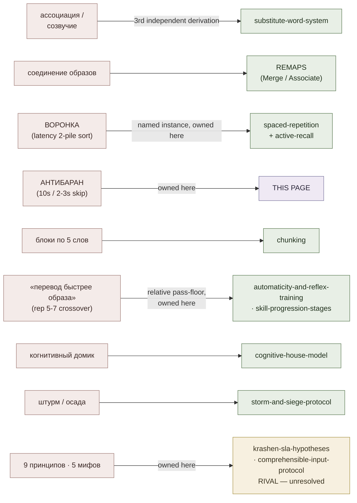

# Yagodkin / Advance Mnemonics (Учись учиться)

**Summary**: Source-overview / lineage page for the Russian **Advance** training centre (Николай Ягодкин, Александр Згода) and its 2023 workbook *Учись учиться* — a mnemonics-first, drill-first vocabulary curriculum built around a one-hour "learn 50 words" practicum. Like [kozarenko-mnemotechnics](./kozarenko-mnemotechnics.md), Advance is a second complete Russian re-implementation of memory moves this wiki already owns, and **it enters the wiki as a source feeding existing owners, not as a new framework or encoder** — no new acronym at framework level. This page is the Facade mapping each Advance construct onto its Neural OS owner, and the canonical home of the handful of genuinely additive artifacts: **Антибаран**, **Воронка**, the **7 information types**, the **Part 1 block protocol**, the **"recall overtakes image" automaticity criterion**, the **reading contract**, and Advance's **9 principles / 5 myths** of language learning. Its language theory is a **rival account to Krashen; the wiki records the disagreement and does not adjudicate it**.

**Sources**: `Ягодкин Н.А., Згода А.Н. - Учись учиться - 2023.pdf` (416 pp., ISBN 978-5-600-03722-9; Издатель А. Н. Згода, Санкт-Петербург). Ingested from the conversion in `0-inbox/`; this page draws on the introduction, the Part 1 practicum, and the "Общая теория изучения языков" chapter.

**Last updated**: 2026-07-16.

---

## What this page is

*Учись учиться* is a workbook, not a treatise. It opens with practice deliberately: the authors put roughly fifty rare English words into a short story, hand the reader ready-made associations, and expect the words in long-term memory within about an hour — the stated reason being that a good method produces results from the first steps, before the learner understands why it works (source: Ягодкин Н.А., Згода А.Н. - Учись учиться - 2023.pdf). The book also frames vocabulary as merely the *working model*: the same moves are claimed to apply to driving, cooking, or writing code (source: Ягодкин Н.А., Згода А.Н. - Учись учиться - 2023.pdf).

Read against the wiki's memory layer, most of what Advance does is already owned here. The substitution move, the spacing, the retrieval testing, the automaticity target — each has an owner page. So this page does three jobs, mirroring the Kozarenko facade:

1. **Maps** each Advance construct onto its existing Neural OS owner.
2. **Owns** the artifacts with no prior home — the protocol shape, the two named triage rules, the information taxonomy, the relative-ordering pass-floor, the contract, and the principles/myths list.
3. **Records** one convergence finding and one live theoretical dispute without resolving the latter.

## Doctrine map — Advance construct → Neural OS owner

| Advance construct (RU) | What it is | Neural OS owner |
|---|---|---|
| **Ассоциация / созвучие** (word → sound-alike image) | Turning a foreign word into a concrete image via its sound | [substitute-word-system](./substitute-word-system.md) |
| **Соединение образов** | Combining the meaning-image and the sound-image into one scene | [REMAPS](./remaps.md) — Merge / Associate moves |
| **Воронка** | Latency-sorted re-drill triage | **This page** §Воронка — an Advance-named instance of [spaced-repetition](./spaced-repetition.md) + [active-recall](./active-recall.md) |
| **Антибаран** | Don't-get-stuck / skip-and-return rule | **This page** §Антибаран |
| **Проверочный блок · Сводный проверочный блок** | Written recall checkpoints, both directions | **This page** §The Part 1 protocol shape |
| **Доведение до автоматизма** | Drilling until retrieval is reflexive | [automaticity-and-reflex-training](./automaticity-and-reflex-training.md); the *criterion* is owned here §Recall overtakes image |
| **Цикл повторений** | Expanding review schedule | [spaced-repetition](./spaced-repetition.md) |
| **Активное воспроизведение** | Producing rather than re-reading | [active-recall](./active-recall.md) |
| **Блоки по пять слов** | Sub-grouping the load | [chunking](./chunking.md) |
| **Когнитивный домик** | Neurodynamics → basic → higher mental functions | [cognitive-house-model](./cognitive-house-model.md) |
| **Штурм · Осада** | Record-day assault vs. steady siege scheduling | [storm-and-siege-protocol](./storm-and-siege-protocol.md) |
| **Запоминание разных типов слов** | Routing by word type (irregular verbs, phrasal verbs, abstracts, false friends…) | [vocabulary-word-type-routing](./vocabulary-word-type-routing.md) |
| **7 типов информации** | Advance's information taxonomy | **This page** §The seven information types |
| **9 принципов · 5 ошибок** | Advance's language-learning theory | **This page** §The nine principles, §The five myths |

The reading is the same as for Kozarenko: when you meet an Advance term, it is usually a Russian name for a move the wiki already owns. Encode by the owner page; use this map as the translation table.

## Convergence — a third independent derivation of the substitution move

Advance's core encoding step is: read the foreign word's sound, find a native-language word that sounds like it, picture that word concretely, and fuse it with an image of the meaning. The book's worked example: *plumber* [пла́мэ] → «пламя» (flame) — the plumber is pictured in flame (source: Ягодкин Н.А., Згода А.Н. - Учись учиться - 2023.pdf). Another: *lark* [лак] → «лакей» (footman), so the footman is given a lark's head and placed by a dawn window announcing dinner (source: Ягодкин Н.А., Згода А.Н. - Учись учиться - 2023.pdf).

That move is defined and owned by [substitute-word-system](./substitute-word-system.md). What is worth registering here is that Advance is the **third independent lineage** to arrive at it — after the Lorayne/Buzan tradition that page documents, and after Kozarenko's *метод наводящих ассоциаций* (МНА) in the Giordano school. Three lineages converging on the same primitive is evidence the primitive is real rather than idiosyncratic — the same convergence logic [kozarenko-mnemotechnics](./kozarenko-mnemotechnics.md) applies to its own re-derivation of [REMAPS](./remaps.md).

Advance's own encode loop is unusually terse: look at the comic panel, read the description while visualizing it as vividly as possible, then say the word aloud three times in both languages (source: Ягодкин Н.А., Згода А.Н. - Учись учиться - 2023.pdf). The "three times" is not arbitrary in their telling — they name three active reproductions as the minimum for a stable neural connection (source: Ягодкин Н.А., Згода А.Н. - Учись учиться - 2023.pdf).

## Антибаран — the anti-stuck rule

**Антибаран** ("anti-ram") is Advance's named rule against grinding on a single stuck item. The image is a ram butting its horns against a new gate and going nowhere; the Антибаран does the opposite — when something does not come immediately, you mark it in the book or a notepad and **move on**, returning to the deferred items later, better prepared (source: Ягодкин Н.А., Згода А.Н. - Учись учиться - 2023.pdf).

The rule carries two concrete latency budgets, and they differ by context:

- **During Part 1 recall checkpoints:** if a word will not come, breathe slowly, try to re-see the whole image — where you placed it, the surrounding details, the sounds, smells, tactile feel — and try to recall the image it interacted with. But **if it still will not come, spend no more than ten seconds on it** and return to it later (source: Ягодкин Н.А., Згода А.Н. - Учись учиться - 2023.pdf). This instruction is repeated verbatim at every checkpoint block.
- **During encoding drills:** do not "sit" on a word longer than **two to three seconds** on the first pass if you cannot encode it (source: Ягодкин Н.А., Згода А.Н. - Учись учиться - 2023.pdf).

A second clause: master any method from simple to complex. If a word is too hard and visualization is stalling badly, invoke the Антибаран and keep working — but with *easy* words, which develops the imagery skill that the hard word needed in the first place (source: Ягодкин Н.А., Згода А.Н. - Учись учиться - 2023.pdf).

The operational point is that Антибаран converts a stall from a blocking failure into a queued item. It is the drill-time counterpart of the wiki's broader "don't let one node halt the pass" discipline, and it composes with [tip-of-the-tongue](./tip-of-the-tongue.md) — Advance's answer to a tip-of-the-tongue state is a timer, not more effort.

## Воронка — Advance's named funnel

**Воронка** ("the funnel") is Advance's name for a two-pile self-sort. When preparing to review already-familiar words, you mark the ones you recalled on the first try and the ones that have gone soft; you then work actively with the *second* list only, rather than imitating busyness by re-reading what you already know (source: Ягодкин Н.А., Згода А.Н. - Учись учиться - 2023.pdf). The stated payoff is time: the funnel narrows the volume of material that must still be memorized, and you repeat **only up to the moment of memorization** and thereafter work only with what is not yet learned (source: Ягодкин Н.А., Згода А.Н. - Учись учиться - 2023.pdf).

The book motivates it with a school-poetry failure: learners who always restarted the poem from the first line whenever they forgot one never reached the final stanzas — the last verses never received enough repetitions (source: Ягодкин Н.А., Згода А.Н. - Учись учиться - 2023.pdf). Every block in Part 1 ends with the instruction to apply Антибаран and Воронка to the words that did not stick (source: Ягодкин Н.А., Згода А.Н. - Учись учиться - 2023.pdf).

> **Boundary discipline (no parallel definition).** The *mechanism* here is not new and is not defined on this page. Dropping known items from the review queue and re-drilling only the failures is the substance of [spaced-repetition](./spaced-repetition.md)'s scheduling and [active-recall](./active-recall.md)'s retrieval-as-the-study-event; those pages own it. **Воронка is registered here only as Advance's named instance** of that mechanism — a manual, paper-and-pencil, single-session realization of it.

What is mildly distinctive about the Advance instance is its **sort key**: the pile assignment is made on **recall latency alone** — did it come immediately, or not — with no grading scale, no confidence rating, and no interval arithmetic. That makes it a degenerate, in-session case of the scheduler [spaced-repetition](./spaced-repetition.md) describes, cheap enough to run with a sheet of paper. Its acknowledged gap: the book defers "how to determine the moment of memorization" to a later chapter (source: Ягодкин Н.А., Згода А.Н. - Учись учиться - 2023.pdf) — the answer it eventually gives is the criterion in §Recall overtakes image below.

## The seven information types

Advance sorts information into **seven basic types**, of which this book covers only the second (source: Ягодкин Н.А., Згода А.Н. - Учись учиться - 2023.pdf):

1. **единичные образы** — single images
2. **парочки** — pairs *(the entire subject of this book: foreign word ↔ translation)*
3. **цепочки** — sequences / chains
4. **цифры** — digits
5. **графика** — graphics
6. **связи** — causal, semantic, and associative links
7. **комплексные информационные объекты** — complex information objects

The authors are explicit that the book discusses only the skill of working with *some kinds of binary information*, namely memorizing foreign words, and that the full skill set is larger than memorization alone (source: Ягодкин Н.А., Згода А.Н. - Учись учиться - 2023.pdf).

**Is this novel here?** Checked against the wiki's existing framing: it is a **finer-grained sibling**, not a new idea. [kozarenko-mnemotechnics](./kozarenko-mnemotechnics.md) already carries the Giordano three-way sort (образная / вербальная / точная), which the doctrine map routes to [representation-rules](./representation-rules.md)'s concrete-first constraint. And [NEDF](./nedf-overview.md) already types material functionally by *slot* (Name-hook · Essence · Distinguisher · Failure) rather than by information shape — so NEDF is orthogonal to this list, not superseded by it. Advance's contribution is granularity: it splits Kozarenko's «точная» into digits and graphics, and adds an explicit *relations* type and a *composite objects* type that neither of the other two taxonomies names. Worth recording as a checklist for routing new material; not worth minting as a framework.

## The Part 1 protocol shape

The practicum has a fixed and repeatable shape. This is the part of Advance most directly transplantable into the wiki's own drill design.

**Six blocks.** Part 1 runs **six vocabulary blocks**, each attached to a fragment of a running story about a janitor and a plumber rescuing a beaver from a swimming pool (source: Ягодкин Н.А., Згода А.Н. - Учись учиться - 2023.pdf). The story is read cold first, with the reader scoring their own comprehension as a percentage before and after each block — a deliberate before/after delta the book requires you to write down (source: Ягодкин Н.А., Згода А.Н. - Учись учиться - 2023.pdf).

**Sub-grouping rule.** Blocks are not learned whole. The stated rule: learn five words → review those five → learn the next five → review those → and only then, having learned all ten, review all ten together (source: Ягодкин Н.А., Згода А.Н. - Учись учиться - 2023.pdf). The justification given is that reviewing earlier words signals to the brain that low-frequency material will be needed again, which activates attention and memory (source: Ягодкин Н.А., Згода А.Н. - Учись учиться - 2023.pdf). Structurally this is [chunking](./chunking.md) applied to session load, with the review inserted at the chunk boundary rather than at the end.

**Проверочный блок** (checkpoint block). After each block, a written recall test in **both directions**: first write the Russian translation opposite each English word, then the reverse — write the English opposite each Russian word (source: Ягодкин Н.А., Згода А.Н. - Учись учиться - 2023.pdf). Spelling is explicitly not graded at this stage; the reader is told to write it however is convenient and concentrate on the *sound* (source: Ягодкин Н.А., Згода А.Н. - Учись учиться - 2023.pdf). The Антибаран ten-second budget governs each item. The block then adds a paper-slider speed drill: cover the right column, read each English word aloud and say it in Russian, slide the sheet down one line to self-check; then cover the left column and go the other way (source: Ягодкин Н.А., Згода А.Н. - Учись учиться - 2023.pdf).

**Two Сводный проверочный блок checkpoints plus a final sweep.** The consolidated checkpoints sit at fixed places: **№ 1 after blocks 1–3**, **№ 2 after blocks 4–6**, and then a **Сводный блок № 3 reviewing the entire 1–6 word list** (source: Ягодкин Н.А., Згода А.Н. - Учись учиться - 2023.pdf). The consolidated blocks add an ordering rule the per-block checkpoints do not have: **work the whole list orally first, and only then in writing** (source: Ягодкин Н.А., Згода А.Н. - Учись учиться - 2023.pdf).

The shape, compactly: `[5 → review 5 → 5 → review 5 → review 10] × 3 → Сводный № 1 → [same] × 3 → Сводный № 2 → Сводный № 3 (all)`.

## Recall overtakes image — a relative-ordering pass-floor

This is the most transferable idea in Part 1, and it is a genuinely different *shape* of pass-floor from the ones the wiki already carries.

The instruction: go through the list several times **until the words start being recalled faster than the images associated with them — which usually happens from the fifth to the seventh repetition** (source: Ягодкин Н.А., Згода А.Н. - Учись учиться - 2023.pdf). Restated at the next block: perform the operation five to seven times across the whole list to achieve fast recall of the word and its translation — "remember that we must recall the **translation faster than we recall the association and the image**. If you have achieved that, you have repeated enough" (source: Ягодкин Н.А., Згода А.Н. - Учись учиться - 2023.pdf).

Two things are being said, and they should not be collapsed:

- **The criterion is relative, not absolute.** It does not say "under N seconds". It compares two retrieval latencies *within the learner* — meaning-retrieval vs. scaffold-retrieval — and declares the scaffold droppable when the direct route wins the race. This is a different instrument from the wiki's existing **absolute-time floors**, which specify a wall-clock threshold. A relative floor needs no calibration to the individual and no stopwatch, which is why it can be run on paper; the cost is that it cannot be compared across learners or aggregated, which is exactly what an absolute floor is for. They are complementary, not rival.
- **The rep-count is an empirical observation, not the standard.** Five-to-seven is where Advance reports the crossover typically happens (source: Ягодкин Н.А., Згода А.Н. - Учись учиться - 2023.pdf); the *pass condition* is the crossover itself. Do not drill to seven and stop; drill to the crossover.

This is Advance's answer to the question [automaticity-and-reflex-training](./automaticity-and-reflex-training.md) owns — when the scaffold comes off and the response becomes reflexive — and its placement on any of the wiki's ordered ladders is a question for [skill-progression-stages](./skill-progression-stages.md), which owns all stage and level numbering. **This page does not assign it a level number and does not restate either ladder.** What it contributes is the *instrument*: a scaffold-drop test that any encoder-built artifact could run, because every encoder builds a scaffold that eventually has to be discarded.

The book's underlying claim is that the association eventually stops being used for recall at all and becomes merely a label for finding it — Yagodkin describes exactly this for a phrase heard many times (source: Ягодкин Н.А., Згода А.Н. - Учись учиться - 2023.pdf).

## The reading contract (Договор)

Advance opens the workbook by making the reader sign a contract with themselves. The form is fill-in-the-blank: city, date, full name, then *"I hereby confirm that I have agreed with myself and will allocate ___ minutes daily to working with the book and will fully work through it by ___"*, followed by a self-reward clause — *"if I fulfil the terms of the contract and meet the deadline, I will reward myself for this achievement with ___"* — and a signature line (source: Ягодкин Н.А., Згода А.Н. - Учись учиться - 2023.pdf).

Two design details worth keeping:

- **Sign the contract you will actually keep, not the one you want.** The instruction is explicit on this point (source: Ягодкин Н.А., Згода А.Н. - Учись учиться - 2023.pdf).
- **Failure is defused in advance.** The contract's own text says that if you miss the deadline, nothing terrible happens, but you commit to re-planning with the mistakes accounted for and to succeeding on the second attempt (source: Ягодкин Н.А., Згода А.Н. - Учись учиться - 2023.pdf).

**Cadences offered.** Full working-through of the book takes approximately **five hours, or three hundred minutes**, which the authors decompose into three interchangeable schedules (source: Ягодкин Н.А., Згода А.Н. - Учись учиться - 2023.pdf):

| Cadence | Daily budget | Duration |
|---|---|---|
| Fifteen minutes a day | 15 min | 20 days |
| Over a month | 10 min | 30 days |
| Compressed | 30 min | 10 days |

The pattern generalizes cleanly: a fixed total budget, an explicit self-chosen rate, a written deadline, a reward, and a pre-authorized retry. It pairs naturally with [storm-and-siege-protocol](./storm-and-siege-protocol.md), which owns the assault-vs-steady scheduling question these three rows are instances of.

A companion habit the book bundles with the contract: a **дневник успеха** (success diary) — after each chapter, find three reasons to think of yourself with respect, and praise yourself out loud, even if you only reviewed old words (source: Ягодкин Н.А., Згода А.Н. - Учись учиться - 2023.pdf).

## The nine principles of language learning

Advance states nine principles, derived over more than twelve years of research at the centre (source: Ягодкин Н.А., Згода А.Н. - Учись учиться - 2023.pdf). Verbatim and in the book's order:

1. **изоляция** (isolation) — break the language into "twigs" like a broom, and train each element in isolation, because attention splits across simultaneous tasks. Vocabulary comes first because memorizing words takes up to 75% of the time and unlearned words throttle grammar and speech (source: Ягодкин Н.А., Згода А.Н. - Учись учиться - 2023.pdf).
2. **специализация** (specialization) — each task gets the instrument that solves *that* task best: mnemonics for words, reproduction patterns for grammar, articulation gymnastics for pronunciation, mind-maps rather than mnemonics for grammar. Short words take single images; long ones take image chains (source: Ягодкин Н.А., Згода А.Н. - Учись учиться - 2023.pdf).
3. **приоритет активных действий** (priority of active actions) — passive perception creates fewer and weaker connections than active reproduction. Their reformulation of the proverb: *better to actively reproduce three times than to passively perceive a hundred times* (source: Ягодкин Н.А., Згода А.Н. - Учись учиться - 2023.pdf).
4. **последовательность** (sequence) — everything *else* in an exercise must already be known, or the target skill is not what gets trained. Reading a simple text fast beats reading a hard text slowly (source: Ягодкин Н.А., Згода А.Н. - Учись учиться - 2023.pdf).
5. **высокий темп** (high tempo) — learning is "climbing a descending escalator"; stopping costs ground. If tempo cannot be held, the sequence principle was violated upstream (source: Ягодкин Н.А., Згода А.Н. - Учись учиться - 2023.pdf).
6. **доведение до автоматизма** (bringing to automaticity) — quality of the neural connection determines how it decays; anything not brought to automaticity is lost. They name two rest points where a long pause is survivable: Elementary (A2) and Intermediate (B1+) (source: Ягодкин Н.А., Згода А.Н. - Учись учиться - 2023.pdf).
7. **повторение** (repetition) — glossed in the book with a pun: repetition is both "the mother of learning" and "the father of stuttering". Repetition is part of memorization, not separate from it; mnemonics minimize but cannot eliminate the cycle (source: Ягодкин Н.А., Згода А.Н. - Учись учиться - 2023.pdf).
8. **измеримость результата** (measurability of result) — language is a well-measurable object. Their countable parameters: words learned; speed of memorizing new words and topics; page-reading speed; percentage understood of a previously unseen film or text; lexical and grammar test results (source: Ягодкин Н.А., Згода А.Н. - Учись учиться - 2023.pdf).
9. **«крылья, или трамплин»** (wings, or springboard) — *"better to lose a day, then fly there in five minutes"*: prepare first (learn the words before reading the text), find the best instrument, and learn to do it correctly and fast before doing it at volume (source: Ягодкин Н.А., Згода А.Н. - Учись учиться - 2023.pdf).

Principle 8 is notable for this wiki: it is Advance's own statement of the discipline [METER](./meter-overview.md) enforces — that an unmeasured method is a personal trick. Principle 6 is their statement of what [automaticity-and-reflex-training](./automaticity-and-reflex-training.md) owns. Principle 3 is a strong-form claim about active reproduction that also happens to be the hinge of their dispute with Krashen — see §Rival account below.

## The five myths

Advance names exactly five typical mistakes (source: Ягодкин Н.А., Згода А.Н. - Учись учиться - 2023.pdf):

1. **переоценка влияния окружения** — overrating immersion. Their polemic: proponents apparently believe language is like radiation, and that irradiation by native speakers makes you a native. They point to long-term emigrants who never got past a level reachable in a few weeks of study, to Russian-speaking communities in the Baltics thirty years on, and to exchange students with low starting levels showing no gain — what actually develops, they say, is gesturing and phone-translator typing speed. The myth violates both isolation and automaticity (source: Ягодкин Н.А., Згода А.Н. - Учись учиться - 2023.pdf).
2. **переоценка пассивного восприятия** — overrating passive input. Their falsifier: if passively listening had *any* cumulative benefit, everyone who listens to foreign music would eventually speak or at least understand — and we observe no such mass phenomenon. They add a neurophysiological claim that speaking and singing, and listening to speech versus song, engage different brain regions, so no accumulation occurs. Passive methods work only *after* a foundation exists — once the song's vocabulary is learned and its constructions drilled, listening becomes a pleasant way to maintain level (source: Ягодкин Н.А., Згода А.Н. - Учись учиться - 2023.pdf).
3. **переход количества в качество** — quantity becoming quality. Works "in dialectical logic and treatises of a particular historical period", they say; in language learning it does not work at all. Words do not learn themselves through frequent encounters (source: Ягодкин Н.А., Згода А.Н. - Учись учиться - 2023.pdf).
4. **акцент на знании грамматики** — the grammar-knowledge emphasis. Traced to a testing artifact: talking to every child is hard, giving a grammar test is easy, so years are spent training test-taking rather than speaking. Grammar is *building material* for the four skills, and freestanding grammar knowledge survives only in language teachers who studied it for five years (source: Ягодкин Н.А., Згода А.Н. - Учись учиться - 2023.pdf).
5. **малая эффективность универсальных инструментов** — the low efficiency of universal tools. There is no single instrument; reading, native-speaker conversation, and — they say explicitly — *even our own beloved mnemonics* do not replace many-sided study (source: Ягодкин Н.А., Згода А.Н. - Учись учиться - 2023.pdf).

Myth 5 is the honest one, and it is the reason this page treats Advance as a source rather than a system: the authors themselves refuse the universal-tool claim.

## Rival account to Krashen — noted, not resolved

Advance's theory is in direct, load-bearing conflict with the acquisition model the wiki already carries.

**Where they collide.** [krashen-sla-hypotheses](./krashen-sla-hypotheses.md) holds that acquisition is driven by comprehensible input consumed for meaning, and [comprehensible-input-protocol](./comprehensible-input-protocol.md) operationalizes that into an input-first practice. Advance's myths 1 and 2 target precisely those positions: immersion is called the *most inefficient* way to spend time on a language, and passive listening is said to accumulate nothing without a pre-built foundation of learned vocabulary and drilled constructions (source: Ягодкин Н.А., Згода А.Н. - Учись учиться - 2023.pdf). Their principle 3 inverts the priority outright — active reproduction over passive perception, three actives beating a hundred passives (source: Ягодкин Н.А., Згода А.Н. - Учись учиться - 2023.pdf).

**The shape of the disagreement.** It is not a detail-level quibble; it is a claim about the *direction* of the causal arrow. Krashen's model makes deliberate vocabulary study a peripheral aid to acquisition-by-input. Advance makes deliberate vocabulary study the precondition without which input is inert — and then makes the stronger claim that input becomes useful only once the vocabulary in that specific input is already known (source: Ягодкин Н.А., Згода А.Н. - Учись учиться - 2023.pdf). Note that both positions can partially agree on the observable: Krashen's "comprehensible" and Advance's "you already know the words" are not far apart in practice. Where they genuinely diverge is on whether comprehension can be *bootstrapped from context*, or must be *pre-installed*.

**The wiki does not adjudicate this.** Neither position is endorsed here, and this page does not declare a winner. Advance's evidence for its side is internal — centre observations and course outcomes, not controlled comparison (see §Unverified claims). Krashen's hypotheses have their own long-standing critiques, which [krashen-sla-hypotheses](./krashen-sla-hypotheses.md) carries. The disagreement is recorded on both pages and left open; a resolution would require a source neither side supplies. Treat the two as **rival accounts in the wiki's SLA corpus**, and note that [polyglot-architecture](./polyglot-architecture.md) currently routes through the Krashen-side pipeline — a routing choice that this contradiction puts formally in question, not one it settles.

## Unverified claims (Advance-internal)

The book's performance numbers come from the centre's own courses and observations. Every one of the following is flagged **(needs verification — Advance-internal, no external citation)**:

| Claim | Where |
|---|---|
| The technique lets you learn **50–100 foreign words per hour** | (source: Ягодкин Н.А., Згода А.Н. - Учись учиться - 2023.pdf) |
| A well-trained practitioner **easily memorizes 100 foreign words per hour** | (source: Ягодкин Н.А., Згода А.Н. - Учись учиться - 2023.pdf) |
| The **~1,500 words** of an entire specialized English school programme could be covered **in two weeks**, easily | (source: Ягодкин Н.А., Згода А.Н. - Учись учиться - 2023.pdf) |
| Systematic word-memorization with a surplus accelerates language learning **~3–4×** | (source: Ягодкин Н.А., Згода А.Н. - Учись учиться - 2023.pdf) |
| Following their repetition cycle preserves **>99%** of learned vocabulary | (source: Ягодкин Н.А., Згода А.Н. - Учись учиться - 2023.pdf) |
| Trained intellectual endurance raises the productivity of any mental activity **at minimum 2–3×** | (source: Ягодкин Н.А., Згода А.Н. - Учись учиться - 2023.pdf) |
| **100 hours per CEFR level** is "more than enough" | (source: Ягодкин Н.А., Згода А.Н. - Учись учиться - 2023.pdf) |
| **Fewer than 400 words** are retained from roughly **1,000 hours** of school English, and many learners retain fewer than 20 correctly-stored irregular verbs | (source: Ягодкин Н.А., Згода А.Н. - Учись учиться - 2023.pdf) |
| There are **182 irregular verbs**, including **52 low-frequency** ones; Advance loads 100 core irregular verbs into long-term memory in two three-hour evenings | (source: Ягодкин Н.А., Згода А.Н. - Учись учиться - 2023.pdf) |

The pattern is worth naming: these are the numbers a training centre uses to sell courses, and the book supplies no methodology, control group, or retention measurement for any of them. That does not make them false — it makes them unaudited. Advance's own principle 8 (measurability) is the standard by which they fall short here, which is a fair way to hold them to it.

## Internal inconsistency and numeric tension

Two problems recorded honestly rather than smoothed over.

**Internal inconsistency — the "ten words per block" claim.** The book states plainly that *"all blocks contain ten words each"*, and builds the sub-grouping rule on that premise: learn five, review five, learn the next five, review, then review all ten (source: Ягодкин Н.А., Згода А.Н. - Учись учиться - 2023.pdf). The actual blocks do not contain ten words. Counting the final consolidated lists, the six blocks run **11 / 7 / 8 / 8 / 7 / 11** (source: Ягодкин Н.А., Згода А.Н. - Учись учиться - 2023.pdf) — block 1 alone is janitor, plumber, clean, well, pool, early, lark, near, fence, moss, caterpillar, which is eleven; block 2 is spread out, tool, crowbar, shovel, mop, rope, match, which is seven. The text elsewhere says fifty-three rare words were seeded into the story (source: Ягодкин Н.А., Згода А.Н. - Учись учиться - 2023.pdf), while the block lists total fifty-two.

Do not repeat "always ten" as fact. The **rule** (halve the block, review at the halfway boundary, then review the whole block) is what survives; the **number** does not. Read charitably, "ten" is a design intention the vocabulary of a natural story would not accommodate — which is itself a useful lesson about protocols that hard-code a chunk size.

**Numeric tension — 100 hours per CEFR level.** Advance's principle 8 asserts that 100 hours per level is more than enough (source: Ягодкин Н.А., Згода А.Н. - Учись учиться - 2023.pdf), which implies roughly 500–600 hours from zero to C2 in one language. That sits against the estimate the wiki already carries: [language-family-clustering](./language-family-clustering.md) owns the transfer math behind the **~4,100-hour** planning figure for B2–C1 across a family-clustered language set plus English C2 (carried on [polyglot-architecture](./polyglot-architecture.md)), and the same page carries the FSI range of **600–2,200 hours to professional proficiency** for a *single* language depending on category. The two accounts are roughly an order of magnitude apart on cost per language.

Note the tension; do not resolve it here. Three caveats belong on the record before anyone tries: the two figures may not measure the same endpoint (CEFR level vs. FSI professional proficiency); Advance's estimate is for Russian speakers learning English, while FSI's is for English speakers learning others; and Advance's number is itself in the unverified table above. None of that makes the gap disappear — it makes it *unadjudicable from these sources*.

## Routing the other direction

The doctrine map above is indexed **by construct**. The inverse index — keyed by the material in front of you, with Advance's answer beside Giordano's and the Neural OS spine's — is [cross-school-encoding-router](./cross-school-encoding-router.md). That page records the coverage fact this page's §The seven information types implies but does not state: Advance *names* seven material types and *operationalizes* one, and its single deep column ([vocabulary-word-type-routing](./vocabulary-word-type-routing.md)) has no equivalent in either other school.

## METER fit

Nothing here mints a measurable new framework, so no new pass-floors are introduced at framework level. Three existing measurement hooks gain a source, and one gains a new instrument:

- **The relative pass-floor is the real METER contribution.** "Translation retrieved faster than the mnemonic image" is a measurable, learner-local scaffold-drop test. It is an *addition to the instrument shelf*, not a replacement for the wiki's absolute-time floors; the pairing (relative floor to decide *when*, absolute floor to decide *how good*) is the composition worth trying. Level placement, if any, is [skill-progression-stages](./skill-progression-stages.md)'s call.
- **Воронка** rides the existing review-queue metrics owned by [spaced-repetition](./spaced-repetition.md) and [active-recall](./active-recall.md); it adds no metric, only a cheap manual realization.
- **Антибаран** contributes two concrete latency budgets (10 s at recall checkpoints, 2–3 s at encode) that can be tested against the wiki's own stall-handling rules.
- Advance's five countable parameters (principle 8) are a ready-made metric list for any language-learning project page.

## Mnemonic

**«БАРАН НЕ ПРОЙДЁТ»** — the ram shall not pass. Picture the Антибаран at the mouth of a **funnel** (Воронка): every word that stalls for more than ten seconds gets butted aside into the "later" pile, and only the failures fall through the narrow end to be re-drilled. Behind the funnel stands a **contract** nailed to the gate (minutes/day, deadline, reward), and above it a **race** between two runners — *translation* and *image* — where you stop drilling the moment translation wins. **Ram · Funnel · Contract · Race** = the four things this page owns; everything else Advance does belongs to somebody else's page.

## Checksum

- If you wrote that Advance is a **new framework or encoder** → wrong; it is a source feeding existing owners, like [kozarenko-mnemotechnics](./kozarenko-mnemotechnics.md). No new acronym.
- If you defined **Воронка as a spacing mechanism** → wrong; the mechanism belongs to [spaced-repetition](./spaced-repetition.md) / [active-recall](./active-recall.md). Воронка is only Advance's *named instance*, sorted by recall latency alone.
- If you said the "recall overtakes image" floor means **"under N seconds"** → wrong; it is a **relative** comparison of two latencies, which is why it needs no stopwatch.
- If you drilled to **seven reps and stopped** → wrong; five-to-seven is where the crossover is *observed*, the crossover itself is the pass condition.
- If you repeated **"all blocks contain ten words"** → wrong; the book says it, the blocks are 11/7/8/8/7/11. The halving *rule* survives, the number does not.
- If you quoted **50–100 words/hour, >99% retention, 3–4× speedup, or 100h/CEFR level** as established → wrong; all Advance-internal, unaudited.
- If you concluded Advance **refutes Krashen** (or Krashen refutes Advance) → wrong; the wiki records the dispute and does not adjudicate it.
- Advance's own **myth 5** says mnemonics are not a universal tool — the authors decline the totalizing claim themselves.
- The Antibaran budgets: **10 seconds** at recall, **2–3 seconds** at encode.

## Visual

New framework minted: NONE. New acronym: NONE. Adjudication of the Krashen dispute: NONE.

## Related pages

- [kozarenko-mnemotechnics](./kozarenko-mnemotechnics.md) — the sibling Russian lineage facade; same "source, not framework" verdict and same page shape
- [substitute-word-system](./substitute-word-system.md) — owner of the substitution move Advance independently re-derives (third lineage)
- [spaced-repetition](./spaced-repetition.md) · [active-recall](./active-recall.md) — owners of the mechanism Воронка is Advance's named instance of
- [automaticity-and-reflex-training](./automaticity-and-reflex-training.md) — owner of the automaticity question the "recall overtakes image" criterion answers
- [skill-progression-stages](./skill-progression-stages.md) — owner of all stage/level numbering; this page assigns no level
- [krashen-sla-hypotheses](./krashen-sla-hypotheses.md) — the rival account; carries a pointer back here
- [comprehensible-input-protocol](./comprehensible-input-protocol.md) — the input-first practice Advance's myths 1–2 attack
- [cognitive-house-model](./cognitive-house-model.md) — Advance's Когнитивный домик
- [storm-and-siege-protocol](./storm-and-siege-protocol.md) — Advance's Штурм/Осада scheduling; the reading-contract cadences are instances
- [vocabulary-word-type-routing](./vocabulary-word-type-routing.md) — Advance's per-word-type routing table
- [chunking](./chunking.md) — the sub-grouping rule (learn 5 → review 5 → …) applied to session load
- [language-family-clustering](./language-family-clustering.md) · [polyglot-architecture](./polyglot-architecture.md) — carry the hour estimates the "100h per CEFR level" claim sits against
- [remaps](./remaps.md) — Merge/Associate moves behind Advance's соединение образов
- [meter-overview](./meter-overview.md) — the measurement discipline Advance's principle 8 independently states
- [tip-of-the-tongue](./tip-of-the-tongue.md) — the state Антибаран answers with a timer rather than more effort

---

## U — See (CAST)
1. One Russian training centre's workbook re-implementing the wiki's memory layer, drill-first
2. Edges: most constructs point at existing owners; four artifacts (ram, funnel, contract, race) are owned here; one edge points at an unresolved contradiction with Krashen

## D — Name (NEDF)
1. Advance/Yagodkin = Russian accelerated-learning centre, ingested as source not framework
2. Distinguisher: the relative pass-floor (translation retrieved faster than the mnemonic image) — no stopwatch, learner-local
3. Failure mode: minting it as a framework; letting Воронка redefine spacing; declaring a winner over Krashen; quoting the sales numbers as fact

## F — Do (SPEAR)
1. Meet an Advance term → look it up in the doctrine map → encode via the owner page
2. Building a vocabulary drill → use the Part 1 shape (halve the block, review at the boundary, both-directions written recall, two consolidated checkpoints + final sweep) and stop at the crossover, not at rep 7

## B — Watch (HEART)
1. Drift toward treating Advance as a rival *system* (it's a source) or its Krashen dispute as settled (it isn't)
2. Воронка redefining spaced repetition on a non-owner page (parallel-definition risk)
3. Advance-internal numbers leaking into other pages without their verification flag

## L — Predict (ORACLE)
1. New Russian accelerated-learning source → predict it re-derives owners already here, plus a proprietary drill protocol and unaudited throughput numbers
2. The relative pass-floor generalizes → predict any encoder's scaffold can be dropped by the same crossover test, not just mnemonic images

## R — Act (GRACE)
1. Russian mnemonics/language material → route through this page's doctrine map before authoring anything new
2. Any Advance throughput claim → carry its verification flag with it, or don't carry it
3. Input-vs-active-reproduction question arises → present both accounts, cite both pages, escalate to the user rather than picking
