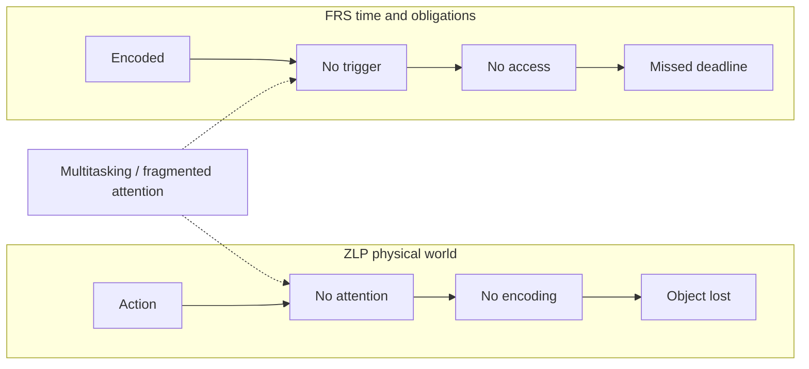

# Zero-Loss Protocol (ZLP) & Forced Recall System (FRS)

Two **different failure modes** need two **different repairs**. ZLP governs **atoms in the physical world** (keys, bag, gear). FRS governs **time and obligations** (deadlines, critical tasks). Same root poison — **unstructured attention** — but antidotes are not interchangeable.

## Memorizing this method

**Helper:** [memorization-helpers.md](./memorization-helpers.md#mh-zero-loss-forced-recall) — NEDF/SPEAR lens, minimal first session, stack placement.

---

## One glance: which tool when?

| Pain | Framework | Core failure | Fix type |
|------|-----------|--------------|----------|
| **Lost objects** (keys, backpack, chargers) | **ZLP** — Zero-Loss Protocol | You **never paid** the encoding tax | **Force encoding** at the moment of placement |
| **Missed deadlines** (even when “already memorized”) | **FRS** — Forced Recall System | Memory **exists** but **never gets queried** | **Force retrieval** through triggers + a tiny active palace |



**Together:** ZLP **locks matter**; FRS **pulls time-bound memory into awareness**. Stack them in a single daily flow when you want the combo to run on rails.

---

## CAST lens (why multitasking hurts both)

Multitasking does not create one generic “bad memory.” It creates **two different leaks**:

- **Fragmented attention → skipped encoding** → ZLP failure (nothing vivid was written at drop-off).
- **Fragmented attention → skipped triggers** → FRS failure (the palace was never opened today).

So the meta-diagnosis is **unstructured attention**; the **prescriptions** stay split: **encode on drop** vs **query on cue**.

---

# Part A — Zero-Loss Protocol (ZLP)

**For:** keys, backpack, wallet, tools — anything that can walk away without a scene.

### The failure chain (honest version)

```text
Action → no attention → no encoding → object lost
```

You did not “forget where.” You **never stored** where.

### ZLP principle

> **No image = no memory = near-guaranteed loss.**

Neutrality is the enemy. Bland placement is invisible to recall.

---

## A1. Fixed anchor points (environment lock)

Each high-loss object gets **one home** — not “usually here,” not a zone, **one coordinate**:

- Keys → *exact* dish, hook, or corner (name it once, never negotiate).
- Backpack → *exact* peg, chair back, or floor tile seam.

**Rule:** zero daily decisions about “where should this live?” The world is pre-compiled.

---

## A2. Drop marker (encoding trigger)

Every time the object **leaves your hand**, you pay a **two-centisecond tax**:

1. **Say** (whisper counts): a fixed line, e.g. *“Keys → desk corner.”*
2. **See** one **exaggerated** micro-scene at the anchor: keys **detonating** into sparks against the wood grain; backpack **swallowing** the hook like a whale mouth.

The line is boring on purpose — it is the **rail**. The image is **loud** — it is the **ink**.

---

## A3. Identity amplification (permanent object souls)

Each object class carries a **non-negotiable caricature** so it never arrives as “generic stuff”:

| Object | Example soul (pick one and keep it forever) |
|--------|---------------------------------------------|
| Keys | **White-hot metal** screaming steam when they touch anything |
| Backpack | **Elephant hide** with one broken strap that flaps like an ear |
| Wallet | **Vault door** that slams with a bass thud |

Swap the table for your own myth — but **never** leave an object visually mute.

---

## A4. Retrieval rule (when something is missing)

1. **Replay the last three scenes** where you could have held it (doorway, car seat, café table).
2. If the replay is **blank** → assume **no encoding** — do not brute-force “memory”; you are guessing.
3. **Backtrack by context**: re-walk the physical path, pockets, surfaces, **not** free-association.

Repair for next time: **smaller anchor + louder drop marker** — not “try harder.”

---

# Part B — Forced Recall System (FRS)

**For:** deadlines, hard appointments, “must ship” tasks — anything that punishes you if recall never surfaces before the clock.

### The failure chain

```text
Information stored → no trigger → no access → missed deadline
```

The mnemonic is not false; it is **un-invoked**.

### FRS principle

> **Memory must be forced into awareness** — or it might as well not exist for calendar reality.

---

## B1. Today Core (mini palace, active layer)

Spin a **tiny** palace — **five loci max** — reserved **only** for:

- **Hard deadlines** (time + consequence)
- **Critical tasks** that must not slip off the mental stack

This is not your textbook palace. It is a **dashboard**: small, violent, exclusive. Anything that does not clear the “if I miss this, something breaks” bar does not get a locus.

*Pairs with:* ordered walks in [mind-palace.md](./mind-palace.md) and date/time scaffolding in [calendar-time-memorization.md](./calendar-time-memorization.md).

---

## B2. Triple trigger system (install forced access)

### A — Physical triggers (body-linked)

- **Feet on floor** (wake) → **10-second** Today Core pass.
- **Hand on door** (leaving) → same pass.
- **Head on pillow** (sleep) → same pass.

Anchor the habit to **existing motion**, not motivation.

### B — Alarm triggers (clock-linked)

- **2–3 alarms / day**, label: **CHECK SYSTEM** (not the task name — the habit name).
- Alarm fires → **only** the five-loci sweep, not email.

### C — State trigger (overload-linked)

Whenever you notice **confusion** or **overwhelm** → automatic line:

> **“Check palace.”**

No negotiation. Confusion is the bell.

---

## B3. Ten-second rule

Every trigger → **fast recall**, not deep work:

- Name each locus’s payload in order.
- If a locus is empty → either **promote** nothing from inbox, or **demote** something that was wishful thinking.

Speed keeps the layer honest.

---

## B4. Reset protocol (when you drift)

1. **Stop** (physical stillness — one breath).
2. Ask once: **“What matters now?”**
3. **Open Today Core** — five loci only.
4. **Resume** with the smallest executable next step.

*Pairs with:* [metacognitive-checklist.md](./metacognitive-checklist.md) mid-session audits and [retrieval-protocol.md](./retrieval-protocol.md) cadence.

---

## Daily flow (ZLP + FRS on one belt)

A minimal **automatic** loop — no heroics:

| When | ZLP | FRS |
|------|-----|-----|
| Object hits anchor | Drop marker + identity flash | — |
| Wake / leave / sleep | Keys/bag at anchor check | Today Core pass |
| Alarm “CHECK SYSTEM” | — | Today Core pass |
| Overwhelm spike | Optional: pat pockets | **Check palace** |

When both run, you are defending **matter** and **time** with the same attention budget — split **mechanisms**, shared **rhythm**.

---

## See also

- [mind-palace.md](./mind-palace.md) — loci, routes, palace vs flat index
- [retrieval-protocol.md](./retrieval-protocol.md) — Anki + walks + repair (long-horizon consolidation)
- [calendar-time-memorization.md](./calendar-time-memorization.md) — encoding calendar and clock lines
- [navigator.md](./navigator.md) — project-scale **Act** phase: obligations meet execution
- [metacognitive-checklist.md](./metacognitive-checklist.md) — catching drift before it becomes loss
